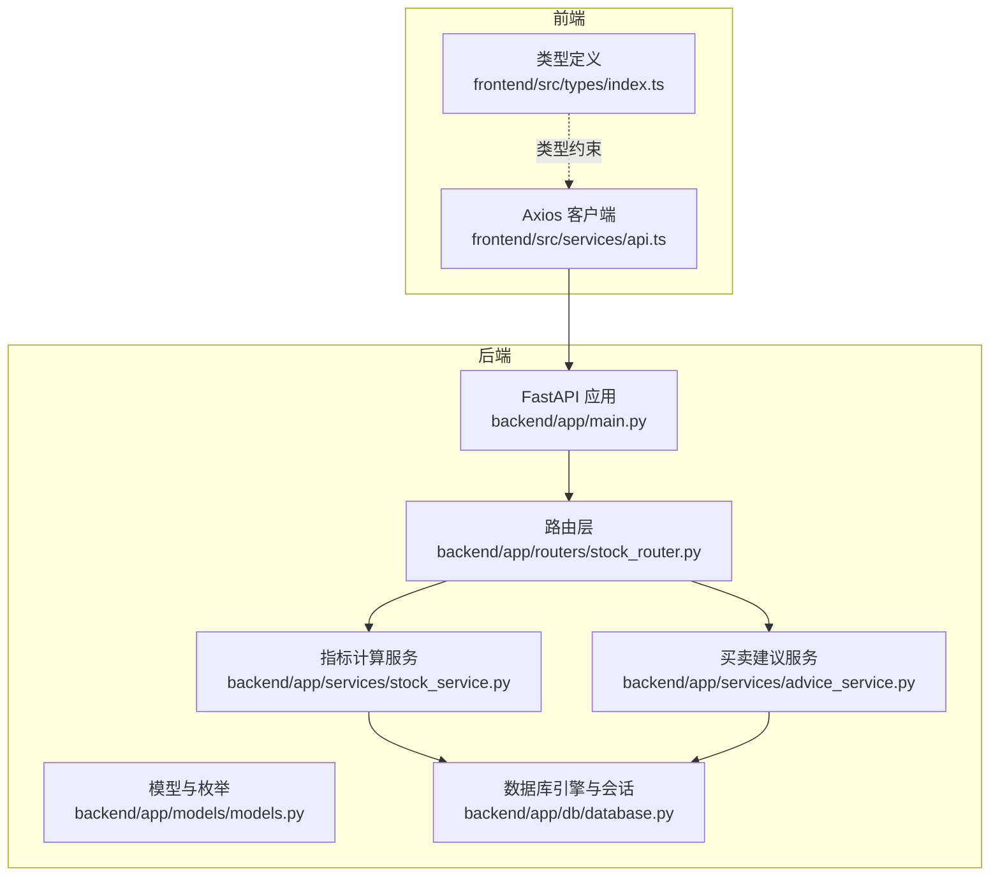
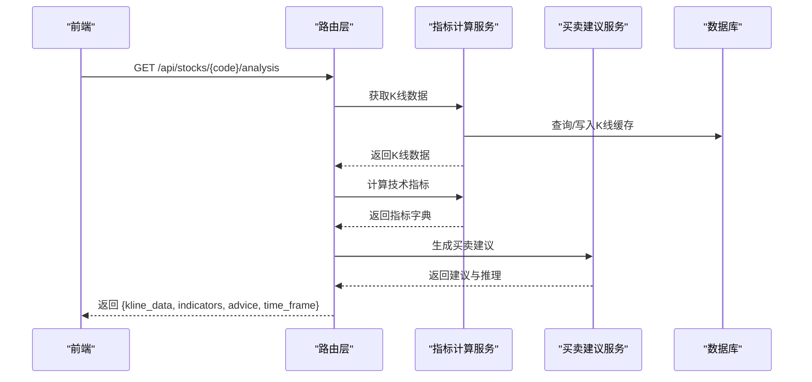
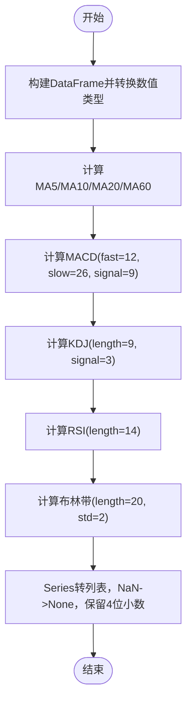
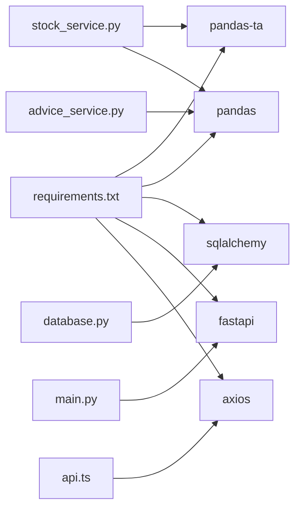

# 技术指标计算

<cite>
**本文引用的文件**

- [backend/app/services/stock_service.py](file://backend/app/services/stock_service.py)

- [backend/app/services/advice_service.py](file://backend/app/services/advice_service.py)

- [backend/app/routers/stock_router.py](file://backend/app/routers/stock_router.py)

- [backend/app/models/models.py](file://backend/app/models/models.py)

- [backend/app/db/database.py](file://backend/app/db/database.py)

- [backend/app/main.py](file://backend/app/main.py)

- [frontend/src/services/api.ts](file://frontend/src/services/api.ts)

- [frontend/src/types/index.ts](file://frontend/src/types/index.ts)

- [backend/requirements.txt](file://backend/requirements.txt)
</cite>

## 目录
1. [简介](#简介)

2. [项目结构](#项目结构)

3. [核心组件](#核心组件)

4. [架构总览](#架构总览)

5. [详细组件分析](#详细组件分析)

6. [依赖分析](#依赖分析)

7. [性能考量](#性能考量)

8. [故障排查指南](#故障排查指南)

9. [结论](#结论)

10. [附录](#附录)

## 简介
本文件系统化梳理了该股票交易应用中的技术指标计算模块，重点覆盖以下指标：

- 移动平均线（MA5/MA10/MA20/MA60）

- MACD（三重移动平均、快慢线与柱状图）

- KDJ（随机指标、平滑因子与信号线）

- RSI（相对强弱指数、超买超卖判断）

- 布林带（BOLL，通道宽度与价格位置）

同时提供参数设置、算法原理、调优建议与典型应用场景，帮助开发者与使用者理解与正确使用这些指标。

## 项目结构
后端采用 FastAPI + SQLAlchemy 架构，前端使用 TypeScript + Axios。技术指标计算由后端服务统一处理，并通过路由暴露给前端。



图表来源

- [backend/app/main.py:1-28](file://backend/app/main.py#L1-L28)

- [backend/app/routers/stock_router.py:1-197](file://backend/app/routers/stock_router.py#L1-L197)

- [backend/app/services/stock_service.py:1-327](file://backend/app/services/stock_service.py#L1-L327)

- [backend/app/services/advice_service.py:1-193](file://backend/app/services/advice_service.py#L1-L193)

- [backend/app/models/models.py:1-75](file://backend/app/models/models.py#L1-L75)

- [backend/app/db/database.py:1-24](file://backend/app/db/database.py#L1-L24)

- [frontend/src/services/api.ts:1-68](file://frontend/src/services/api.ts#L1-L68)

- [frontend/src/types/index.ts:1-94](file://frontend/src/types/index.ts#L1-L94)

章节来源

- [backend/app/main.py:1-28](file://backend/app/main.py#L1-L28)

- [backend/app/routers/stock_router.py:1-197](file://backend/app/routers/stock_router.py#L1-L197)

- [backend/app/services/stock_service.py:1-327](file://backend/app/services/stock_service.py#L1-L327)

- [backend/app/services/advice_service.py:1-193](file://backend/app/services/advice_service.py#L1-L193)

- [backend/app/models/models.py:1-75](file://backend/app/models/models.py#L1-L75)

- [backend/app/db/database.py:1-24](file://backend/app/db/database.py#L1-L24)

- [frontend/src/services/api.ts:1-68](file://frontend/src/services/api.ts#L1-L68)

- [frontend/src/types/index.ts:1-94](file://frontend/src/types/index.ts#L1-L94)

## 核心组件
- 指标计算服务：负责将K线数据转换为pandas DataFrame，调用pandas-ta库计算各类技术指标，并将结果序列化为API可返回的字典结构。

- 买卖建议服务：基于指标结果进行综合打分与置信度评估，输出“买入/卖出/持有”建议及推理过程。

- 路由层：提供获取K线与分析结果的REST接口；在获取分析结果时，先获取K线，再计算指标，最后生成建议。

- 数据模型与缓存：定义K线缓存表结构，支持按股票代码、周期、日期去重存储，提升重复查询效率。

- 数据库：SQLite 引擎与SQLAlchemy会话管理，初始化数据库表结构。

- 前端API与类型：定义请求参数与响应结构，确保前后端一致的数据契约。

章节来源

- [backend/app/services/stock_service.py:255-327](file://backend/app/services/stock_service.py#L255-L327)

- [backend/app/services/advice_service.py:4-193](file://backend/app/services/advice_service.py#L4-L193)

- [backend/app/routers/stock_router.py:98-131](file://backend/app/routers/stock_router.py#L98-L131)

- [backend/app/models/models.py:58-75](file://backend/app/models/models.py#L58-L75)

- [backend/app/db/database.py:1-24](file://backend/app/db/database.py#L1-L24)

- [frontend/src/services/api.ts:34-44](file://frontend/src/services/api.ts#L34-L44)

- [frontend/src/types/index.ts:25-49](file://frontend/src/types/index.ts#L25-L49)

## 架构总览
技术指标计算在后端完成，前端通过HTTP接口获取分析结果。流程如下：

- 前端发起分析请求

- 后端路由层调用指标计算服务与建议生成服务

- 指标计算服务将K线数据转为DataFrame并调用pandas-ta计算指标

- 建议服务对指标进行综合分析，输出信号与置信度

- 返回包含K线、指标与建议的JSON对象



图表来源

- [backend/app/routers/stock_router.py:98-131](file://backend/app/routers/stock_router.py#L98-L131)

- [backend/app/services/stock_service.py:255-327](file://backend/app/services/stock_service.py#L255-L327)

- [backend/app/services/advice_service.py:4-193](file://backend/app/services/advice_service.py#L4-L193)

- [backend/app/db/database.py:1-24](file://backend/app/db/database.py#L1-L24)

## 详细组件分析

### 指标计算服务（stock_service.calculate_indicators）
- 输入：K线数据列表（包含日期、开盘、收盘、最高、最低、成交量）

- 处理：

  - 将K线数据转换为DataFrame并确保数值列类型正确

  - 使用pandas-ta库计算各指标：

    - 移动平均线：MA5/MA10/MA20/MA60（SMA）

    - MACD：快线（dif）、慢线（dea）、柱状图（histogram），参数分别为fast=12、slow=26、signal=9

    - KDJ：周期length=9，信号线周期signal=3

    - RSI：周期length=14

    - 布林带：周期length=20，标准差std=2

  - 将Series结果转换为列表，NaN值转换为None并保留4位小数

- 输出：包含各指标序列与成交量的字典



图表来源

- [backend/app/services/stock_service.py:255-327](file://backend/app/services/stock_service.py#L255-L327)

章节来源

- [backend/app/services/stock_service.py:255-327](file://backend/app/services/stock_service.py#L255-L327)

### 买卖建议服务（advice_service.generate_advice）
- 输入：指标字典与K线数据

- 处理要点：

  - MACD：比较DIF与DEA，识别金叉/死叉与多头/空头排列；结合柱状图穿越零轴判断趋势强度

  - KDJ：K/D均低于20视为超卖，高于80视为超买；K>D偏多，K<D偏空

  - RSI：小于30超卖，大于70超买，中间区间中性

  - 均线：多头排列（价格>MA5>MA10>MA20）偏多，空头排列偏空，否则趋势不明

  - 布林带：股价触及上轨偏空，触及下轨偏多

  - 综合评分：对各单项信号加权求平均，得到综合信号与置信度

- 输出：包含信号、置信度、推理列表与指标摘要的字典

```mermaid
flowchart TD
A["输入：指标字典 + K线"] --> B{"数据足够？"}
B -- 否 --> Hold["返回持有建议"]
B -- 是 --> C["提取最新价格与指标"]
C --> D["MACD分析"]
C --> E["KDJ分析"]
C --> F["RSI分析"]
C --> G["均线分析"]
C --> H["布林带分析"]
D --> I["汇总信号"]
E --> I
F --> I
G --> I
H --> I
I --> J{"综合评分"}
J --> |>0.3| Buy["买入"]
J --> |<-0.3| Sell["卖出"]
J --> |[-0.3,0.3]| Hold2["持有"]
Buy --> K["计算置信度"]
Sell --> K
Hold2 --> K
K --> L["输出建议与推理"]
```

图表来源

- [backend/app/services/advice_service.py:4-193](file://backend/app/services/advice_service.py#L4-L193)

章节来源

- [backend/app/services/advice_service.py:4-193](file://backend/app/services/advice_service.py#L4-L193)

### 路由层（stock_router）
- 提供分析接口：GET /api/stocks/{stock_code}/analysis

- 流程：获取K线 -> 计算指标 -> 生成建议 -> 返回组合结果

- 时间框架：从关注股票记录中读取当前时间框架（short/medium/long）

章节来源

- [backend/app/routers/stock_router.py:98-131](file://backend/app/routers/stock_router.py#L98-L131)

### 数据模型与缓存（models.KlineCache）
- 字段：股票代码、周期、日期、OHLCV、换手率

- 索引与唯一约束：按(股票代码, 周期, 日期)去重

- 作用：本地缓存K线，减少重复网络请求，支持增量更新

章节来源

- [backend/app/models/models.py:58-75](file://backend/app/models/models.py#L58-L75)

### 数据库与会话（db.database）
- SQLite 引擎与会话工厂

- 初始化：启动时创建所有表

章节来源

- [backend/app/db/database.py:1-24](file://backend/app/db/database.py#L1-L24)

### 前端API与类型（frontend）
- API：/api/stocks/{stock_code}/analysis

- 类型：TechnicalIndicators、StockAnalysis、KlineData等

章节来源

- [frontend/src/services/api.ts:34-44](file://frontend/src/services/api.ts#L34-L44)

- [frontend/src/types/index.ts:25-49](file://frontend/src/types/index.ts#L25-L49)

## 依赖分析
- pandas-ta：提供SMA、MACD、KDJ、RSI、BBANDS等指标计算

- pandas：数据结构与Series/DataFrame处理

- SQLAlchemy：ORM与SQLite持久化

- FastAPI/Axios：后端API与前端HTTP客户端



图表来源

- [backend/requirements.txt:1-10](file://backend/requirements.txt#L1-L10)

- [backend/app/services/stock_service.py:1-10](file://backend/app/services/stock_service.py#L1-L10)

- [backend/app/services/advice_service.py:1-10](file://backend/app/services/advice_service.py#L1-L10)

- [backend/app/db/database.py:1-24](file://backend/app/db/database.py#L1-L24)

- [backend/app/main.py:1-28](file://backend/app/main.py#L1-L28)

- [frontend/src/services/api.ts:1-12](file://frontend/src/services/api.ts#L1-L12)

章节来源

- [backend/requirements.txt:1-10](file://backend/requirements.txt#L1-L10)

## 性能考量
- 指标计算复杂度

  - 移动平均线：O(N)线性扫描

  - MACD：涉及三次指数平滑，整体仍为O(N)

  - KDJ：包含滚动极值计算，通常为O(N·K)，K为周期长度（此处K=9）

  - RSI：单次滚动计算，O(N)

  - 布林带：一次滚动均值与标准差计算，O(N)

- 缓存策略

  - 本地SQLite缓存K线，避免重复抓取

  - 增量更新：仅写入缺失日期，更新当日盘中数据

- 并发与重试

  - 远程接口调用具备重试机制，降低网络波动影响

- 建议

  - 对于长周期回测，建议在服务端批量计算并缓存结果

  - 前端渲染时对指标序列做节流/虚拟化，避免大量DOM节点

[本节为通用性能讨论，不直接分析具体文件]

## 故障排查指南
- 获取K线失败

  - 现象：HTTP 500，错误信息提示获取失败

  - 排查：检查网络访问权限、目标接口可用性；确认重试逻辑是否生效

  - 参考路径：[backend/app/services/stock_service.py:240-252](file://backend/app/services/stock_service.py#L240-L252)

- 指标为空或NaN过多

  - 现象：返回指标序列包含较多None

  - 排查：确认K线数据长度是否满足指标周期要求；检查Series转列表逻辑

  - 参考路径：[backend/app/services/stock_service.py:322-327](file://backend/app/services/stock_service.py#L322-L327)

- 建议信号异常

  - 现象：综合信号与预期不符

  - 排查：检查各单项指标阈值与权重；确认时间框架与数据长度

  - 参考路径：[backend/app/services/advice_service.py:140-173](file://backend/app/services/advice_service.py#L140-L173)

- 数据库连接问题

  - 现象：启动时报错或查询失败

  - 排查：确认SQLite文件路径与权限；检查初始化逻辑

  - 参考路径：[backend/app/db/database.py:22-24](file://backend/app/db/database.py#L22-L24)

章节来源

- [backend/app/services/stock_service.py:240-252](file://backend/app/services/stock_service.py#L240-L252)

- [backend/app/services/stock_service.py:322-327](file://backend/app/services/stock_service.py#L322-L327)

- [backend/app/services/advice_service.py:140-173](file://backend/app/services/advice_service.py#L140-L173)

- [backend/app/db/database.py:22-24](file://backend/app/db/database.py#L22-L24)

## 结论
该模块以pandas-ta为核心，实现了主流技术指标的标准化计算，并通过建议服务将多指标融合为可解释的交易信号。配合本地K线缓存与增量更新策略，兼顾了准确性与时效性。建议在生产环境中进一步完善回测框架与可视化展示，以提升用户体验与决策质量。

[本节为总结性内容，不直接分析具体文件]

## 附录

### 指标参数与调优建议
- 移动平均线（MA5/MA10/MA20/MA60）

  - 参数：周期分别为5、10、20、60

  - 调优建议：短期交易可侧重MA5/MA10；趋势跟踪可侧重MA20/MA60；多周期共振可观察排列关系

- MACD

  - 参数：fast=12，slow=26，signal=9

  - 调优建议：在震荡市提高signal（如10）以平滑信号；在趋势明显时降低signal增强敏感度

- KDJ

  - 参数：length=9，signal=3

  - 调优建议：超买超卖阈值可调整至20/80；在趋势明确时结合趋势线过滤假信号

- RSI

  - 参数：length=14

  - 调优建议：短期交易可用12/25；长期趋势可用21/50；结合布林带判断突破有效性

- 布林带

  - 参数：length=20，std=2

  - 调优建议：std可根据波动率调整；通道收窄后注意突破方向与成交量配合

[本节为通用参数建议，不直接分析具体文件]

### 实际应用场景
- 趋势跟踪：利用MA多头/空头排列与MACD多头排列识别主趋势

- 超买超卖：RSI/KDJ在极端区域提供入场/出场参考

- 回调支撑/阻力：布林带上轨/下轨作为短期压力/支撑

- 交叉信号：MACD金叉/死叉与KDJ交叉作为短期买卖信号

[本节为概念性说明，不直接分析具体文件]
