# 技术面分析系统

<cite>
**本文引用的文件**
- [backend/app/main.py](file://backend/app/main.py)
- [backend/app/db/database.py](file://backend/app/db/database.py)
- [backend/app/models/models.py](file://backend/app/models/models.py)
- [backend/app/routers/stock_router.py](file://backend/app/routers/stock_router.py)
- [backend/app/routers/agent_router.py](file://backend/app/routers/agent_router.py)
- [backend/app/services/stock_service.py](file://backend/app/services/stock_service.py)
- [backend/app/services/advice_service.py](file://backend/app/services/advice_service.py)
- [backend/app/services/profile_service.py](file://backend/app/services/profile_service.py)
- [backend/app/agents/base_agent.py](file://backend/app/agents/base_agent.py)
- [backend/app/agents/sentiment_agent.py](file://backend/app/agents/sentiment_agent.py)
- [backend/app/agents/sector_agent.py](file://backend/app/agents/sector_agent.py)
- [backend/app/agents/macro_agent.py](file://backend/app/agents/macro_agent.py)
- [backend/app/agents/enhanced_advice_agent.py](file://backend/app/agents/enhanced_advice_agent.py)
- [backend/app/llm/client.py](file://backend/app/llm/client.py)
- [backend/app/llm/prompts.py](file://backend/app/llm/prompts.py)
- [frontend/src/App.tsx](file://frontend/src/App.tsx)
- [frontend/src/pages/AnalysisPage.tsx](file://frontend/src/pages/AnalysisPage.tsx)
- [frontend/src/pages/SentimentPage.tsx](file://frontend/src/pages/SentimentPage.tsx)
- [frontend/src/pages/SectorPage.tsx](file://frontend/src/pages/SectorPage.tsx)
- [frontend/src/pages/MacroPage.tsx](file://frontend/src/pages/MacroPage.tsx)
- [frontend/src/services/api.ts](file://frontend/src/services/api.ts)
- [frontend/src/types/index.ts](file://frontend/src/types/index.ts)
- [frontend/src/constants/indicators.ts](file://frontend/src/constants/indicators.ts)
- [frontend/src/theme/index.ts](file://frontend/src/theme/index.ts)
- [doc/产品设计文档.md](file://doc/产品设计文档.md)
- [start.sh](file://start.sh)
- [stop.sh](file://stop.sh)
</cite>

## 目录
1. [简介](#简介)
2. [项目结构](#项目结构)
3. [核心组件](#核心组件)
4. [架构总览](#架构总览)
5. [详细组件分析](#详细组件分析)
6. [依赖关系分析](#依赖关系分析)
7. [性能考量](#性能考量)
8. [故障排查指南](#故障排查指南)
9. [结论](#结论)
10. [附录](#附录)

## 简介
本技术面分析系统围绕"单股票聚焦、数据驱动、自我进化"的理念构建，提供从K线数据获取、本地缓存与增量更新、技术指标计算到买卖建议生成与可视化展示的完整闭环。系统采用前后端分离架构：后端基于FastAPI与SQLite，前端基于React+ECharts，支持日K/周K/月K蜡烛图叠加均线、成交量及MACD/KDJ/RSI等副图指标展示，并输出可解释的买卖建议与炒股画像。

**更新** 新增副图指标面板功能，实现 MACD/KDJ/RSI 三层数组网格布局，显著增强了技术分析能力。新增AI代理分析功能，包括消息面情绪分析(SentimentAgent)、板块联动分析(SectorAgent)、宏观环境分析(MacroAgent)和增强版买卖建议(EnhancedAdviceAgent)，形成多维度智能分析体系。

## 项目结构
- 后端
  - 应用入口与中间件：FastAPI应用、CORS、数据库初始化
  - 数据库：SQLAlchemy引擎、会话管理、模型定义
  - 路由器：股票关注、搜索、K线与分析、交易记录、炒股画像、AI代理分析
  - 服务层：K线数据获取与缓存、技术指标计算、买卖建议生成、炒股画像生成、AI代理执行
  - AI代理：消息面、板块、宏观、增强建议代理，统一执行模板
  - LLM：OpenAI兼容的统一客户端，支持JSON解析和状态管理
- 前端
  - 路由与布局：React Router、Ant Design主题
  - 页面：分析页(K线图与建议展示)、消息面页、板块页、宏观页、交易页、画像页
  - 服务：Axios封装的REST API客户端，支持Agent分析接口
  - 类型：前后端统一的数据结构定义
  - 常量：技术指标元数据定义，支持指标解释和描述
  - 主题：深色主题配置，支持ECharts图表样式

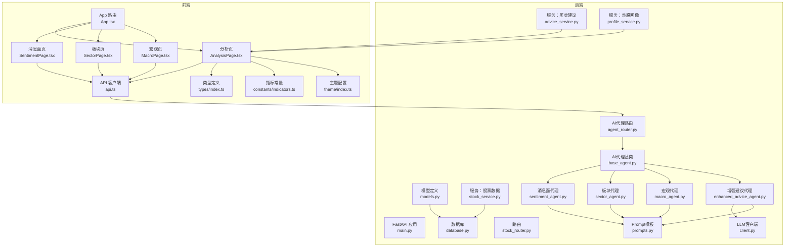

**图表来源**
- [backend/app/main.py:1-28](file://backend/app/main.py#L1-L28)
- [backend/app/db/database.py:1-24](file://backend/app/db/database.py#L1-L24)
- [backend/app/models/models.py:1-75](file://backend/app/models/models.py#L1-L75)
- [backend/app/routers/stock_router.py:1-197](file://backend/app/routers/stock_router.py#L1-L197)
- [backend/app/routers/agent_router.py:1-395](file://backend/app/routers/agent_router.py#L1-L395)
- [backend/app/agents/base_agent.py:1-119](file://backend/app/agents/base_agent.py#L1-L119)
- [backend/app/llm/client.py:1-146](file://backend/app/llm/client.py#L1-L146)
- [frontend/src/App.tsx:1-27](file://frontend/src/App.tsx#L1-L27)
- [frontend/src/pages/AnalysisPage.tsx:1-777](file://frontend/src/pages/AnalysisPage.tsx#L1-L777)
- [frontend/src/pages/SentimentPage.tsx:1-464](file://frontend/src/pages/SentimentPage.tsx#L1-L464)
- [frontend/src/pages/SectorPage.tsx:1-468](file://frontend/src/pages/SectorPage.tsx#L1-L468)
- [frontend/src/pages/MacroPage.tsx:1-256](file://frontend/src/pages/MacroPage.tsx#L1-L256)
- [frontend/src/services/api.ts:1-178](file://frontend/src/services/api.ts#L1-L178)
- [frontend/src/constants/indicators.ts:1-116](file://frontend/src/constants/indicators.ts#L1-L116)
- [frontend/src/theme/index.ts:1-116](file://frontend/src/theme/index.ts#L1-L116)

**章节来源**
- [backend/app/main.py:1-28](file://backend/app/main.py#L1-L28)
- [backend/app/db/database.py:1-24](file://backend/app/db/database.py#L1-L24)
- [backend/app/models/models.py:1-75](file://backend/app/models/models.py#L1-L75)
- [backend/app/routers/stock_router.py:1-197](file://backend/app/routers/stock_router.py#L1-L197)
- [backend/app/routers/agent_router.py:1-395](file://backend/app/routers/agent_router.py#L1-L395)
- [frontend/src/App.tsx:1-27](file://frontend/src/App.tsx#L1-L27)
- [frontend/src/pages/AnalysisPage.tsx:1-777](file://frontend/src/pages/AnalysisPage.tsx#L1-L777)
- [frontend/src/pages/SentimentPage.tsx:1-464](file://frontend/src/pages/SentimentPage.tsx#L1-L464)
- [frontend/src/pages/SectorPage.tsx:1-468](file://frontend/src/pages/SectorPage.tsx#L1-L468)
- [frontend/src/pages/MacroPage.tsx:1-256](file://frontend/src/pages/MacroPage.tsx#L1-L256)
- [frontend/src/services/api.ts:1-178](file://frontend/src/services/api.ts#L1-L178)
- [frontend/src/types/index.ts:1-174](file://frontend/src/types/index.ts#L1-L174)
- [frontend/src/constants/indicators.ts:1-116](file://frontend/src/constants/indicators.ts#L1-L116)
- [frontend/src/theme/index.ts:1-116](file://frontend/src/theme/index.ts#L1-L116)

## 核心组件
- 应用入口与中间件
  - CORS跨域配置，允许前端开发服务器访问
  - 启动事件初始化数据库表结构
- 数据库与模型
  - SQLite本地存储，包含K线缓存表、关注股票表、交易记录表、Agent结果缓存表、每日快照表
  - K线缓存表按股票代码+周期+日期建立唯一约束，确保幂等写入
  - Agent结果缓存表支持按日期和LLM使用状态的智能缓存策略
- 路由与控制器
  - 提供关注股票、历史记录、搜索、K线、分析、交易记录、炒股画像、AI代理分析等接口
  - AI代理路由支持单Agent分析和综合分析链路，具备缓存管理和快照功能
  - 分析接口串联K线获取、指标计算与买卖建议生成
- 服务层
  - K线服务：本地缓存优先、增量更新、双数据源容灾（新浪/东方财富）
  - 指标服务：基于pandas_ta计算MA、MACD、KDJ、RSI、布林带
  - 建议服务：多指标综合评分与置信度计算，输出推理过程
  - 画像服务：基于交易记录统计胜率、盈亏比、持仓偏好、情绪准确率等
  - AI代理服务：统一的Agent执行框架，支持并行执行和降级处理
- AI代理系统
  - 基础代理框架：Template Method模式，统一执行流程
  - 四大代理：消息面情绪分析、板块联动分析、宏观环境分析、增强版买卖建议
  - LLM集成：OpenAI兼容接口，支持JSON输出解析和状态监控
  - 缓存与快照：智能缓存策略，支持LLM可用性检测和降级结果处理
- 前端增强功能
  - 副图指标面板：支持MACD/KDJ/RSI三层数组网格布局
  - 技术指标常量：提供指标元数据、描述和解释函数
  - 深色主题：完整的ECharts图表主题配置

**章节来源**
- [backend/app/main.py:1-28](file://backend/app/main.py#L1-L28)
- [backend/app/db/database.py:1-24](file://backend/app/db/database.py#L1-L24)
- [backend/app/models/models.py:58-75](file://backend/app/models/models.py#L58-L75)
- [backend/app/routers/stock_router.py:80-131](file://backend/app/routers/stock_router.py#L80-L131)
- [backend/app/routers/agent_router.py:29-180](file://backend/app/routers/agent_router.py#L29-L180)
- [backend/app/agents/base_agent.py:46-119](file://backend/app/agents/base_agent.py#L46-L119)
- [backend/app/llm/client.py:17-146](file://backend/app/llm/client.py#L17-L146)
- [backend/app/services/stock_service.py:131-253](file://backend/app/services/stock_service.py#L131-L253)
- [backend/app/services/stock_service.py:255-327](file://backend/app/services/stock_service.py#L255-L327)
- [backend/app/services/advice_service.py:4-173](file://backend/app/services/advice_service.py#L4-L173)
- [backend/app/services/profile_service.py:6-97](file://backend/app/services/profile_service.py#L6-L97)
- [frontend/src/pages/AnalysisPage.tsx:61-161](file://frontend/src/pages/AnalysisPage.tsx#L61-L161)
- [frontend/src/constants/indicators.ts:1-116](file://frontend/src/constants/indicators.ts#L1-L116)
- [frontend/src/theme/index.ts:1-116](file://frontend/src/theme/index.ts#L1-L116)

## 架构总览
系统采用"双数据源容灾 + 本地缓存 + 增量更新 + AI智能分析"的综合数据获取策略，后端负责数据聚合与指标计算，前端负责可视化与交互。AI智能分析通过四大代理形成完整的分析闭环，新增的副图指标面板提供了更丰富的技术分析能力：

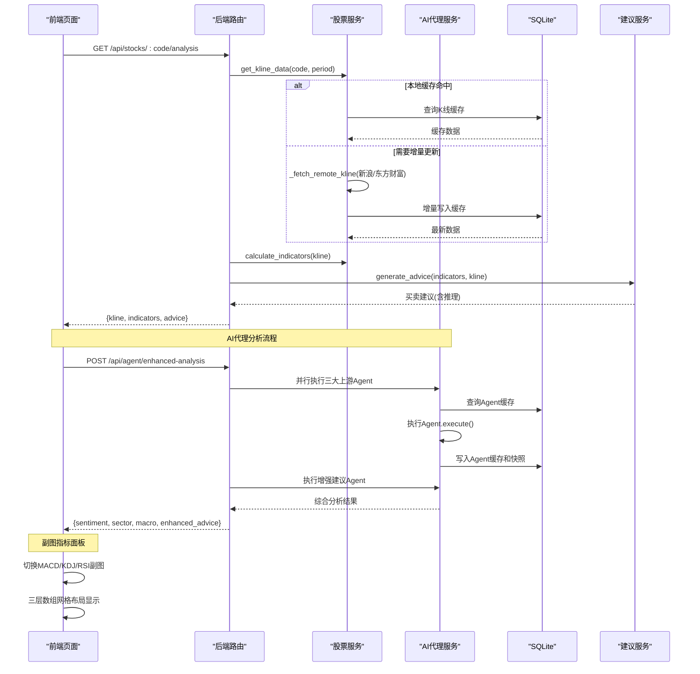

**图表来源**
- [backend/app/routers/stock_router.py:98-131](file://backend/app/routers/stock_router.py#L98-L131)
- [backend/app/routers/agent_router.py:258-354](file://backend/app/routers/agent_router.py#L258-L354)
- [backend/app/services/stock_service.py:131-253](file://backend/app/services/stock_service.py#L131-L253)
- [backend/app/services/stock_service.py:255-327](file://backend/app/services/stock_service.py#L255-L327)
- [backend/app/services/advice_service.py:4-173](file://backend/app/services/advice_service.py#L4-L173)
- [frontend/src/pages/AnalysisPage.tsx:254-300](file://frontend/src/pages/AnalysisPage.tsx#L254-L300)

## 详细组件分析

### K线数据获取与缓存机制
- 本地缓存策略
  - 按股票代码+周期查询缓存，合并返回
  - 若缓存最后日期距今天小于等于1天且数据长度≥60，则直接返回缓存
- 增量更新算法
  - 计算缓存最后日期与当前日期差，超过阈值则拉取远程数据
  - 仅插入本地缺失日期，当日数据允许覆盖更新
- 多数据源备份方案
  - 主数据源：新浪财经（JSONP）
  - 备用数据源：AKShare（东方财富）按起止日期拉取
  - 失败回退与重试：带指数退避的重试包装
- 错误处理
  - 远程失败但有缓存时返回缓存；否则抛出错误

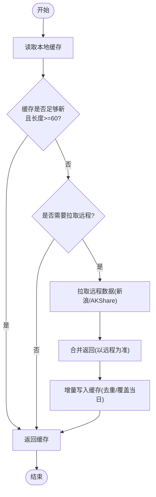

**图表来源**
- [backend/app/services/stock_service.py:153-237](file://backend/app/services/stock_service.py#L153-L237)
- [backend/app/services/stock_service.py:240-253](file://backend/app/services/stock_service.py#L240-L253)

**章节来源**
- [backend/app/services/stock_service.py:131-253](file://backend/app/services/stock_service.py#L131-L253)
- [backend/app/models/models.py:58-75](file://backend/app/models/models.py#L58-L75)

### 技术指标计算实现
- 输入数据：K线序列（开高低收、成交量）
- 计算库：pandas_ta
- 指标清单与参数
  - 均线：MA5/MA10/MA20/MA60（简单移动平均）
  - MACD：快线12、慢线26、信号9
  - KDJ：周期9、平滑3
  - RSI：周期14
  - 布林带：周期20、标准差2
- 输出格式：将Series转换为列表，NaN转为None，便于前端渲染

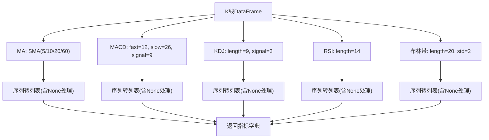

**图表来源**
- [backend/app/services/stock_service.py:255-327](file://backend/app/services/stock_service.py#L255-L327)

**章节来源**
- [backend/app/services/stock_service.py:255-327](file://backend/app/services/stock_service.py#L255-L327)

### 买卖建议生成算法
- 综合评分范围：-1.5 ~ +1.5
- 信号规则
  - MACD：金叉+1.5、多头排列+0.5；死叉-1.5、空头排列-0.5
  - KDJ：超卖区+1.0；超买区-1.0；K>D+0.3；K<D-0.3
  - RSI：超卖+1.0；超买-1.0
  - 均线：多头排列+1.0；空头排列-1.0
  - 布林带：触及下轨+0.8；触及上轨-0.8
- 综合判断
  - 平均分>0.3：买入；< -0.3：卖出；否则：持有
  - 置信度=MIN(|平均分|/1.5, 1.0)
  - 输出包含推理过程与指标摘要

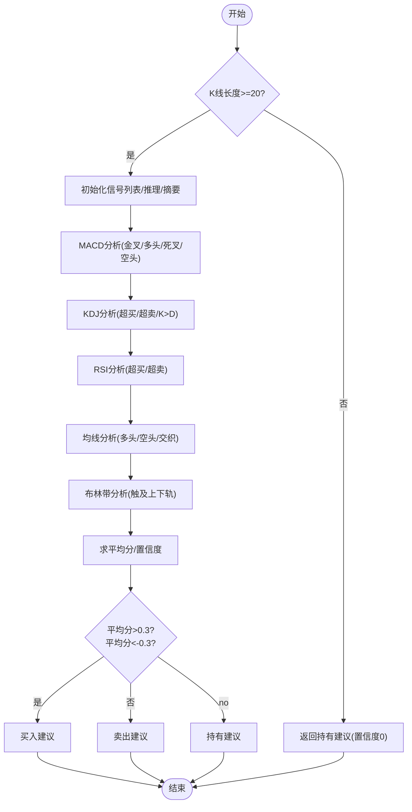

**图表来源**
- [backend/app/services/advice_service.py:4-173](file://backend/app/services/advice_service.py#L4-L173)

**章节来源**
- [backend/app/services/advice_service.py:4-173](file://backend/app/services/advice_service.py#L4-L173)

### 副图指标面板与三层数组网格布局

#### 副图指标面板架构
新增的副图指标面板功能实现了MACD/KDJ/RSI三种技术指标的独立显示，采用三层数组网格布局，提供更精细的技术分析能力：

- **MACD副图**：包含DIF、DEA、MACD柱三线显示，支持超买超卖区域标记
- **KDJ副图**：包含K、D、J三条线，内置20/80超买超卖线
- **RSI副图**：单线显示，内置30/70超买超卖线
- **网格布局**：三层独立网格，每层对应一个副图指标

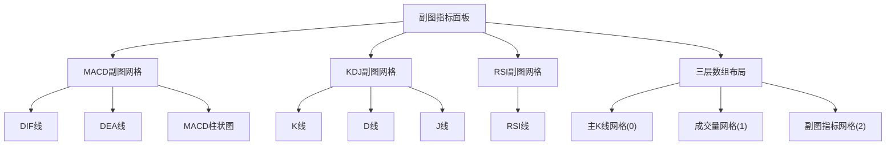

**图表来源**
- [frontend/src/pages/AnalysisPage.tsx:254-300](file://frontend/src/pages/AnalysisPage.tsx#L254-L300)
- [frontend/src/pages/AnalysisPage.tsx:366-389](file://frontend/src/pages/AnalysisPage.tsx#L366-L389)

#### 技术指标元数据系统
新增的技术指标常量系统提供了完整的指标描述和解释功能：

- **指标元数据**：包含标签、描述和解释函数
- **MACD解释**：基于DIF/DEA关系的多空判断
- **KDJ解释**：基于K/D/J值的超买超卖分析
- **RSI解释**：基于RSI值的市场情绪判断
- **均线解释**：基于股价与均线位置的关系分析

**章节来源**
- [frontend/src/pages/AnalysisPage.tsx:254-300](file://frontend/src/pages/AnalysisPage.tsx#L254-L300)
- [frontend/src/pages/AnalysisPage.tsx:366-389](file://frontend/src/pages/AnalysisPage.tsx#L366-L389)
- [frontend/src/constants/indicators.ts:1-116](file://frontend/src/constants/indicators.ts#L1-L116)

### AI代理分析系统

#### AI代理基础框架
- 模板方法模式：统一的执行流程，子类只需实现特定方法
- 统一返回结构：AgentResult包含状态、数据、LLM使用标记、时间戳和错误信息
- 执行流程：数据获取 → LLM分析 → 降级处理 → 缓存写入
- 降级机制：LLM不可用时自动回退到传统分析逻辑

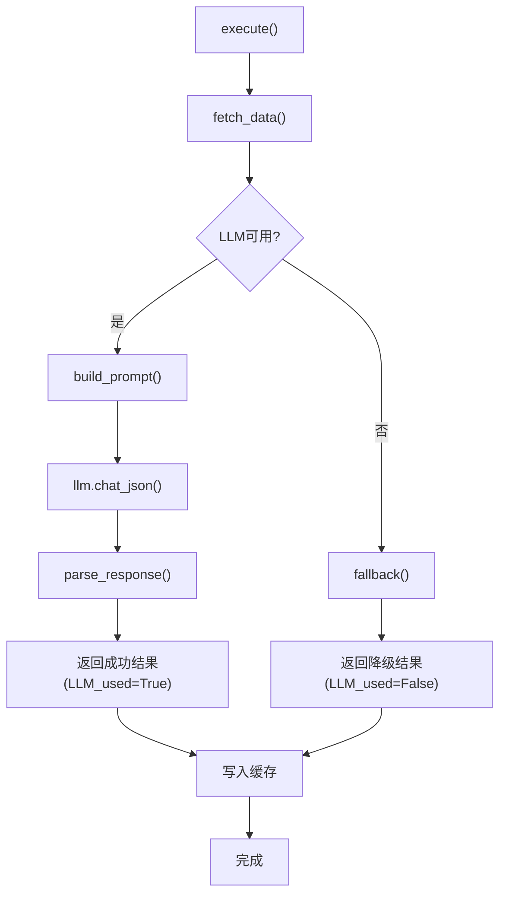

**图表来源**
- [backend/app/agents/base_agent.py:62-102](file://backend/app/agents/base_agent.py#L62-L102)

#### 消息面情绪分析代理
- 数据来源：新闻、公告、研报、公司资料、经营数据、股东信息
- 分析维度：整体情绪评分(-1~1)、情绪标签、关键新闻、噪音比例
- 输出结构：包含情绪分析摘要、关键新闻列表、原始新闻数量
- 降级处理：展示原始数据而非AI分析结果

**章节来源**
- [backend/app/agents/sentiment_agent.py:1-91](file://backend/app/agents/sentiment_agent.py#L1-L91)
- [backend/app/llm/prompts.py:12-106](file://backend/app/llm/prompts.py#L12-L106)

#### 板块联动分析代理
- 数据来源：行业估值、主力资金流向、行业财务、概念板块、同行对比
- 分析维度：板块名称、走势趋势、相对强度、轮动信号、行业排名
- 输出结构：包含板块分析摘要、相关概念、前十大同行
- 降级处理：返回默认的未知板块信息

**章节来源**
- [backend/app/agents/sector_agent.py:1-85](file://backend/app/agents/sector_agent.py#L1-L85)
- [backend/app/llm/prompts.py:113-173](file://backend/app/llm/prompts.py#L113-L173)

#### 宏观环境分析代理
- 数据来源：指数行情、资金流向、宏观经济指标
- 分析维度：市场阶段、市场情绪、风险等级、关键指标
- 输出结构：包含宏观分析摘要、主要指数行情、风险评估
- 降级处理：提取原始数据中的关键信息进行展示

**章节来源**
- [backend/app/agents/macro_agent.py:1-81](file://backend/app/agents/macro_agent.py#L1-L81)
- [backend/app/llm/prompts.py:180-233](file://backend/app/llm/prompts.py#L180-L233)

#### 增强版买卖建议代理
- 综合分析：融合技术面、消息面、板块、宏观、基本面五个维度
- 输出增强：包含维度评分、风险警告、仓位建议、总结
- 个性化：结合用户炒股画像和当前持仓情况
- 降级处理：返回纯技术指标建议和默认维度评分

**章节来源**
- [backend/app/agents/enhanced_advice_agent.py:1-129](file://backend/app/agents/enhanced_advice_agent.py#L1-L129)
- [backend/app/llm/prompts.py:240-357](file://backend/app/llm/prompts.py#L240-L357)

#### LLM客户端与Prompt管理
- OpenAI兼容：支持任意OpenAI兼容的模型服务
- 功能特性：JSON输出解析、重试机制、状态监控、配置热重载
- Prompt模板：针对不同Agent的专用Prompt，确保输出结构化
- 安全处理：API Key脱敏显示，支持禁用LLM功能

**章节来源**
- [backend/app/llm/client.py:17-146](file://backend/app/llm/client.py#L17-L146)
- [backend/app/llm/prompts.py:1-358](file://backend/app/llm/prompts.py#L1-L358)

### AI代理路由与缓存管理

#### 综合分析流程
- 缓存优先：优先查询Agent缓存，命中则直接返回
- 并行执行：三大上游Agent并行运行，提高响应速度
- 智能缓存：支持LLM可用性检测，避免降级结果污染
- 快照功能：抽取关键指标写入每日快照表

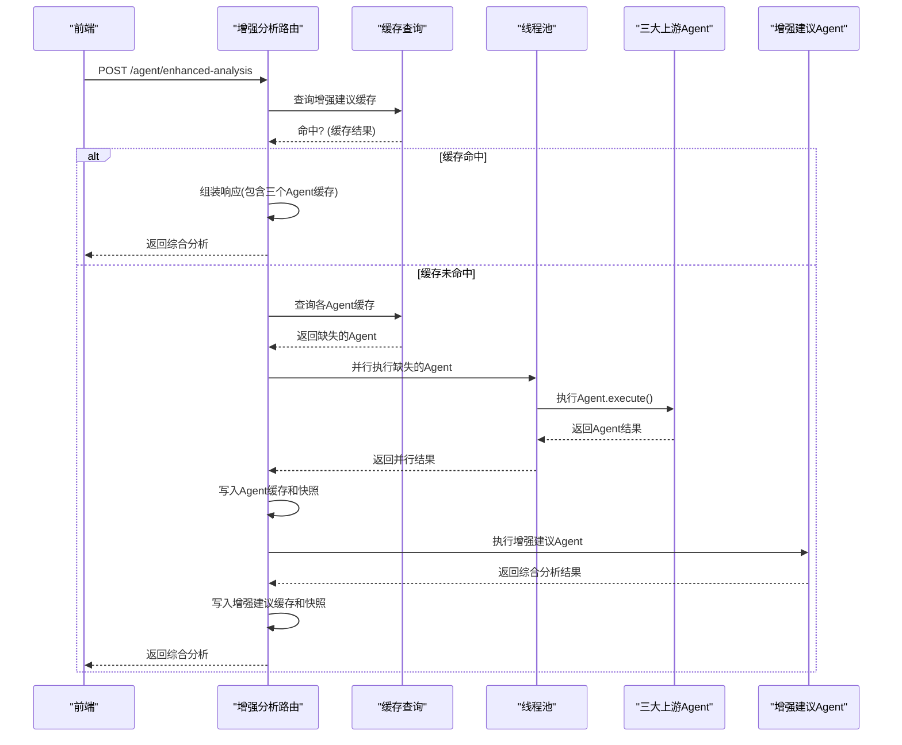

**图表来源**
- [backend/app/routers/agent_router.py:258-354](file://backend/app/routers/agent_router.py#L258-L354)

#### 缓存策略
- 时间边界：以09:00为边界，09:00之后的缓存才视为新鲜
- LLM检测：LLM可用但缓存为降级结果时强制重新分析
- 快照管理：每日仅保留最新的一条Agent快照
- 清理机制：支持按股票代码清理Agent缓存和数据源缓存

**章节来源**
- [backend/app/routers/agent_router.py:36-180](file://backend/app/routers/agent_router.py#L36-L180)

### 技术分析图表展示与交互
- 图表组件：ECharts for React
- K线图配置
  - 蜡烛图：OHLC颜色区分涨跌
  - 均线叠加：MA5/MA10/MA20/MA60（可选）
  - 成交量：红绿柱区分涨跌
  - 副图：MACD/KDJ/RSI（已实现三层数组网格布局）
- 交互体验
  - 周期切换：日K/周K/月K
  - 缩放：内置缩放与滑块缩放
  - 建议展示：信号标签与置信度百分比
  - 推理过程：逐条Alert展示
  - 副图切换：通过Segmented组件切换MACD/KDJ/RSI副图

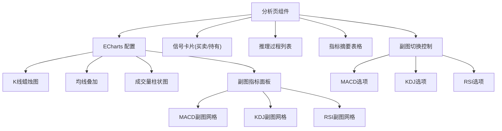

**图表来源**
- [frontend/src/pages/AnalysisPage.tsx:514-538](file://frontend/src/pages/AnalysisPage.tsx#L514-L538)
- [frontend/src/pages/AnalysisPage.tsx:254-300](file://frontend/src/pages/AnalysisPage.tsx#L254-L300)
- [frontend/src/pages/AnalysisPage.tsx:366-389](file://frontend/src/pages/AnalysisPage.tsx#L366-L389)

**章节来源**
- [frontend/src/pages/AnalysisPage.tsx:1-777](file://frontend/src/pages/AnalysisPage.tsx#L1-L777)
- [frontend/src/services/api.ts:33-44](file://frontend/src/services/api.ts#L33-L44)

### AI代理页面与交互体验

#### 消息面情绪分析页面
- 实时数据：支持刷新按钮和缓存时间显示
- 多源信息：新闻、公告、研报、公司资料、股东信息
- 情绪可视化：情绪图标、评分、标签、噪音比例
- 关键新闻：AI筛选的重点新闻列表
- 公司资料：基本资料、经营数据、股东信息表格

**章节来源**
- [frontend/src/pages/SentimentPage.tsx:1-464](file://frontend/src/pages/SentimentPage.tsx#L1-L464)

#### 板块联动分析页面
- 板块概览：板块名称、走势趋势、轮动信号、行业排名
- 指标展示：相对强度、PE/PB/ROE、主力资金流向
- 数据详情：行业概况、资金流向、行业财务
- 关联分析：同行对比、相关概念板块
- 实时刷新：支持独立数据源的刷新操作

**章节来源**
- [frontend/src/pages/SectorPage.tsx:1-468](file://frontend/src/pages/SectorPage.tsx#L1-L468)

#### 宏观环境分析页面
- 市场概览：市场阶段、市场情绪、风险等级
- 指数行情：主要指数的实时行情和涨跌幅
- 关键指标：CPI、PMI、LPR等宏观经济指标
- 影响分析：对个股的具体影响评估
- 数据刷新：支持指数数据的独立刷新

**章节来源**
- [frontend/src/pages/MacroPage.tsx:1-256](file://frontend/src/pages/MacroPage.tsx#L1-L256)

### 数据模型与类型定义
- 后端模型
  - FocusStock：当前关注股票（时间框架、激活状态）
  - TradeRecord：交易记录（类型、价格、数量、理由、情绪、目标价、持有周期、结果）
  - KlineCache：K线本地缓存（唯一约束：股票+周期+日期）
  - AgentResultCache：AI代理结果缓存（支持LLM使用状态）
  - DailyAgentSnapshot：每日Agent快照（关键指标聚合）
- 前端类型
  - FocusStock、StockSearchResult、KlineData、TechnicalIndicators、TradingAdvice、StockAnalysis、TradeRecord、TradeRecordCreate、TradingProfile
  - AgentResult、EnhancedAnalysis、LLMStatus、AgentSnapshot
  - 技术指标类型：包含MACD、KDJ、RSI等副图指标数据结构
- 路由响应模型
  - FocusStockResponse、TradeRecordResponse、TechnicalIndicators、TradingAdvice、StockKlineResponse、TradingProfile

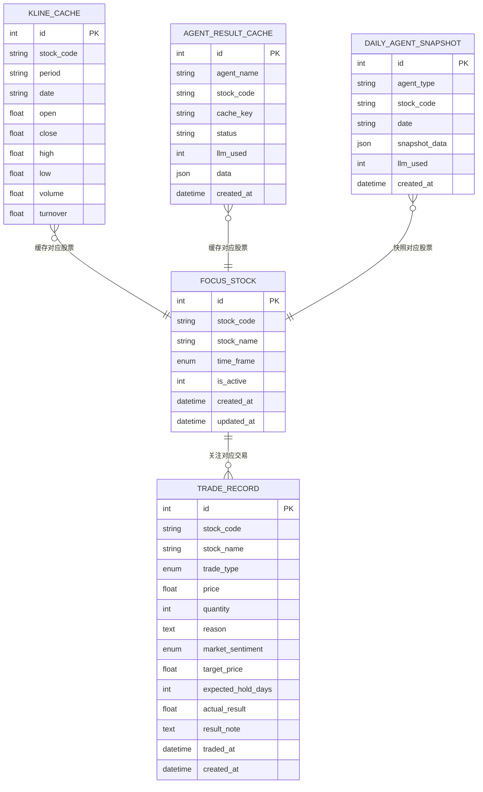

**图表来源**
- [backend/app/models/models.py:25-75](file://backend/app/models/models.py#L25-L75)

**章节来源**
- [backend/app/models/models.py:1-75](file://backend/app/models/models.py#L1-L75)
- [frontend/src/types/index.ts:1-174](file://frontend/src/types/index.ts#L1-L174)

## 依赖关系分析
- 组件耦合
  - 路由器依赖服务层（股票服务、建议服务、画像服务、AI代理服务）
  - 股票服务依赖数据库模型与第三方库（akshare、pandas_ta、requests）
  - AI代理服务依赖LLM客户端和Prompt模板
  - 建议服务与指标计算解耦，便于独立演进
  - 前端通过API客户端与后端交互，类型定义保持一致
  - 副图指标面板依赖技术指标常量系统和主题配置
- 外部依赖
  - FastAPI、SQLAlchemy、pandas_ta、ECharts for React、Axios、httpx
- 潜在循环依赖
  - 未发现直接循环导入；服务间通过函数调用解耦

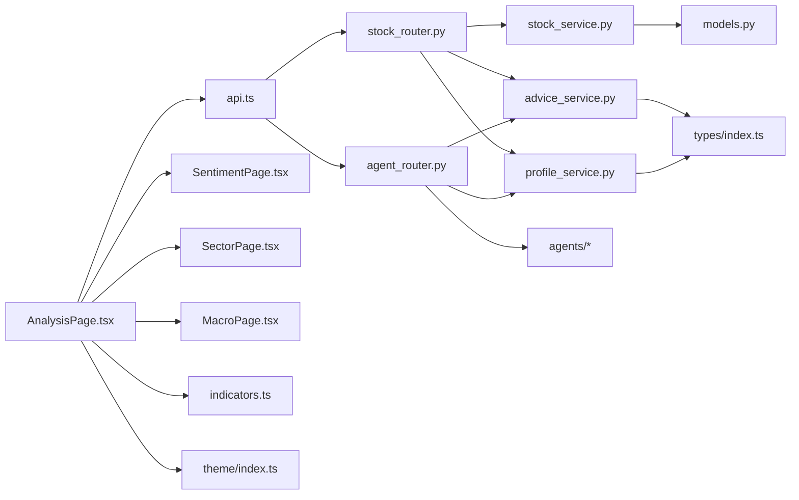

**图表来源**
- [backend/app/routers/stock_router.py:1-197](file://backend/app/routers/stock_router.py#L1-L197)
- [backend/app/routers/agent_router.py:1-395](file://backend/app/routers/agent_router.py#L1-L395)
- [backend/app/services/stock_service.py:1-327](file://backend/app/services/stock_service.py#L1-L327)
- [backend/app/services/advice_service.py:1-193](file://backend/app/services/advice_service.py#L1-L193)
- [backend/app/services/profile_service.py:1-114](file://backend/app/services/profile_service.py#L1-L114)
- [frontend/src/pages/AnalysisPage.tsx:1-777](file://frontend/src/pages/AnalysisPage.tsx#L1-L777)
- [frontend/src/pages/SentimentPage.tsx:1-464](file://frontend/src/pages/SentimentPage.tsx#L1-L464)
- [frontend/src/pages/SectorPage.tsx:1-468](file://frontend/src/pages/SectorPage.tsx#L1-L468)
- [frontend/src/pages/MacroPage.tsx:1-256](file://frontend/src/pages/MacroPage.tsx#L1-L256)
- [frontend/src/services/api.ts:1-178](file://frontend/src/services/api.ts#L1-L178)
- [frontend/src/types/index.ts:1-174](file://frontend/src/types/index.ts#L1-L174)
- [frontend/src/constants/indicators.ts:1-116](file://frontend/src/constants/indicators.ts#L1-L116)
- [frontend/src/theme/index.ts:1-116](file://frontend/src/theme/index.ts#L1-L116)

**章节来源**
- [backend/app/routers/stock_router.py:1-197](file://backend/app/routers/stock_router.py#L1-L197)
- [backend/app/routers/agent_router.py:1-395](file://backend/app/routers/agent_router.py#L1-L395)
- [backend/app/services/stock_service.py:1-327](file://backend/app/services/stock_service.py#L1-L327)
- [frontend/src/services/api.ts:1-178](file://frontend/src/services/api.ts#L1-L178)

## 性能考量
- 响应时间
  - 缓存命中时响应极快（文档说明约0.18秒）
  - 增量更新仅写入缺失日期，避免全量重拉
  - AI代理并行执行，减少总体等待时间
  - 副图指标面板采用三层数组布局，优化渲染性能
- 数据量与渲染
  - ECharts渲染大量K线点时注意内存与渲染性能，建议合理设置dataZoom初始范围
  - 指标序列含大量None值，前端渲染时需处理空值
  - AI代理输出JSON较大，注意前端渲染性能
  - 副图指标数据量适中，三层数组布局避免过度拥挤
- 网络与限流
  - 东方财富API存在限流，系统通过新浪主数据源规避
  - 远程失败时优先返回缓存，保证离线可用性
  - LLM调用支持重试机制，避免单次失败影响整体性能

## 故障排查指南
- 后端启动
  - 使用启动脚本检查依赖安装与进程PID，确认端口占用
- 接口异常
  - K线获取失败：检查网络与数据源可用性，确认重试与回退逻辑
  - 分析接口返回错误：查看HTTP异常详情，定位具体服务层错误
  - AI代理失败：检查LLM配置状态，确认API Key和模型可用性
- 前端加载
  - 无数据：确认已设置关注股票并选择正确周期
  - 图表空白：检查指标序列是否为空或全部为None
  - AI页面空白：检查Agent缓存状态，确认LLM可用性
  - 副图指标异常：检查subIndicator状态和指标数据完整性
- 数据一致性
  - 缓存未更新：确认最后缓存日期与当前日期差是否满足阈值
  - 重复数据：检查唯一约束与去重逻辑
  - Agent缓存异常：使用清理缓存接口清除失效数据

**章节来源**
- [start.sh:1-113](file://start.sh#L1-L113)
- [stop.sh:1-56](file://stop.sh#L1-L56)
- [backend/app/routers/stock_router.py:90-96](file://backend/app/routers/stock_router.py#L90-L96)
- [backend/app/routers/agent_router.py:384-395](file://backend/app/routers/agent_router.py#L384-L395)
- [backend/app/services/stock_service.py:240-253](file://backend/app/services/stock_service.py#L240-L253)
- [frontend/src/pages/AnalysisPage.tsx:35-48](file://frontend/src/pages/AnalysisPage.tsx#L35-L48)

## 结论
本系统以简洁可靠的架构实现了从K线缓存、增量更新到技术指标计算与买卖建议生成的全流程。通过双数据源容灾与SQLite本地缓存，兼顾了稳定性与性能；前端以ECharts实现直观的K线与指标叠加展示。

**更新** 新增的副图指标面板功能显著增强了技术分析能力，实现MACD/KDJ/RSI三层数组网格布局，为用户提供更精细的技术分析工具。新增的AI代理分析系统进一步提升了分析能力，通过消息面、板块、宏观三个维度的智能分析，配合增强版买卖建议，形成了完整的多维度智能决策体系。统一的Agent框架确保了扩展性和维护性，为后续的功能迭代奠定了坚实基础。

## 附录
- 启动与停止
  - 后端：uvicorn服务监听127.0.0.1:8000
  - 前端：Vite开发服务器监听127.0.0.1:5173
- 文档参考
  - 产品设计文档：功能模块、版本规划与技术选型
  - AI代理集成：多Agent协同分析架构设计
  - 副图指标面板：三层数组网格布局设计

**章节来源**
- [start.sh:46-87](file://start.sh#L46-L87)
- [doc/产品设计文档.md:1-288](file://doc/产品设计文档.md#L1-L288)