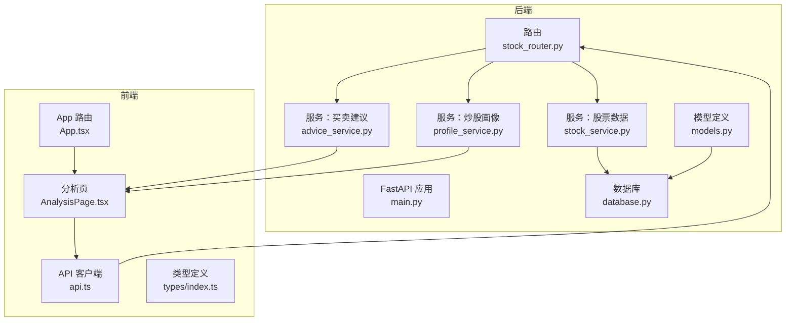
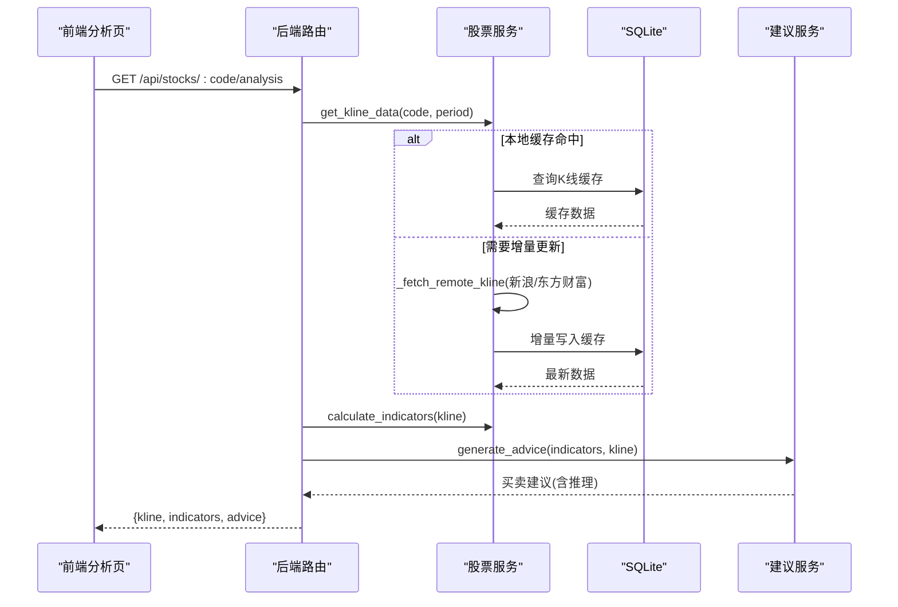
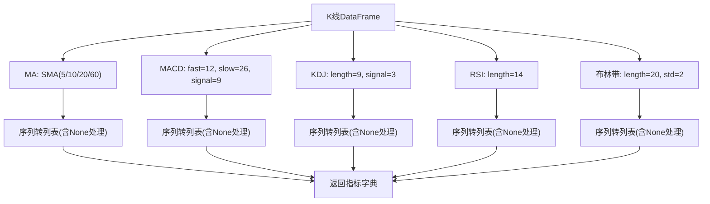
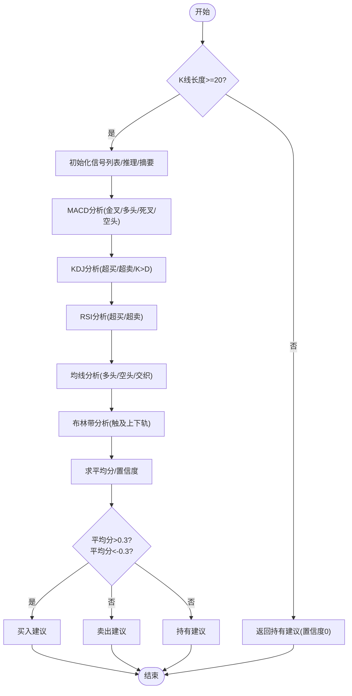
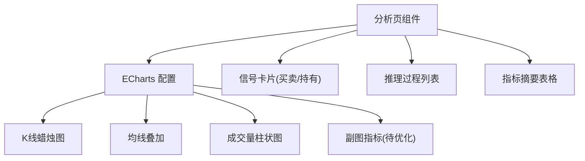
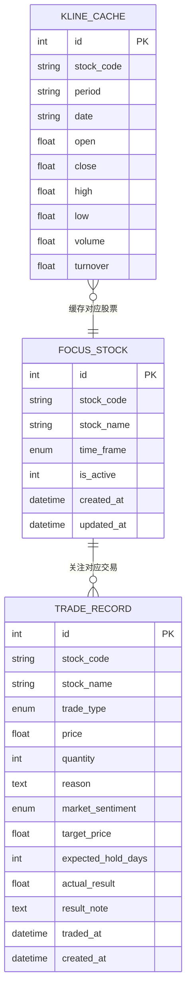
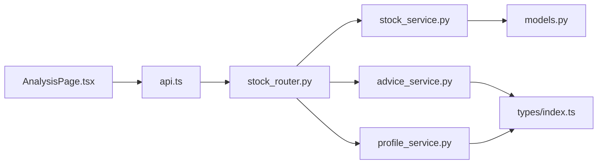

# 技术面分析系统

<cite>
**本文引用的文件**

- [backend/app/main.py](file://backend/app/main.py)

- [backend/app/db/database.py](file://backend/app/db/database.py)

- [backend/app/models/models.py](file://backend/app/models/models.py)

- [backend/app/routers/stock_router.py](file://backend/app/routers/stock_router.py)

- [backend/app/services/stock_service.py](file://backend/app/services/stock_service.py)

- [backend/app/services/advice_service.py](file://backend/app/services/advice_service.py)

- [backend/app/services/profile_service.py](file://backend/app/services/profile_service.py)

- [frontend/src/App.tsx](file://frontend/src/App.tsx)

- [frontend/src/pages/AnalysisPage.tsx](file://frontend/src/pages/AnalysisPage.tsx)

- [frontend/src/services/api.ts](file://frontend/src/services/api.ts)

- [frontend/src/types/index.ts](file://frontend/src/types/index.ts)

- [doc/MVP实现说明.md](file://doc/MVP实现说明.md)

- [doc/产品设计文档.md](file://doc/产品设计文档.md)

- [start.sh](file://start.sh)

- [stop.sh](file://stop.sh)
</cite>

## 目录
1. [简介](#简介)

2. [项目结构](#项目结构)

3. [核心组件](#核心组件)

4. [架构总览](#架构总览)

5. [详细组件分析](#详细组件分析)

6. [依赖关系分析](#依赖关系分析)

7. [性能考量](#性能考量)

8. [故障排查指南](#故障排查指南)

9. [结论](#结论)

10. [附录](#附录)

## 简介
本技术面分析系统围绕“单股票聚焦、数据驱动、自我进化”的理念构建，提供从K线数据获取、本地缓存与增量更新、技术指标计算到买卖建议生成与可视化展示的完整闭环。系统采用前后端分离架构：后端基于FastAPI与SQLite，前端基于React+ECharts，支持日K/周K/月K蜡烛图叠加均线、成交量及MACD/KDJ/RSI等副图指标展示，并输出可解释的买卖建议与炒股画像。

## 项目结构
- 后端

  - 应用入口与中间件：FastAPI应用、CORS、数据库初始化

  - 数据库：SQLAlchemy引擎、会话管理、模型定义

  - 路由器：股票关注、搜索、K线与分析、交易记录、炒股画像

  - 服务层：K线数据获取与缓存、技术指标计算、买卖建议生成、炒股画像生成

- 前端

  - 路由与布局：React Router、Ant Design主题

  - 页面：分析页（K线图与建议展示）、交易页、画像页

  - 服务：Axios封装的REST API客户端

  - 类型：前后端统一的数据结构定义

**图表来源**

- [backend/app/main.py:1-28](file://backend/app/main.py#L1-L28)

- [backend/app/db/database.py:1-24](file://backend/app/db/database.py#L1-L24)

- [backend/app/models/models.py:1-75](file://backend/app/models/models.py#L1-L75)

- [backend/app/routers/stock_router.py:1-197](file://backend/app/routers/stock_router.py#L1-L197)

- [backend/app/services/stock_service.py:1-327](file://backend/app/services/stock_service.py#L1-L327)

- [backend/app/services/advice_service.py:1-193](file://backend/app/services/advice_service.py#L1-L193)

- [backend/app/services/profile_service.py:1-114](file://backend/app/services/profile_service.py#L1-L114)

- [frontend/src/App.tsx:1-27](file://frontend/src/App.tsx#L1-L27)

- [frontend/src/pages/AnalysisPage.tsx:1-213](file://frontend/src/pages/AnalysisPage.tsx#L1-L213)

- [frontend/src/services/api.ts:1-68](file://frontend/src/services/api.ts#L1-L68)

- [frontend/src/types/index.ts:1-94](file://frontend/src/types/index.ts#L1-L94)

**章节来源**

- [backend/app/main.py:1-28](file://backend/app/main.py#L1-L28)

- [backend/app/db/database.py:1-24](file://backend/app/db/database.py#L1-L24)

- [backend/app/models/models.py:1-75](file://backend/app/models/models.py#L1-L75)

- [backend/app/routers/stock_router.py:1-197](file://backend/app/routers/stock_router.py#L1-L197)

- [frontend/src/App.tsx:1-27](file://frontend/src/App.tsx#L1-L27)

- [frontend/src/pages/AnalysisPage.tsx:1-213](file://frontend/src/pages/AnalysisPage.tsx#L1-L213)

- [frontend/src/services/api.ts:1-68](file://frontend/src/services/api.ts#L1-L68)

- [frontend/src/types/index.ts:1-94](file://frontend/src/types/index.ts#L1-L94)

## 核心组件
- 应用入口与中间件

  - CORS跨域配置，允许前端开发服务器访问

  - 启动事件初始化数据库表结构

- 数据库与模型

  - SQLite本地存储，包含K线缓存表、关注股票表、交易记录表

  - K线缓存表按股票代码+周期+日期建立唯一约束，确保幂等写入

- 路由与控制器

  - 提供关注股票、历史记录、搜索、K线、分析、交易记录、炒股画像等接口

  - 分析接口串联K线获取、指标计算与买卖建议生成

- 服务层

  - K线服务：本地缓存优先、增量更新、双数据源容灾（新浪/东方财富）

  - 指标服务：基于pandas_ta计算MA、MACD、KDJ、RSI、布林带

  - 建议服务：多指标综合评分与置信度计算，输出推理过程

  - 画像服务：基于交易记录统计胜率、盈亏比、持仓偏好、情绪准确率等

**章节来源**

- [backend/app/main.py:1-28](file://backend/app/main.py#L1-L28)

- [backend/app/db/database.py:1-24](file://backend/app/db/database.py#L1-L24)

- [backend/app/models/models.py:58-75](file://backend/app/models/models.py#L58-L75)

- [backend/app/routers/stock_router.py:80-131](file://backend/app/routers/stock_router.py#L80-L131)

- [backend/app/services/stock_service.py:131-253](file://backend/app/services/stock_service.py#L131-L253)

- [backend/app/services/stock_service.py:255-327](file://backend/app/services/stock_service.py#L255-L327)

- [backend/app/services/advice_service.py:4-173](file://backend/app/services/advice_service.py#L4-L173)

- [backend/app/services/profile_service.py:6-97](file://backend/app/services/profile_service.py#L6-L97)

## 架构总览
系统采用“双数据源容灾 + 本地缓存 + 增量更新”的数据获取策略，后端负责数据聚合与指标计算，前端负责可视化与交互。分析流程如下：

**图表来源**

- [backend/app/routers/stock_router.py:98-131](file://backend/app/routers/stock_router.py#L98-L131)

- [backend/app/services/stock_service.py:131-253](file://backend/app/services/stock_service.py#L131-L253)

- [backend/app/services/stock_service.py:255-327](file://backend/app/services/stock_service.py#L255-L327)

- [backend/app/services/advice_service.py:4-173](file://backend/app/services/advice_service.py#L4-L173)

## 详细组件分析

### K线数据获取与缓存机制
- 本地缓存策略

  - 按股票代码+周期查询缓存，合并返回

  - 若缓存最后日期距今天小于等于1天且数据长度≥60，则直接返回缓存

- 增量更新算法

  - 计算缓存最后日期与当前日期差，超过阈值则拉取远程数据

  - 仅插入本地缺失日期，当日数据允许覆盖更新

- 多数据源备份方案

  - 主数据源：新浪财经（JSONP）

  - 备用数据源：AKShare（东方财富）按起止日期拉取

  - 失败回退与重试：带指数退避的重试包装

- 错误处理

  - 远程失败但有缓存时返回缓存；否则抛出错误

**图表来源**

- [backend/app/services/stock_service.py:153-237](file://backend/app/services/stock_service.py#L153-L237)

- [backend/app/services/stock_service.py:240-253](file://backend/app/services/stock_service.py#L240-L253)

**章节来源**

- [backend/app/services/stock_service.py:131-253](file://backend/app/services/stock_service.py#L131-L253)

- [backend/app/models/models.py:58-75](file://backend/app/models/models.py#L58-L75)

- [doc/MVP实现说明.md:43-63](file://doc/MVP实现说明.md#L43-L63)

### 技术指标计算实现
- 输入数据：K线序列（开高低收、成交量）

- 计算库：pandas_ta

- 指标清单与参数

  - 均线：MA5/MA10/MA20/MA60（简单移动平均）

  - MACD：快线12、慢线26、信号9

  - KDJ：周期9、平滑3

  - RSI：周期14

  - 布林带：周期20、标准差2

- 输出格式：将Series转换为列表，NaN转为None，便于前端渲染

**图表来源**

- [backend/app/services/stock_service.py:255-327](file://backend/app/services/stock_service.py#L255-L327)

**章节来源**

- [backend/app/services/stock_service.py:255-327](file://backend/app/services/stock_service.py#L255-L327)

- [doc/MVP实现说明.md:27-42](file://doc/MVP实现说明.md#L27-L42)

### 买卖建议生成算法
- 综合评分范围：-1.5 ~ +1.5

- 信号规则

  - MACD：金叉+1.5、多头排列+0.5；死叉-1.5、空头排列-0.5

  - KDJ：超卖区+1.0；超买区-1.0；K>D+0.3；K<D-0.3

  - RSI：超卖+1.0；超买-1.0

  - 均线：多头排列+1.0；空头排列-1.0

  - 布林带：触及下轨+0.8；触及上轨-0.8

- 综合判断

  - 平均分>0.3：买入；< -0.3：卖出；否则：持有

  - 置信度=MIN(|平均分|/1.5, 1.0)

  - 输出包含推理过程与指标摘要

**图表来源**

- [backend/app/services/advice_service.py:4-173](file://backend/app/services/advice_service.py#L4-L173)

**章节来源**

- [backend/app/services/advice_service.py:4-173](file://backend/app/services/advice_service.py#L4-L173)

- [doc/MVP实现说明.md:27-42](file://doc/MVP实现说明.md#L27-L42)

### 技术分析图表展示与交互
- 图表组件：ECharts for React

- K线图配置

  - 蜡烛图：OHLC颜色区分涨跌

  - 均线叠加：MA5/MA10/MA20/MA60（可选）

  - 成交量：红绿柱区分涨跌

  - 副图：MACD/KDJ/RSI（数值已计算，但当前仅叠加均线，副图面板待优化）

- 交互体验

  - 周期切换：日K/周K/月K

  - 缩放：内置缩放与滑块缩放

  - 建议展示：信号标签与置信度百分比

  - 推理过程：逐条Alert展示

**图表来源**

- [frontend/src/pages/AnalysisPage.tsx:54-157](file://frontend/src/pages/AnalysisPage.tsx#L54-L157)

- [frontend/src/pages/AnalysisPage.tsx:162-211](file://frontend/src/pages/AnalysisPage.tsx#L162-L211)

**章节来源**

- [frontend/src/pages/AnalysisPage.tsx:1-213](file://frontend/src/pages/AnalysisPage.tsx#L1-L213)

- [frontend/src/services/api.ts:33-44](file://frontend/src/services/api.ts#L33-L44)

- [doc/MVP实现说明.md:84](file://doc/MVP实现说明.md#L84)

### 数据模型与类型定义
- 后端模型

  - FocusStock：当前关注股票（时间框架、激活状态）

  - TradeRecord：交易记录（类型、价格、数量、理由、情绪、目标价、持有周期、结果）

  - KlineCache：K线本地缓存（唯一约束：股票+周期+日期）

- 前端类型

  - FocusStock、StockSearchResult、KlineData、TechnicalIndicators、TradingAdvice、StockAnalysis、TradeRecord、TradeRecordCreate、TradingProfile

- 路由响应模型

  - FocusStockResponse、TradeRecordResponse、TechnicalIndicators、TradingAdvice、StockKlineResponse、TradingProfile

**图表来源**

- [backend/app/models/models.py:25-75](file://backend/app/models/models.py#L25-L75)

**章节来源**

- [backend/app/models/models.py:1-75](file://backend/app/models/models.py#L1-L75)

- [frontend/src/types/index.ts:1-94](file://frontend/src/types/index.ts#L1-L94)

- [backend/app/models/schemas.py:1-118](file://backend/app/models/schemas.py#L1-L118)

## 依赖关系分析
- 组件耦合

  - 路由器依赖服务层（股票服务、建议服务、画像服务）

  - 股票服务依赖数据库模型与第三方库（akshare、pandas_ta、requests）

  - 建议服务与指标计算解耦，便于独立演进

  - 前端通过API客户端与后端交互，类型定义保持一致

- 外部依赖

  - FastAPI、SQLAlchemy、pandas_ta、ECharts for React、Axios

- 潜在循环依赖

  - 未发现直接循环导入；服务间通过函数调用解耦

**图表来源**

- [backend/app/routers/stock_router.py:1-197](file://backend/app/routers/stock_router.py#L1-L197)

- [backend/app/services/stock_service.py:1-327](file://backend/app/services/stock_service.py#L1-L327)

- [backend/app/services/advice_service.py:1-193](file://backend/app/services/advice_service.py#L1-L193)

- [backend/app/services/profile_service.py:1-114](file://backend/app/services/profile_service.py#L1-L114)

- [frontend/src/pages/AnalysisPage.tsx:1-213](file://frontend/src/pages/AnalysisPage.tsx#L1-L213)

- [frontend/src/services/api.ts:1-68](file://frontend/src/services/api.ts#L1-L68)

- [frontend/src/types/index.ts:1-94](file://frontend/src/types/index.ts#L1-L94)

**章节来源**

- [backend/app/routers/stock_router.py:1-197](file://backend/app/routers/stock_router.py#L1-L197)

- [backend/app/services/stock_service.py:1-327](file://backend/app/services/stock_service.py#L1-L327)

- [frontend/src/services/api.ts:1-68](file://frontend/src/services/api.ts#L1-L68)

## 性能考量
- 响应时间

  - 缓存命中时响应极快（文档说明约0.18秒）

  - 增量更新仅写入缺失日期，避免全量重拉

- 数据量与渲染

  - ECharts渲染大量K线点时注意内存与渲染性能，建议合理设置dataZoom初始范围

  - 指标序列含大量None值，前端渲染时需处理空值

- 网络与限流

  - 东方财富API存在限流，系统通过新浪主数据源规避

  - 远程失败时优先返回缓存，保证离线可用性

[本节为通用性能指导，不直接分析具体文件]

## 故障排查指南
- 后端启动

  - 使用启动脚本检查依赖安装与进程PID，确认端口占用

- 接口异常

  - K线获取失败：检查网络与数据源可用性，确认重试与回退逻辑

  - 分析接口返回错误：查看HTTP异常详情，定位具体服务层错误

- 前端加载

  - 无数据：确认已设置关注股票并选择正确周期

  - 图表空白：检查指标序列是否为空或全部为None

- 数据一致性

  - 缓存未更新：确认最后缓存日期与当前日期差是否满足阈值

  - 重复数据：检查唯一约束与去重逻辑

**章节来源**

- [start.sh:1-113](file://start.sh#L1-L113)

- [stop.sh:1-56](file://stop.sh#L1-L56)

- [backend/app/routers/stock_router.py:90-96](file://backend/app/routers/stock_router.py#L90-L96)

- [backend/app/services/stock_service.py:240-253](file://backend/app/services/stock_service.py#L240-L253)

- [frontend/src/pages/AnalysisPage.tsx:35-48](file://frontend/src/pages/AnalysisPage.tsx#L35-L48)

## 结论
本系统以简洁可靠的架构实现了从K线缓存、增量更新到技术指标计算与买卖建议生成的全流程。通过双数据源容灾与SQLite本地缓存，兼顾了稳定性与性能；前端以ECharts实现直观的K线与指标叠加展示。建议后续在副图指标面板、风险控制模块与智能选股方面持续迭代，逐步完善产品设计文档中规划的功能。

[本节为总结性内容，不直接分析具体文件]

## 附录
- 启动与停止

  - 后端：uvicorn服务监听127.0.0.1:8000

  - 前端：Vite开发服务器监听127.0.0.1:5173

- 文档参考

  - MVP实现说明：明确指标信号策略、数据源策略与缓存策略

  - 产品设计文档：功能模块、版本规划与技术选型

**章节来源**

- [start.sh:46-87](file://start.sh#L46-L87)

- [doc/MVP实现说明.md:1-86](file://doc/MVP实现说明.md#L1-L86)

- [doc/产品设计文档.md:1-288](file://doc/产品设计文档.md#L1-L288)
