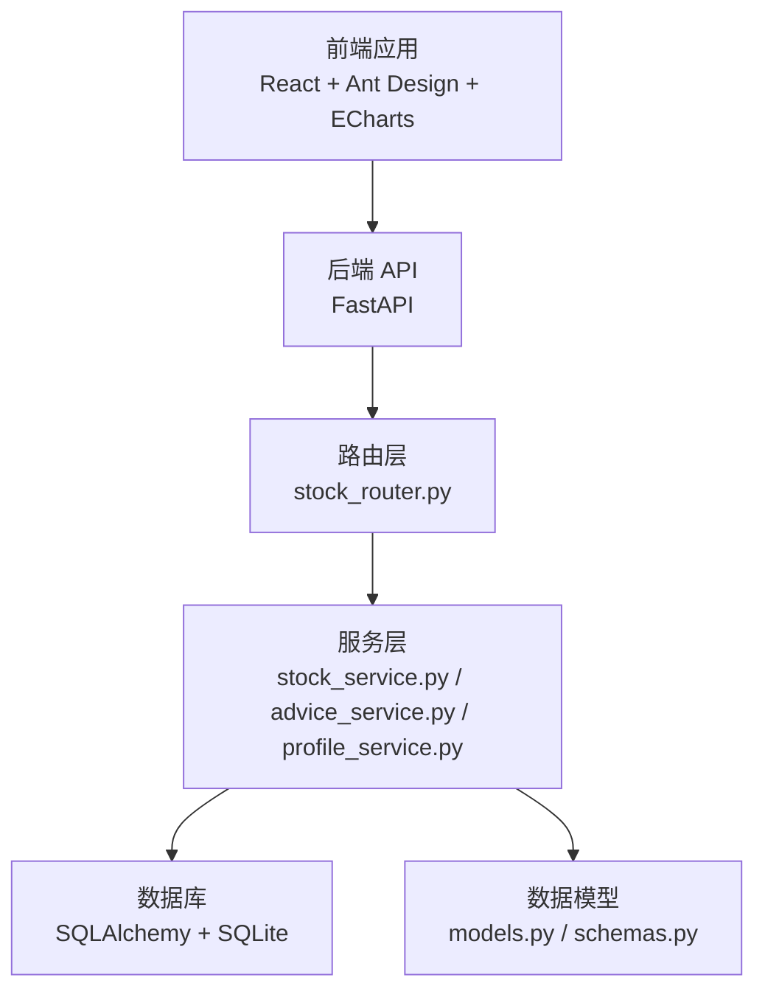
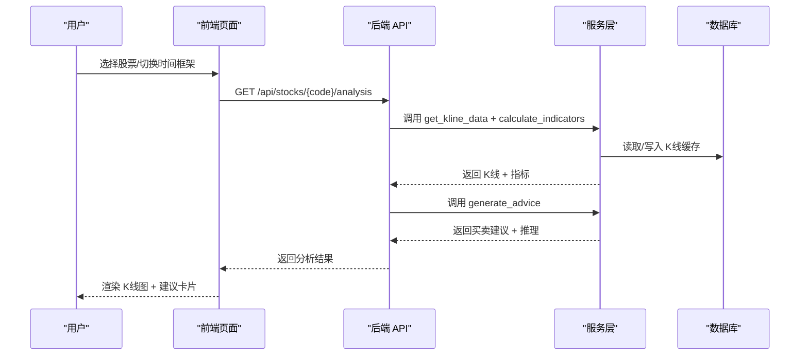
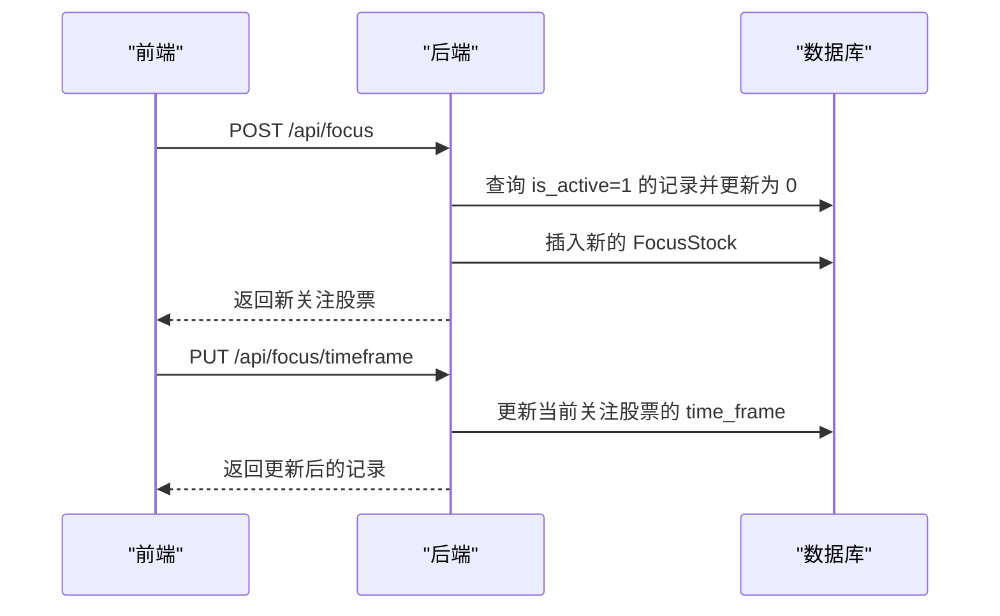
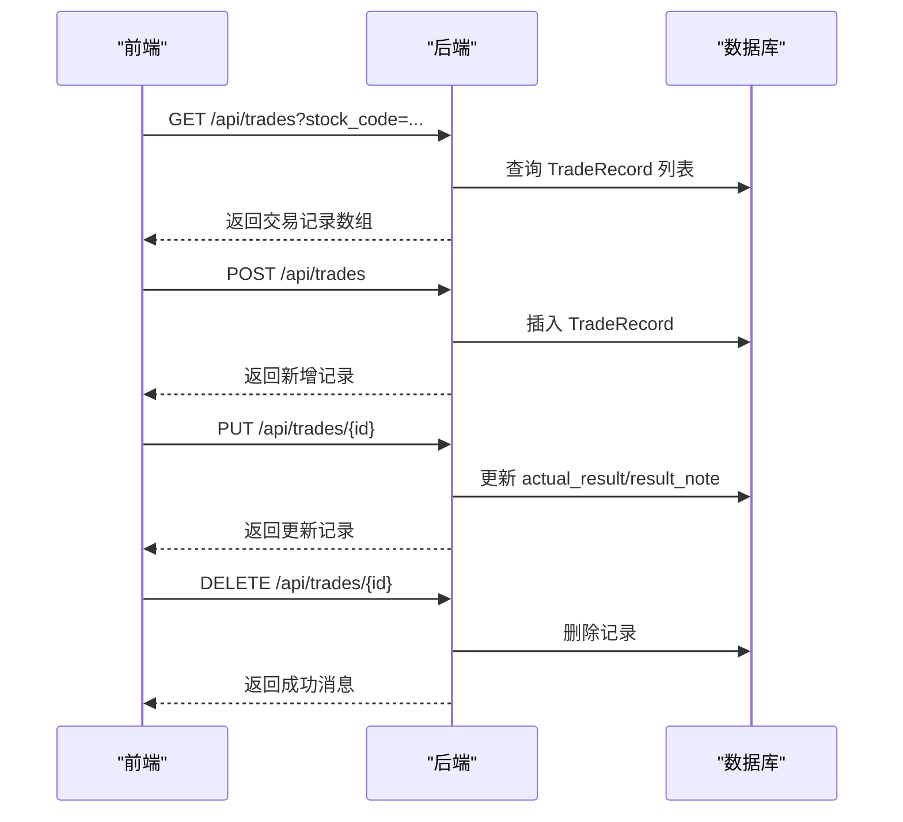
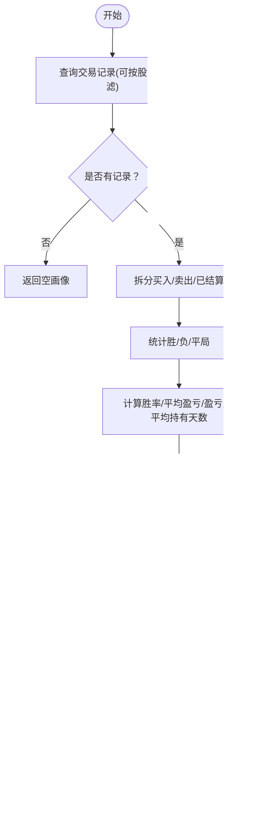
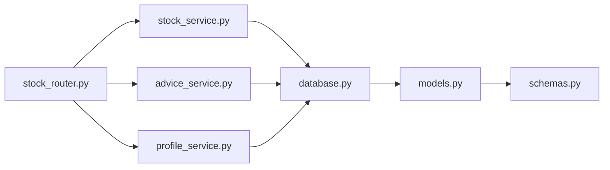

# 核心功能

<cite>
**本文引用的文件**
- [backend/app/main.py](file://backend/app/main.py)
- [backend/app/routers/stock_router.py](file://backend/app/routers/stock_router.py)
- [backend/app/services/stock_service.py](file://backend/app/services/stock_service.py)
- [backend/app/services/advice_service.py](file://backend/app/services/advice_service.py)
- [backend/app/services/profile_service.py](file://backend/app/services/profile_service.py)
- [backend/app/models/models.py](file://backend/app/models/models.py)
- [backend/app/models/schemas.py](file://backend/app/models/schemas.py)
- [backend/app/db/database.py](file://backend/app/db/database.py)
- [frontend/src/pages/AnalysisPage.tsx](file://frontend/src/pages/AnalysisPage.tsx)
- [frontend/src/pages/TradesPage.tsx](file://frontend/src/pages/TradesPage.tsx)
- [frontend/src/services/api.ts](file://frontend/src/services/api.ts)
- [frontend/src/types/index.ts](file://frontend/src/types/index.ts)
- [doc/产品设计文档.md](file://doc/产品设计文档.md)
- [doc/技术架构文档.md](file://doc/技术架构文档.md)
</cite>

## 目录
1. [简介](#简介)
2. [项目结构](#项目结构)
3. [核心组件](#核心组件)
4. [架构总览](#架构总览)
5. [详细组件分析](#详细组件分析)
6. [依赖关系分析](#依赖关系分析)
7. [性能考量](#性能考量)
8. [故障排查指南](#故障排查指南)
9. [结论](#结论)
10. [附录](#附录)

## 简介
Stock Foker 是一款面向个人投资者的自用股票分析应用，核心理念是“深度聚焦、数据驱动、自我进化”。系统围绕单支股票聚焦模式，提供股票关注管理、技术面分析、交易记录管理与炒股画像分析等主要功能模块。后端采用 FastAPI + SQLAlchemy + SQLite，前端采用 React + Ant Design + ECharts，形成前后端分离、数据本地化的轻量级解决方案。

## 项目结构
- 后端
  - 应用入口与中间件：backend/app/main.py
  - 路由层：backend/app/routers/stock_router.py
  - 服务层：stock_service.py、advice_service.py、profile_service.py
  - 数据模型与序列化：models.py、schemas.py
  - 数据库初始化与会话：db/database.py
- 前端
  - 页面：AnalysisPage.tsx（分析页）、TradesPage.tsx（交易记录页）
  - API 封装：services/api.ts
  - 类型定义：types/index.ts
- 文档
  - 产品设计文档.md、技术架构文档.md

**图表来源**
- [backend/app/main.py:1-28](file://backend/app/main.py#L1-L28)
- [backend/app/routers/stock_router.py:1-197](file://backend/app/routers/stock_router.py#L1-L197)
- [backend/app/services/stock_service.py:1-327](file://backend/app/services/stock_service.py#L1-L327)
- [backend/app/services/advice_service.py:1-193](file://backend/app/services/advice_service.py#L1-L193)
- [backend/app/services/profile_service.py:1-114](file://backend/app/services/profile_service.py#L1-L114)
- [backend/app/models/models.py:1-75](file://backend/app/models/models.py#L1-L75)
- [backend/app/models/schemas.py:1-118](file://backend/app/models/schemas.py#L1-L118)
- [backend/app/db/database.py:1-24](file://backend/app/db/database.py#L1-L24)

**章节来源**
- [doc/技术架构文档.md:19-67](file://doc/技术架构文档.md#L19-L67)

## 核心组件
- 股票关注管理：设置/切换当前关注股票、更新时间框架、查询历史关注
- 技术面分析：K线数据获取与缓存、技术指标计算、买卖建议生成
- 交易记录管理：增删改查交易记录，补充实际结果
- 炒股画像分析：基于交易记录生成交易画像，包含胜率、盈亏比、持有周期偏好、情绪判断准确率等

**章节来源**
- [backend/app/routers/stock_router.py:18-197](file://backend/app/routers/stock_router.py#L18-L197)
- [backend/app/services/stock_service.py:131-327](file://backend/app/services/stock_service.py#L131-L327)
- [backend/app/services/advice_service.py:4-193](file://backend/app/services/advice_service.py#L4-L193)
- [backend/app/services/profile_service.py:6-114](file://backend/app/services/profile_service.py#L6-L114)

## 架构总览
系统采用前后端分离架构，前端通过 Axios 调用后端 API；后端以 FastAPI 提供 REST 接口，服务层负责数据获取、指标计算与画像生成，数据层使用 SQLAlchemy + SQLite。

**图表来源**
- [backend/app/routers/stock_router.py:98-131](file://backend/app/routers/stock_router.py#L98-L131)
- [backend/app/services/stock_service.py:131-327](file://backend/app/services/stock_service.py#L131-L327)
- [backend/app/services/advice_service.py:4-193](file://backend/app/services/advice_service.py#L4-L193)

## 详细组件分析

### 股票关注管理
- 功能要点
  - 获取当前关注股票：返回 is_active=1 的记录
  - 设置关注股票：自动取消旧关注，新增新关注
  - 更新时间框架：仅允许更新当前关注股票的时间框架
  - 历史关注查询：按时间倒序返回最近关注记录
- 数据模型
  - FocusStock：包含 stock_code、stock_name、time_frame、is_active 等字段
- 用户交互
  - 前端通过 api.ts 的 getFocusStock、setFocusStock、updateTimeFrame 调用后端接口
  - AnalysisPage.tsx 在关注变更时触发分析请求

**图表来源**
- [backend/app/routers/stock_router.py:20-65](file://backend/app/routers/stock_router.py#L20-L65)
- [backend/app/models/models.py:25-36](file://backend/app/models/models.py#L25-L36)

**章节来源**
- [backend/app/routers/stock_router.py:18-65](file://backend/app/routers/stock_router.py#L18-L65)
- [backend/app/models/models.py:25-36](file://backend/app/models/models.py#L25-L36)
- [frontend/src/services/api.ts:14-24](file://frontend/src/services/api.ts#L14-L24)

### 技术面分析
- K线数据获取与缓存
  - 优先从本地 SQLite 缓存读取，若缓存不完整或过期则增量拉取远程数据
  - 支持新浪接口（主）+ AKShare 降级（备），并做重试与异常兜底
  - 缓存表 KlineCache 包含唯一约束 (stock_code, period, date)
- 技术指标计算
  - 使用 pandas-ta 计算均线、MACD、KDJ、RSI、布林带等指标
  - 将 Series 转换为列表，NaN 转为 None，便于序列化
- 买卖建议生成
  - 综合 MACD、KDJ、RSI、均线、布林带等指标，给出“买入/卖出/持有”信号与置信度
  - 输出推理过程，便于用户理解建议依据
- 前端展示
  - AnalysisPage.tsx 使用 ECharts 渲染 K线图、均线与成交量
  - 展示买卖建议与指标概览

**图表来源**
- [backend/app/services/stock_service.py:153-237](file://backend/app/services/stock_service.py#L153-L237)
- [backend/app/services/stock_service.py:255-327](file://backend/app/services/stock_service.py#L255-L327)
- [backend/app/services/advice_service.py:4-173](file://backend/app/services/advice_service.py#L4-L173)

**章节来源**
- [backend/app/services/stock_service.py:131-327](file://backend/app/services/stock_service.py#L131-L327)
- [backend/app/services/advice_service.py:4-193](file://backend/app/services/advice_service.py#L4-L193)
- [frontend/src/pages/AnalysisPage.tsx:28-213](file://frontend/src/pages/AnalysisPage.tsx#L28-L213)

### 交易记录管理
- 功能要点
  - 列表查询：支持按股票代码过滤、限制数量、按时间倒序
  - 新增记录：创建交易记录，填充 stock_code/name、类型、价格数量、理由、情绪判断、目标价与持有天数等
  - 更新结果：补充实际盈亏与备注
  - 删除记录：按 id 删除
- 数据模型
  - TradeRecord：包含 stock_code/name、trade_type、price、quantity、reason、market_sentiment、target_price、expected_hold_days、actual_result、result_note、traded_at 等
- 前端交互
  - TradesPage.tsx 提供表格展示、新增弹窗、结果补充弹窗、删除确认
  - api.ts 封装 getTradeRecords、createTradeRecord、updateTradeRecord、deleteTradeRecord

**图表来源**
- [backend/app/routers/stock_router.py:136-184](file://backend/app/routers/stock_router.py#L136-L184)
- [backend/app/models/models.py:38-56](file://backend/app/models/models.py#L38-L56)
- [frontend/src/pages/TradesPage.tsx:28-260](file://frontend/src/pages/TradesPage.tsx#L28-L260)

**章节来源**
- [backend/app/routers/stock_router.py:136-184](file://backend/app/routers/stock_router.py#L136-L184)
- [backend/app/models/models.py:38-56](file://backend/app/models/models.py#L38-L56)
- [frontend/src/pages/TradesPage.tsx:28-260](file://frontend/src/pages/TradesPage.tsx#L28-L260)

### 炒股画像分析
- 功能要点
  - 基于交易记录生成画像：胜率、平均盈亏、盈亏比、平均持有天数、交易频率、时间框架偏好、情绪判断准确率、常见买卖理由
  - 支持按股票过滤
  - 无数据时返回空画像
- 算法说明
  - 胜率 = 已结算盈利交易数 / 已结算交易总数
  - 平均盈亏 = 盈利/亏损交易总金额 / 交易次数
  - 盈亏比 = |平均盈利 / 平均亏损|（当亏损为 0 时为 0）
  - 持有周期偏好：<=5 天为短线，<=30 天为中线，否则为长线
  - 交易频率：>=20 为高频，>=5 为中频，否则为低频
  - 情绪判断准确率：按乐观/悲观与实际结果一致性统计
- 前端交互
  - TradesPage.tsx 与 AnalysisPage.tsx 通过 api.ts 的 getTradingProfile 获取画像并展示

**图表来源**
- [backend/app/services/profile_service.py:6-97](file://backend/app/services/profile_service.py#L6-L97)

**章节来源**
- [backend/app/services/profile_service.py:6-114](file://backend/app/services/profile_service.py#L6-L114)
- [frontend/src/services/api.ts:61-65](file://frontend/src/services/api.ts#L61-L65)

## 依赖关系分析
- 组件耦合
  - 路由层依赖服务层；服务层依赖数据库层；前端通过 API 封装间接依赖后端
  - 服务层内部职责清晰：stock_service 负责数据获取与缓存、指标计算；advice_service 负责建议生成；profile_service 负责画像生成
- 外部依赖
  - 后端：FastAPI、SQLAlchemy、pandas、pandas-ta、akshare、requests
  - 前端：React、Ant Design、ECharts、Axios
- 数据模型与序列化
  - models.py 定义枚举与实体；schemas.py 定义 Pydantic 模型用于请求/响应校验与序列化

**图表来源**
- [backend/app/routers/stock_router.py:1-197](file://backend/app/routers/stock_router.py#L1-L197)
- [backend/app/services/stock_service.py:1-327](file://backend/app/services/stock_service.py#L1-L327)
- [backend/app/services/advice_service.py:1-193](file://backend/app/services/advice_service.py#L1-L193)
- [backend/app/services/profile_service.py:1-114](file://backend/app/services/profile_service.py#L1-L114)
- [backend/app/db/database.py:1-24](file://backend/app/db/database.py#L1-L24)
- [backend/app/models/models.py:1-75](file://backend/app/models/models.py#L1-L75)
- [backend/app/models/schemas.py:1-118](file://backend/app/models/schemas.py#L1-L118)

**章节来源**
- [backend/app/routers/stock_router.py:1-197](file://backend/app/routers/stock_router.py#L1-L197)
- [backend/app/models/models.py:1-75](file://backend/app/models/models.py#L1-L75)
- [backend/app/models/schemas.py:1-118](file://backend/app/models/schemas.py#L1-L118)

## 性能考量
- 数据缓存与增量更新
  - 本地 SQLite 缓存 K线数据，避免频繁远程请求；仅写入缺失日期与更新当日盘中数据
- 指标计算
  - 使用 pandas-ta 进行批量向量化计算，避免逐条循环
- 前端渲染
  - ECharts 渲染 K线图与指标，支持缩放与滑条，保证交互流畅
- API 设计
  - 通过分页与限制返回条数控制响应体积，减轻前端压力

**章节来源**
- [backend/app/services/stock_service.py:153-237](file://backend/app/services/stock_service.py#L153-L237)
- [backend/app/services/stock_service.py:255-327](file://backend/app/services/stock_service.py#L255-L327)
- [frontend/src/pages/AnalysisPage.tsx:28-213](file://frontend/src/pages/AnalysisPage.tsx#L28-L213)

## 故障排查指南
- K线数据获取失败
  - 现象：分析页加载失败，提示错误
  - 排查：检查网络访问新浪接口与 AKShare 降级接口；查看后端异常堆栈
  - 参考路径：[backend/app/services/stock_service.py:240-252](file://backend/app/services/stock_service.py#L240-L252)
- 买卖建议为空或置信度为 0
  - 现象：建议为持有或无有效信号
  - 排查：确认 K线数据长度是否满足指标计算需求；检查指标是否全部为空
  - 参考路径：[backend/app/services/advice_service.py:9-15](file://backend/app/services/advice_service.py#L9-L15)
- 交易记录更新失败
  - 现象：更新结果或删除记录时报错
  - 排查：确认记录是否存在；检查字段校验与权限
  - 参考路径：[backend/app/routers/stock_router.py:159-184](file://backend/app/routers/stock_router.py#L159-L184)
- 数据库初始化问题
  - 现象：首次运行无表或表结构不一致
  - 排查：确认 init_db 是否执行；检查 DATABASE_URL 与 SQLite 文件权限
  - 参考路径：[backend/app/db/database.py:22-24](file://backend/app/db/database.py#L22-L24)

**章节来源**
- [backend/app/services/stock_service.py:240-252](file://backend/app/services/stock_service.py#L240-L252)
- [backend/app/services/advice_service.py:9-15](file://backend/app/services/advice_service.py#L9-L15)
- [backend/app/routers/stock_router.py:159-184](file://backend/app/routers/stock_router.py#L159-L184)
- [backend/app/db/database.py:22-24](file://backend/app/db/database.py#L22-L24)

## 结论
Stock Foker 通过清晰的模块划分与稳健的技术选型，实现了从数据获取、指标计算到建议生成与画像分析的完整闭环。其单股票聚焦模式有助于减少信息噪音，结合交易记录与炒股画像，帮助用户建立自我认知与持续优化的交易体系。建议在后续版本中逐步引入板块联动、消息面与宏观环境感知，进一步提升辅助决策能力。

## 附录
- 功能使用示例与最佳实践
  - 股票关注管理
    - 建议每次仅关注一支股票，确保分析聚焦
    - 根据交易风格设置时间框架（短线/中线/长线），以便建议策略适配
  - 技术面分析
    - 使用日K/周K/月K切换观察不同周期趋势
    - 结合买卖建议与推理过程，理解指标信号的形成逻辑
  - 交易记录管理
    - 录入时尽量填写理由、情绪判断与预期持有天数，便于画像分析
    - 及时补充实际结果与备注，保持数据完整性
  - 炒股画像分析
    - 定期回顾画像维度，识别交易习惯与偏差
    - 借助画像中的常见买卖理由，反思决策动机与一致性

**章节来源**
- [doc/产品设计文档.md:20-288](file://doc/产品设计文档.md#L20-L288)
- [doc/技术架构文档.md:120-197](file://doc/技术架构文档.md#L120-L197)