# 核心功能

<cite>
**本文引用的文件**
- [backend/app/main.py](file://backend/app/main.py)
- [backend/app/routers/stock_router.py](file://backend/app/routers/stock_router.py)
- [backend/app/routers/agent_router.py](file://backend/app/routers/agent_router.py)
- [backend/app/routers/data_source_router.py](file://backend/app/routers/data_source_router.py)
- [backend/app/routers/snapshot_router.py](file://backend/app/routers/snapshot_router.py)
- [backend/app/services/stock_service.py](file://backend/app/services/stock_service.py)
- [backend/app/services/advice_service.py](file://backend/app/services/advice_service.py)
- [backend/app/services/profile_service.py](file://backend/app/services/profile_service.py)
- [backend/app/services/data_source_service.py](file://backend/app/services/data_source_service.py)
- [backend/app/agents/base_agent.py](file://backend/app/agents/base_agent.py)
- [backend/app/agents/enhanced_advice_agent.py](file://backend/app/agents/enhanced_advice_agent.py)
- [backend/app/agents/macro_agent.py](file://backend/app/agents/macro_agent.py)
- [backend/app/agents/sector_agent.py](file://backend/app/agents/sector_agent.py)
- [backend/app/agents/sentiment_agent.py](file://backend/app/agents/sentiment_agent.py)
- [backend/app/llm/client.py](file://backend/app/llm/client.py)
- [backend/app/llm/prompts.py](file://backend/app/llm/prompts.py)
- [backend/app/models/models.py](file://backend/app/models/models.py)
- [backend/app/models/schemas.py](file://backend/app/models/schemas.py)
- [backend/app/db/database.py](file://backend/app/db/database.py)
- [frontend/src/pages/AnalysisPage.tsx](file://frontend/src/pages/AnalysisPage.tsx)
- [frontend/src/pages/TradesPage.tsx](file://frontend/src/pages/TradesPage.tsx)
- [frontend/src/pages/MacroPage.tsx](file://frontend/src/pages/MacroPage.tsx)
- [frontend/src/pages/SectorPage.tsx](file://frontend/src/pages/SectorPage.tsx)
- [frontend/src/pages/SentimentPage.tsx](file://frontend/src/pages/SentimentPage.tsx)
- [frontend/src/pages/SettingsPage.tsx](file://frontend/src/pages/SettingsPage.tsx)
- [frontend/src/contexts/AgentCacheContext.tsx](file://frontend/src/contexts/AgentCacheContext.tsx)
- [frontend/src/services/api.ts](file://frontend/src/services/api.ts)
- [frontend/src/types/index.ts](file://frontend/src/types/index.ts)
- [doc/产品设计文档.md](file://doc/产品设计文档.md)
- [doc/技术架构文档.md](file://doc/技术架构文档.md)
</cite>

## 更新摘要
**所做更改**
- 新增AI代理分析系统章节，涵盖消息面、板块、宏观和增强建议代理
- 新增数据源缓存基础设施章节，介绍独立数据源缓存机制
- 新增位置管理功能章节，添加股票持仓信息管理
- 更新AI设置页面和LLM配置管理
- 新增Agent缓存上下文和数据源Hook集成
- 扩展前端页面以支持新的AI分析功能

## 目录
1. [简介](#简介)
2. [项目结构](#项目结构)
3. [核心组件](#核心组件)
4. [架构总览](#架构总览)
5. [详细组件分析](#详细组件分析)
6. [依赖关系分析](#依赖关系分析)
7. [性能考量](#性能考量)
8. [故障排查指南](#故障排查指南)
9. [结论](#结论)
10. [附录](#附录)

## 简介
Stock Foker 是一款面向个人投资者的自用股票分析应用，核心理念是"深度聚焦、数据驱动、自我进化"。系统围绕单支股票聚焦模式，提供股票关注管理、技术面分析、交易记录管理与炒股画像分析等主要功能模块。后端采用 FastAPI + SQLAlchemy + SQLite，前端采用 React + Ant Design + ECharts，形成前后端分离、数据本地化的轻量级解决方案。

**更新** 新版本引入了完整的AI代理分析系统，包括消息面情绪分析、板块联动分析、宏观环境感知和增强版买卖建议，同时建立了独立的数据源缓存基础设施，支持多种外部数据源的统一管理。

## 项目结构
- 后端
  - 应用入口与中间件：backend/app/main.py
  - 路由层：stock_router.py、agent_router.py、data_source_router.py、snapshot_router.py
  - 服务层：stock_service.py、advice_service.py、profile_service.py、data_source_service.py
  - AI代理层：base_agent.py、sentiment_agent.py、sector_agent.py、macro_agent.py、enhanced_advice_agent.py
  - LLM层：client.py、prompts.py
  - 数据模型与序列化：models.py、schemas.py
  - 数据库初始化与会话：db/database.py
- 前端
  - 页面：AnalysisPage.tsx（分析页）、TradesPage.tsx（交易记录页）、MacroPage.tsx（宏观分析）、SectorPage.tsx（板块分析）、SentimentPage.tsx（消息面分析）、SettingsPage.tsx（AI设置）
  - 上下文：AgentCacheContext.tsx（Agent缓存）
  - API封装：services/api.ts
  - 类型定义：types/index.ts
- 文档
  - 产品设计文档.md、技术架构文档.md

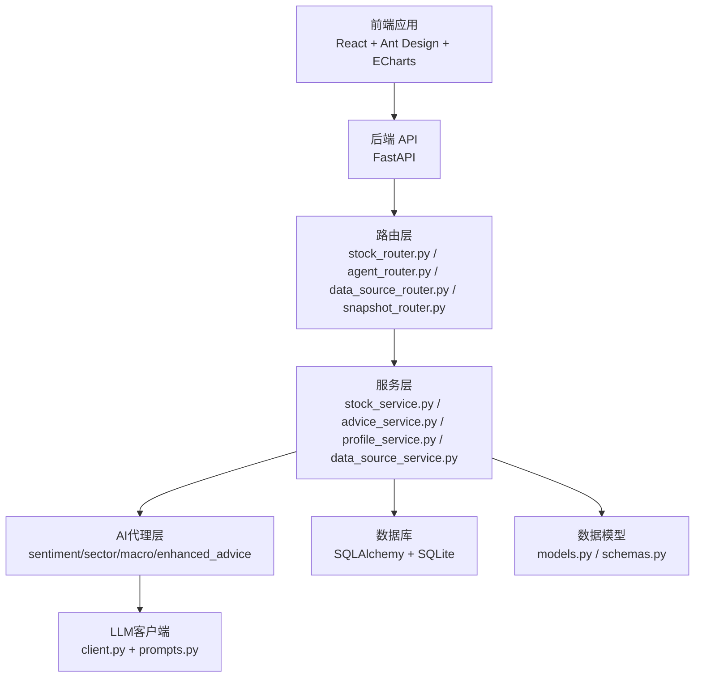

**图表来源**
- [backend/app/main.py:1-74](file://backend/app/main.py#L1-L74)
- [backend/app/routers/stock_router.py:1-197](file://backend/app/routers/stock_router.py#L1-L197)
- [backend/app/routers/agent_router.py:1-395](file://backend/app/routers/agent_router.py#L1-L395)
- [backend/app/routers/data_source_router.py:1-68](file://backend/app/routers/data_source_router.py#L1-L68)
- [backend/app/routers/snapshot_router.py:1-85](file://backend/app/routers/snapshot_router.py#L1-L85)
- [backend/app/services/stock_service.py:1-327](file://backend/app/services/stock_service.py#L1-L327)
- [backend/app/services/advice_service.py:1-193](file://backend/app/services/advice_service.py#L1-L193)
- [backend/app/services/profile_service.py:1-114](file://backend/app/services/profile_service.py#L1-L114)
- [backend/app/services/data_source_service.py:1-161](file://backend/app/services/data_source_service.py#L1-L161)
- [backend/app/agents/base_agent.py:1-119](file://backend/app/agents/base_agent.py#L1-L119)
- [backend/app/llm/client.py:1-146](file://backend/app/llm/client.py#L1-L146)
- [backend/app/models/models.py:1-151](file://backend/app/models/models.py#L1-L151)
- [backend/app/models/schemas.py:1-118](file://backend/app/models/schemas.py#L1-L118)
- [backend/app/db/database.py:1-24](file://backend/app/db/database.py#L1-L24)

**章节来源**
- [doc/技术架构文档.md:19-67](file://doc/技术架构文档.md#L19-L67)

## 核心组件
- 股票关注管理：设置/切换当前关注股票、更新时间框架、查询历史关注
- 技术面分析：K线数据获取与缓存、技术指标计算、买卖建议生成
- 交易记录管理：增删改查交易记录，补充实际结果
- 炒股画像分析：基于交易记录生成交易画像，包含胜率、盈亏比、持有周期偏好、情绪判断准确率等
- **AI代理分析系统**：消息面情绪分析、板块联动分析、宏观环境感知、增强版买卖建议
- **数据源缓存基础设施**：独立于Agent的原始数据缓存，支持多种外部数据源
- **位置管理功能**：股票持仓信息管理，包括成本价、数量、止盈止损价等

**章节来源**
- [backend/app/routers/stock_router.py:18-197](file://backend/app/routers/stock_router.py#L18-L197)
- [backend/app/routers/agent_router.py:1-395](file://backend/app/routers/agent_router.py#L1-L395)
- [backend/app/routers/data_source_router.py:1-68](file://backend/app/routers/data_source_router.py#L1-L68)
- [backend/app/routers/snapshot_router.py:1-85](file://backend/app/routers/snapshot_router.py#L1-L85)
- [backend/app/services/stock_service.py:131-327](file://backend/app/services/stock_service.py#L131-L327)
- [backend/app/services/advice_service.py:4-193](file://backend/app/services/advice_service.py#L4-L193)
- [backend/app/services/profile_service.py:6-114](file://backend/app/services/profile_service.py#L6-L114)
- [backend/app/services/data_source_service.py:1-161](file://backend/app/services/data_source_service.py#L1-L161)
- [backend/app/models/models.py:133-151](file://backend/app/models/models.py#L133-L151)

## 架构总览
系统采用前后端分离架构，前端通过 Axios 调用后端 API；后端以 FastAPI 提供 REST 接口，服务层负责数据获取、指标计算与画像生成，数据层使用 SQLAlchemy + SQLite。新增的AI代理系统通过统一的Agent基类实现，支持LLM分析和降级逻辑。

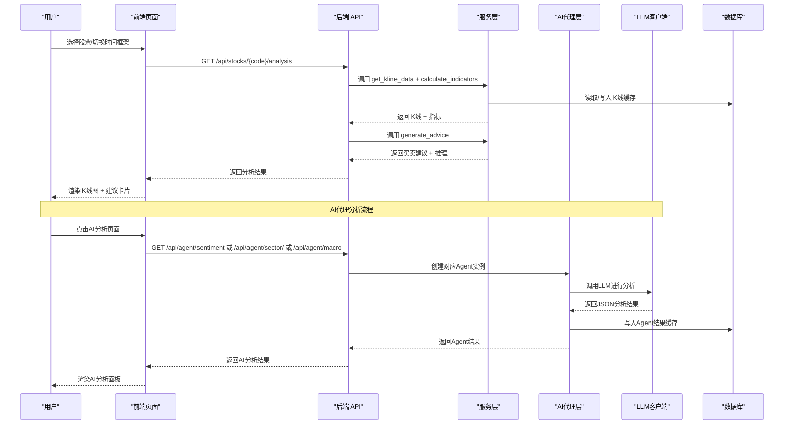

**图表来源**
- [backend/app/routers/stock_router.py:98-131](file://backend/app/routers/stock_router.py#L98-L131)
- [backend/app/routers/agent_router.py:186-354](file://backend/app/routers/agent_router.py#L186-L354)
- [backend/app/services/stock_service.py:131-327](file://backend/app/services/stock_service.py#L131-L327)
- [backend/app/services/advice_service.py:4-173](file://backend/app/services/advice_service.py#L4-L173)
- [backend/app/agents/base_agent.py:62-102](file://backend/app/agents/base_agent.py#L62-L102)
- [backend/app/llm/client.py:37-103](file://backend/app/llm/client.py#L37-L103)

## 详细组件分析

### 股票关注管理
- 功能要点
  - 获取当前关注股票：返回 is_active=1 的记录
  - 设置关注股票：自动取消旧关注，新增新关注
  - 更新时间框架：仅允许更新当前关注股票的时间框架
  - 历史关注查询：按时间倒序返回最近关注记录
- 数据模型
  - FocusStock：包含 stock_code、stock_name、time_frame、is_active 等字段
- 用户交互
  - 前端通过 api.ts 的 getFocusStock、setFocusStock、updateTimeFrame 调用后端接口
  - AnalysisPage.tsx 在关注变更时触发分析请求

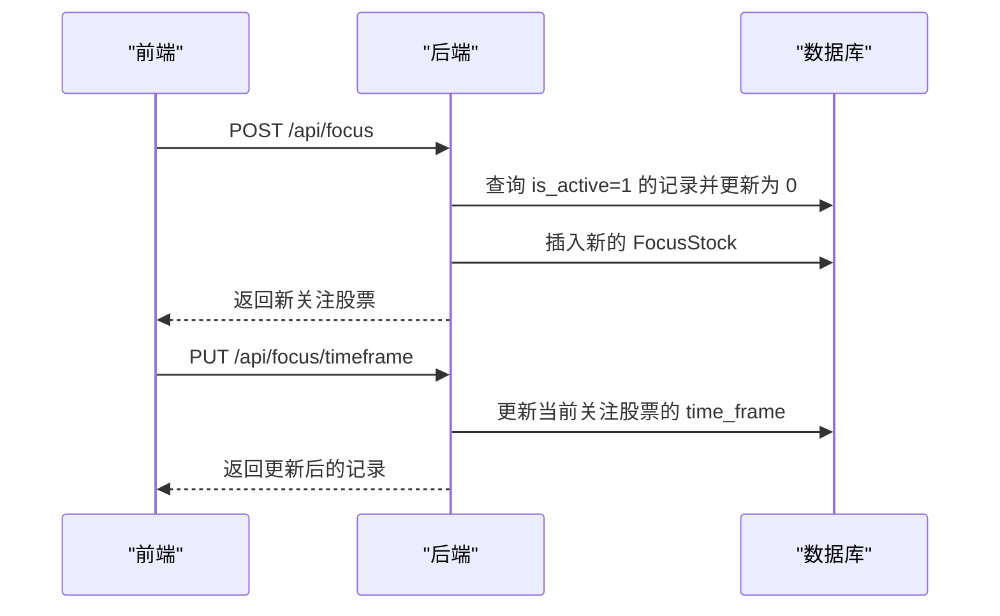

**图表来源**
- [backend/app/routers/stock_router.py:20-65](file://backend/app/routers/stock_router.py#L20-L65)
- [backend/app/models/models.py:30-41](file://backend/app/models/models.py#L30-L41)

**章节来源**
- [backend/app/routers/stock_router.py:18-65](file://backend/app/routers/stock_router.py#L18-L65)
- [backend/app/models/models.py:30-41](file://backend/app/models/models.py#L30-L41)
- [frontend/src/services/api.ts:14-24](file://frontend/src/services/api.ts#L14-L24)

### 技术面分析
- K线数据获取与缓存
  - 优先从本地 SQLite 缓存读取，若缓存不完整或过期则增量拉取远程数据
  - 支持新浪接口（主）+ AKShare 降级（备），并做重试与异常兜底
  - 缓存表 KlineCache 包含唯一约束 (stock_code, period, date)
- 技术指标计算
  - 使用 pandas-ta 计算均线、MACD、KDJ、RSI、布林带等指标
  - 将 Series 转换为列表，NaN 转为 None，便于序列化
- 买卖建议生成
  - 综合 MACD、KDJ、RSI、均线、布林带等指标，给出"买入/卖出/持有"信号与置信度
  - 输出推理过程，便于用户理解建议依据
- 前端展示
  - AnalysisPage.tsx 使用 ECharts 渲染 K线图、均线与成交量
  - 展示买卖建议与指标概览

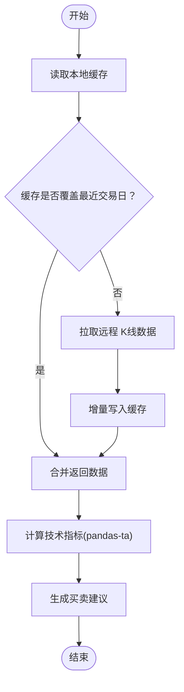

**图表来源**
- [backend/app/services/stock_service.py:153-237](file://backend/app/services/stock_service.py#L153-L237)
- [backend/app/services/stock_service.py:255-327](file://backend/app/services/stock_service.py#L255-L327)
- [backend/app/services/advice_service.py:4-173](file://backend/app/services/advice_service.py#L4-L173)

**章节来源**
- [backend/app/services/stock_service.py:131-327](file://backend/app/services/stock_service.py#L131-L327)
- [backend/app/services/advice_service.py:4-193](file://backend/app/services/advice_service.py#L4-L193)
- [frontend/src/pages/AnalysisPage.tsx:28-213](file://frontend/src/pages/AnalysisPage.tsx#L28-L213)

### 交易记录管理
- 功能要点
  - 列表查询：支持按股票代码过滤、限制数量、按时间倒序
  - 新增记录：创建交易记录，填充 stock_code/name、类型、价格数量、理由、情绪判断、目标价与持有天数等
  - 更新结果：补充实际盈亏与备注
  - 删除记录：按 id 删除
- 数据模型
  - TradeRecord：包含 stock_code/name、trade_type、price、quantity、reason、market_sentiment、target_price、expected_hold_days、actual_result、result_note、traded_at 等
- 前端交互
  - TradesPage.tsx 提供表格展示、新增弹窗、结果补充弹窗、删除确认
  - api.ts 封装 getTradeRecords、createTradeRecord、updateTradeRecord、deleteTradeRecord

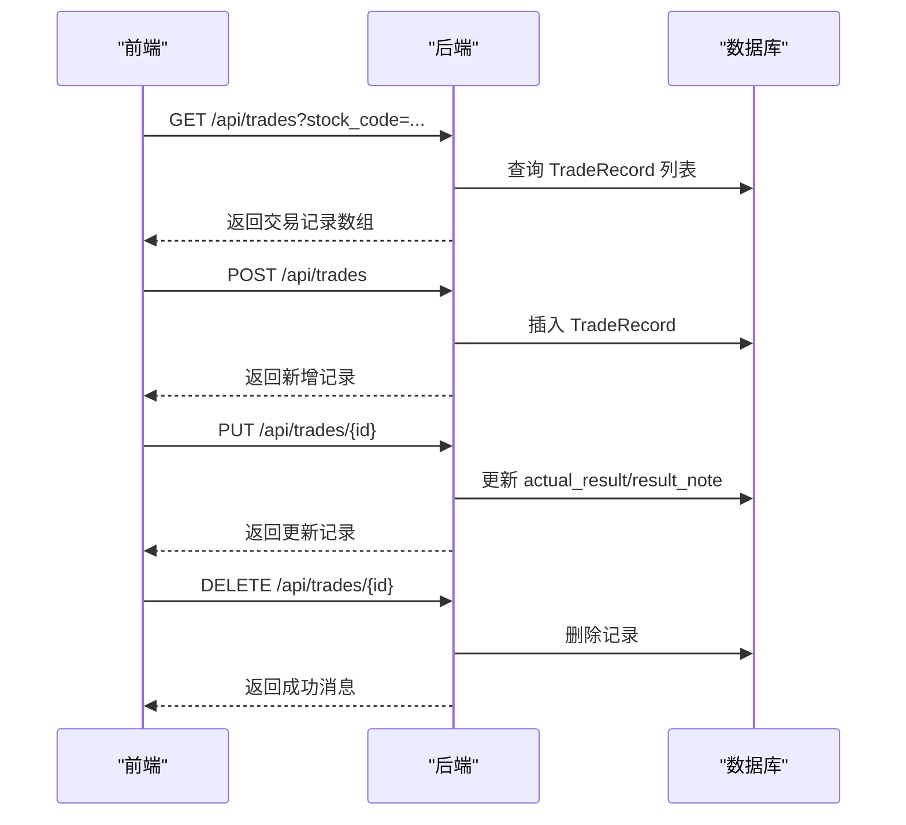

**图表来源**
- [backend/app/routers/stock_router.py:136-184](file://backend/app/routers/stock_router.py#L136-L184)
- [backend/app/models/models.py:43-62](file://backend/app/models/models.py#L43-L62)
- [frontend/src/pages/TradesPage.tsx:28-260](file://frontend/src/pages/TradesPage.tsx#L28-L260)

**章节来源**
- [backend/app/routers/stock_router.py:136-184](file://backend/app/routers/stock_router.py#L136-L184)
- [backend/app/models/models.py:43-62](file://backend/app/models/models.py#L43-L62)
- [frontend/src/pages/TradesPage.tsx:28-260](file://frontend/src/pages/TradesPage.tsx#L28-L260)

### 炒股画像分析
- 功能要点
  - 基于交易记录生成画像：胜率、平均盈亏、盈亏比、平均持有天数、交易频率、时间框架偏好、情绪判断准确率、常见买卖理由
  - 支持按股票过滤
  - 无数据时返回空画像
- 算法说明
  - 胜率 = 已结算盈利交易数 / 已结算交易总数
  - 平均盈亏 = 盈利/亏损交易总金额 / 交易次数
  - 盈亏比 = |平均盈利 / 平均亏损|（当亏损为 0 时为 0）
  - 持有周期偏好：<=5 天为短线，<=30 天为中线，否则为长线
  - 交易频率：>=20 为高频，>=5 为中频，否则为低频
  - 情绪判断准确率：按乐观/悲观与实际结果一致性统计
- 前端交互
  - TradesPage.tsx 与 AnalysisPage.tsx 通过 api.ts 的 getTradingProfile 获取画像并展示

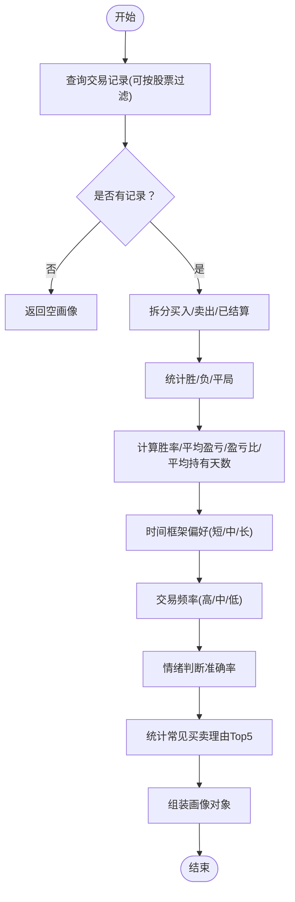

**图表来源**
- [backend/app/services/profile_service.py:6-97](file://backend/app/services/profile_service.py#L6-L97)

**章节来源**
- [backend/app/services/profile_service.py:6-114](file://backend/app/services/profile_service.py#L6-L114)
- [frontend/src/services/api.ts:61-65](file://frontend/src/services/api.ts#L61-L65)

### AI代理分析系统

**更新** 新增完整的AI代理分析系统，提供多维度的智能分析能力。

#### AI代理基类架构
- BaseAgent 抽象基类提供统一的执行流程
- 支持LLM分析和降级逻辑，确保系统稳定性
- 统一的结果结构 AgentResult，包含状态、数据、时间戳等信息

#### 消息面情绪分析
- 数据源整合：新闻、公告、研报、公司基本资料、经营数据、股东信息
- 情绪评分：-1.0到1.0的连续评分，区分利好、利空、中性
- 关键新闻提取：识别对股价影响最大的新闻事件
- 噪音过滤：计算新闻噪音比例，提高分析质量

#### 板块联动分析
- 行业估值：PE、PB、ROE等估值指标
- 资金流向：主力资金净流入、大单净买入等
- 行业财务：营收增速、净利润增速、毛利率等财务指标
- 同业对比：板块内股票相对强弱分析

#### 宏观环境感知
- 市场阶段：牛市、熊市、震荡市判断
- 市场情绪：基于多项指标的综合情绪评分
- 风险等级：低、中、高风险评估
- 对个股影响：分析宏观环境对关注股票的具体影响

#### 增强版买卖建议
- 多维度融合：技术面、消息面、板块联动、宏观环境、基本面
- 置信度评估：0到1的置信度评分
- 推理过程：详细的分析步骤和权衡逻辑
- 个性化建议：结合用户交易风格和当前持仓

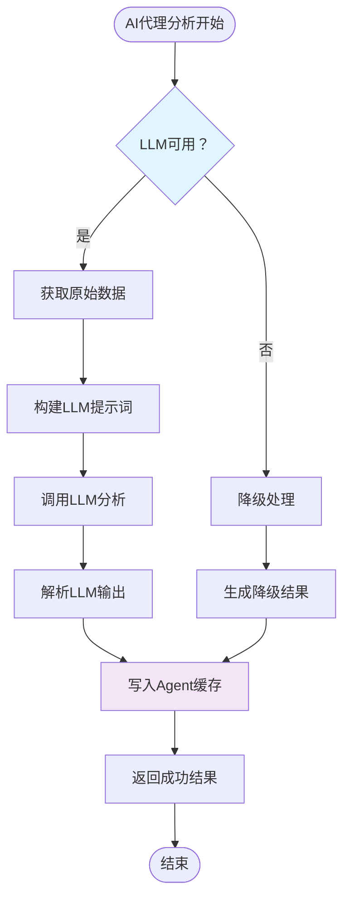

**图表来源**
- [backend/app/agents/base_agent.py:62-102](file://backend/app/agents/base_agent.py#L62-L102)
- [backend/app/agents/sentiment_agent.py:15-56](file://backend/app/agents/sentiment_agent.py#L15-L56)
- [backend/app/agents/sector_agent.py:15-45](file://backend/app/agents/sector_agent.py#L15-L45)
- [backend/app/agents/macro_agent.py:15-42](file://backend/app/agents/macro_agent.py#L15-L42)
- [backend/app/agents/enhanced_advice_agent.py:14-74](file://backend/app/agents/enhanced_advice_agent.py#L14-L74)

**章节来源**
- [backend/app/agents/base_agent.py:1-119](file://backend/app/agents/base_agent.py#L1-L119)
- [backend/app/agents/sentiment_agent.py:1-91](file://backend/app/agents/sentiment_agent.py#L1-L91)
- [backend/app/agents/sector_agent.py:1-85](file://backend/app/agents/sector_agent.py#L1-L85)
- [backend/app/agents/macro_agent.py:1-81](file://backend/app/agents/macro_agent.py#L1-L81)
- [backend/app/agents/enhanced_advice_agent.py:1-129](file://backend/app/agents/enhanced_advice_agent.py#L1-L129)
- [backend/app/routers/agent_router.py:186-354](file://backend/app/routers/agent_router.py#L186-L354)

### 数据源缓存基础设施

**更新** 新增独立的数据源缓存系统，支持多种外部数据源的统一管理。

#### 缓存架构
- 独立于Agent的原始数据缓存
- 每天09:00作为缓存新鲜度边界
- 支持强制刷新和缓存查询
- 统一的数据源注册表管理

#### 支持的数据源类型
- hithink_news：财经资讯搜索
- announcements：公司公告
- industry_valuation：行业估值数据
- market_data：市场数据
- industry_finance：行业财务数据
- industry_peers：同业对比数据
- hithink_index：主要指数行情
- reports：研究报告
- basicinfo：公司基本资料
- business：公司经营数据
- shareholders：股东股本信息
- concept_boards：概念板块数据

#### 缓存策略
- 新鲜度控制：仅返回09:00之后的缓存数据
- 写入优化：合并相同日期的数据
- 错误处理：缓存写入失败时记录警告日志

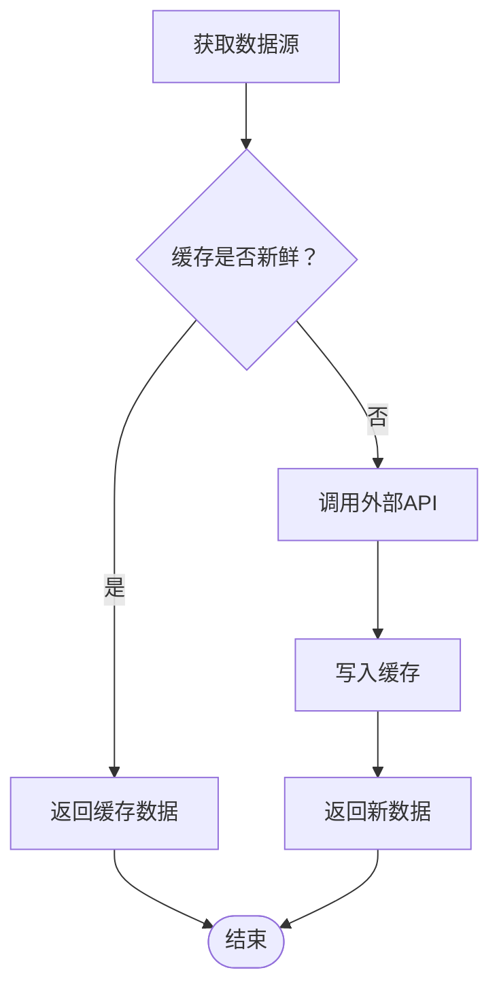

**图表来源**
- [backend/app/services/data_source_service.py:122-151](file://backend/app/services/data_source_service.py#L122-L151)
- [backend/app/routers/data_source_router.py:22-67](file://backend/app/routers/data_source_router.py#L22-L67)

**章节来源**
- [backend/app/services/data_source_service.py:1-161](file://backend/app/services/data_source_service.py#L1-L161)
- [backend/app/routers/data_source_router.py:1-68](file://backend/app/routers/data_source_router.py#L1-L68)
- [backend/app/models/models.py:118-131](file://backend/app/models/models.py#L118-L131)

### 位置管理功能

**更新** 新增股票持仓信息管理功能，支持完整的持仓跟踪。

#### 持仓信息管理
- 成本价：买入时的成本价格
- 数量：持有的股份数量
- 止盈止损：自动止盈止损价格设置
- 风险控制：基于持仓的风控建议
- 实时监控：结合技术分析提供买卖建议

#### 与AI分析的集成
- 增强建议Agent会考虑当前持仓情况
- 提供个性化的仓位管理建议
- 结合用户交易风格和风险偏好

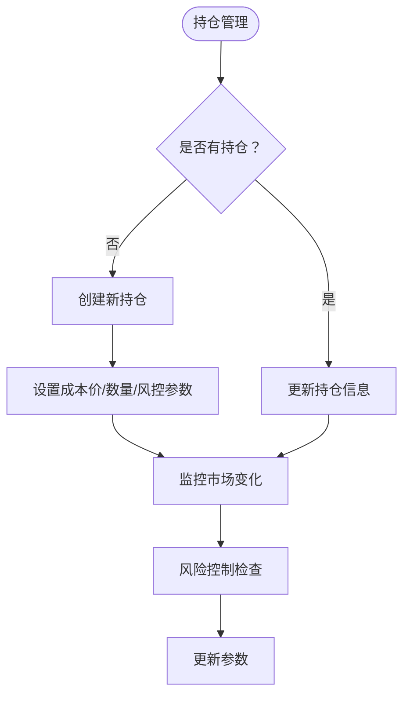

**图表来源**
- [backend/app/agents/enhanced_advice_agent.py:29-43](file://backend/app/agents/enhanced_advice_agent.py#L29-L43)
- [backend/app/models/models.py:133-151](file://backend/app/models/models.py#L133-L151)

**章节来源**
- [backend/app/models/models.py:133-151](file://backend/app/models/models.py#L133-L151)
- [backend/app/agents/enhanced_advice_agent.py:14-74](file://backend/app/agents/enhanced_advice_agent.py#L14-L74)

### AI设置与配置管理

**更新** 新增AI设置页面，支持LLM配置的动态管理。

#### LLM配置管理
- 配置热重载：修改.env后无需重启后端
- 状态监控：实时显示LLM可用性和配置状态
- 多供应商支持：支持DeepSeek、Moonshot、GLM、Qwen、OpenAI等
- 安全脱敏：API Key显示脱敏信息

#### 前端缓存优化
- Agent缓存上下文：避免页面切换时重复调用
- 缓存新鲜度：与后端缓存边界同步（每天09:00）
- 内存缓存：使用Map存储，避免组件重渲染

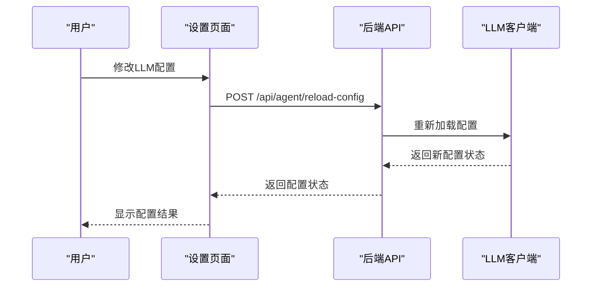

**图表来源**
- [frontend/src/pages/SettingsPage.tsx:28-39](file://frontend/src/pages/SettingsPage.tsx#L28-L39)
- [backend/app/routers/agent_router.py:367-377](file://backend/app/routers/agent_router.py#L367-L377)
- [frontend/src/contexts/AgentCacheContext.tsx:78-132](file://frontend/src/contexts/AgentCacheContext.tsx#L78-L132)

**章节来源**
- [frontend/src/pages/SettingsPage.tsx:1-132](file://frontend/src/pages/SettingsPage.tsx#L1-L132)
- [backend/app/routers/agent_router.py:361-377](file://backend/app/routers/agent_router.py#L361-L377)
- [frontend/src/contexts/AgentCacheContext.tsx:1-139](file://frontend/src/contexts/AgentCacheContext.tsx#L1-L139)

## 依赖关系分析
- 组件耦合
  - 路由层依赖服务层；服务层依赖数据库层；前端通过 API 封装间接依赖后端
  - 服务层内部职责清晰：stock_service 负责数据获取与缓存、指标计算；advice_service 负责建议生成；profile_service 负责画像生成；data_source_service 负责数据源缓存
  - AI代理层通过统一基类实现，支持LLM分析和降级逻辑
- 外部依赖
  - 后端：FastAPI、SQLAlchemy、pandas、pandas-ta、akshare、requests、httpx
  - 前端：React、Ant Design、ECharts、Axios
- 数据模型与序列化
  - models.py 定义枚举与实体；schemas.py 定义 Pydantic 模型用于请求/响应校验与序列化

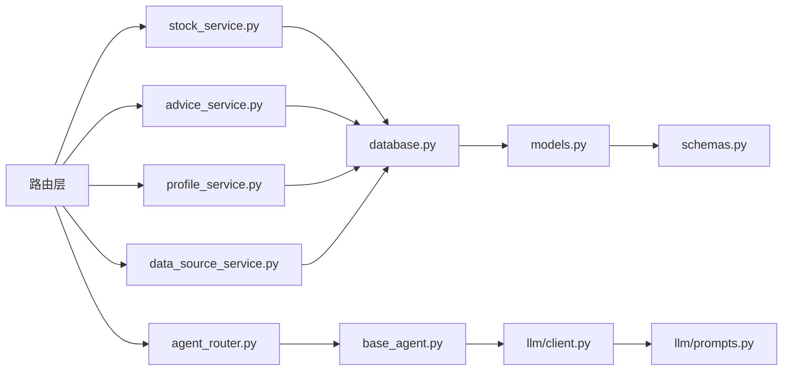

**图表来源**
- [backend/app/routers/stock_router.py:1-197](file://backend/app/routers/stock_router.py#L1-L197)
- [backend/app/routers/agent_router.py:1-395](file://backend/app/routers/agent_router.py#L1-L395)
- [backend/app/routers/data_source_router.py:1-68](file://backend/app/routers/data_source_router.py#L1-L68)
- [backend/app/routers/snapshot_router.py:1-85](file://backend/app/routers/snapshot_router.py#L1-L85)
- [backend/app/services/stock_service.py:1-327](file://backend/app/services/stock_service.py#L1-L327)
- [backend/app/services/advice_service.py:1-193](file://backend/app/services/advice_service.py#L1-L193)
- [backend/app/services/profile_service.py:1-114](file://backend/app/services/profile_service.py#L1-L114)
- [backend/app/services/data_source_service.py:1-161](file://backend/app/services/data_source_service.py#L1-L161)
- [backend/app/agents/base_agent.py:1-119](file://backend/app/agents/base_agent.py#L1-L119)
- [backend/app/llm/client.py:1-146](file://backend/app/llm/client.py#L1-L146)
- [backend/app/db/database.py:1-24](file://backend/app/db/database.py#L1-L24)
- [backend/app/models/models.py:1-151](file://backend/app/models/models.py#L1-L151)
- [backend/app/models/schemas.py:1-118](file://backend/app/models/schemas.py#L1-L118)

**章节来源**
- [backend/app/routers/stock_router.py:1-197](file://backend/app/routers/stock_router.py#L1-L197)
- [backend/app/models/models.py:1-151](file://backend/app/models/models.py#L1-L151)
- [backend/app/models/schemas.py:1-118](file://backend/app/models/schemas.py#L1-L118)

## 性能考量
- 数据缓存与增量更新
  - 本地 SQLite 缓存 K线数据，避免频繁远程请求；仅写入缺失日期与更新当日盘中数据
  - AI代理结果缓存：每天09:00作为新鲜度边界，避免重复计算
  - 前端内存缓存：Agent缓存上下文避免页面切换时的重复请求
- 指标计算
  - 使用 pandas-ta 进行批量向量化计算，避免逐条循环
- 前端渲染
  - ECharts 渲染 K线图与指标，支持缩放与滑条，保证交互流畅
  - 数据源Hook实现懒加载和缓存，提升页面响应速度
- API 设计
  - 通过分页与限制返回条数控制响应体积，减轻前端压力
  - LLM调用支持重试和指数退避，提高成功率

**章节来源**
- [backend/app/services/stock_service.py:153-237](file://backend/app/services/stock_service.py#L153-L237)
- [backend/app/services/stock_service.py:255-327](file://backend/app/services/stock_service.py#L255-L327)
- [backend/app/agents/base_agent.py:62-102](file://backend/app/agents/base_agent.py#L62-L102)
- [frontend/src/contexts/AgentCacheContext.tsx:78-132](file://frontend/src/contexts/AgentCacheContext.tsx#L78-L132)
- [frontend/src/pages/AnalysisPage.tsx:28-213](file://frontend/src/pages/AnalysisPage.tsx#L28-L213)

## 故障排查指南
- K线数据获取失败
  - 现象：分析页加载失败，提示错误
  - 排查：检查网络访问新浪接口与 AKShare 降级接口；查看后端异常堆栈
  - 参考路径：[backend/app/services/stock_service.py:240-252](file://backend/app/services/stock_service.py#L240-L252)
- 买卖建议为空或置信度为 0
  - 现象：建议为持有或无有效信号
  - 排查：确认 K线数据长度是否满足指标计算需求；检查指标是否全部为空
  - 参考路径：[backend/app/services/advice_service.py:9-15](file://backend/app/services/advice_service.py#L9-L15)
- 交易记录更新失败
  - 现象：更新结果或删除记录时报错
  - 排查：确认记录是否存在；检查字段校验与权限
  - 参考路径：[backend/app/routers/stock_router.py:159-184](file://backend/app/routers/stock_router.py#L159-L184)
- 数据库初始化问题
  - 现象：首次运行无表或表结构不一致
  - 排查：确认 init_db 是否执行；检查 DATABASE_URL 与 SQLite 文件权限
  - 参考路径：[backend/app/db/database.py:22-24](file://backend/app/db/database.py#L22-L24)
- **AI代理分析失败**
  - 现象：AI分析页面加载失败或显示降级结果
  - 排查：检查LLM配置状态；确认API Key正确；查看Agent执行日志
  - 参考路径：[backend/app/agents/base_agent.py:94-102](file://backend/app/agents/base_agent.py#L94-L102)
- **数据源缓存异常**
  - 现象：数据源页面显示缓存错误或数据不更新
  - 排查：检查缓存新鲜度边界；确认数据源类型有效；查看缓存写入日志
  - 参考路径：[backend/app/services/data_source_service.py:110-115](file://backend/app/services/data_source_service.py#L110-L115)
- **LLM配置问题**
  - 现象：AI功能不可用或配置状态异常
  - 排查：检查.env配置文件；确认重新加载配置；验证API Key有效性
  - 参考路径：[frontend/src/pages/SettingsPage.tsx:28-39](file://frontend/src/pages/SettingsPage.tsx#L28-L39)

**章节来源**
- [backend/app/services/stock_service.py:240-252](file://backend/app/services/stock_service.py#L240-L252)
- [backend/app/services/advice_service.py:9-15](file://backend/app/services/advice_service.py#L9-L15)
- [backend/app/routers/stock_router.py:159-184](file://backend/app/routers/stock_router.py#L159-L184)
- [backend/app/db/database.py:22-24](file://backend/app/db/database.py#L22-L24)
- [backend/app/agents/base_agent.py:94-102](file://backend/app/agents/base_agent.py#L94-L102)
- [backend/app/services/data_source_service.py:110-115](file://backend/app/services/data_source_service.py#L110-L115)
- [frontend/src/pages/SettingsPage.tsx:28-39](file://frontend/src/pages/SettingsPage.tsx#L28-L39)

## 结论
Stock Foker 通过清晰的模块划分与稳健的技术选型，实现了从数据获取、指标计算到建议生成与画像分析的完整闭环。新版本引入的AI代理分析系统进一步提升了分析能力，通过消息面、板块、宏观等多维度的智能分析，为投资决策提供更全面的支持。独立的数据源缓存基础设施确保了系统的稳定性和性能，而位置管理功能则完善了投资管理的全生命周期。建议在后续版本中继续优化AI分析的准确性，扩展更多数据源类型，并增强个性化推荐能力。

## 附录
- 功能使用示例与最佳实践
  - 股票关注管理
    - 建议每次仅关注一支股票，确保分析聚焦
    - 根据交易风格设置时间框架（短线/中线/长线），以便建议策略适配
  - 技术面分析
    - 使用日K/周K/月K切换观察不同周期趋势
    - 结合买卖建议与推理过程，理解指标信号的形成逻辑
  - 交易记录管理
    - 录入时尽量填写理由、情绪判断与预期持有天数，便于画像分析
    - 及时补充实际结果与备注，保持数据完整性
  - 炒股画像分析
    - 定期回顾画像维度，识别交易习惯与偏差
    - 借助画像中的常见买卖理由，反思决策动机与一致性
  - **AI代理分析使用建议**
    - 消息面分析：重点关注AI提取的关键新闻和情绪变化
    - 板块联动：结合行业轮动和资金流向制定交易策略
    - 宏观环境：根据市场阶段调整仓位和风险偏好
    - 增强建议：将AI建议与个人交易风格相结合，避免盲目跟随
  - **数据源缓存管理**
    - 定期检查缓存新鲜度，必要时使用强制刷新功能
    - 关注数据源类型的有效性，及时更新过期的数据
    - 利用缓存机制提升页面加载速度，减少外部API依赖
  - **位置管理最佳实践**
    - 合理设置止盈止损价格，严格执行风险管理
    - 结合技术分析和AI建议制定加减仓策略
    - 定期评估持仓表现，及时调整投资组合

**章节来源**
- [doc/产品设计文档.md:20-288](file://doc/产品设计文档.md#L20-L288)
- [doc/技术架构文档.md:120-197](file://doc/技术架构文档.md#L120-L197)
- [frontend/src/pages/MacroPage.tsx:1-256](file://frontend/src/pages/MacroPage.tsx#L1-L256)
- [frontend/src/pages/SectorPage.tsx:1-468](file://frontend/src/pages/SectorPage.tsx#L1-L468)
- [frontend/src/pages/SentimentPage.tsx:1-464](file://frontend/src/pages/SentimentPage.tsx#L1-L464)