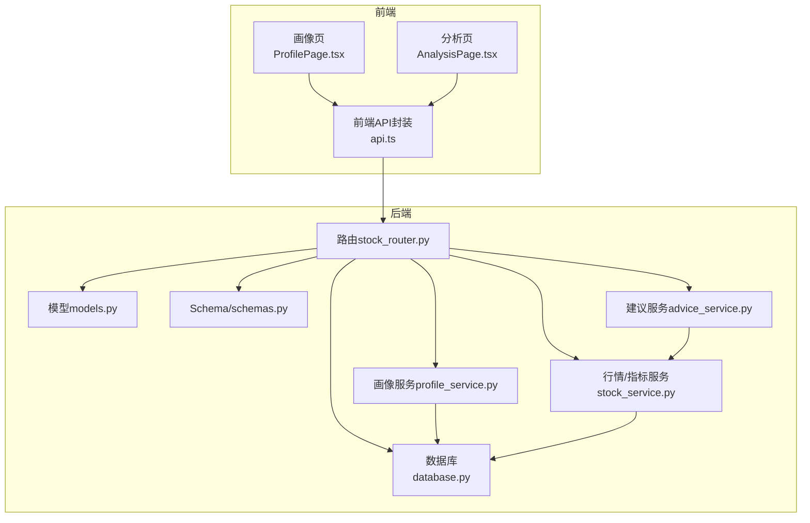
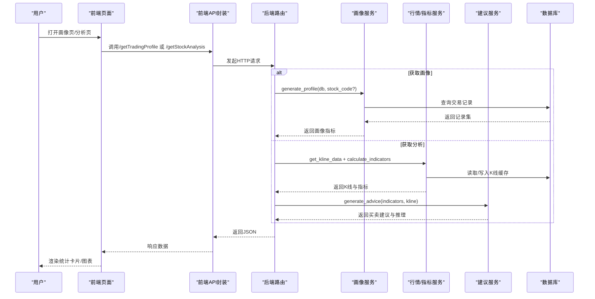
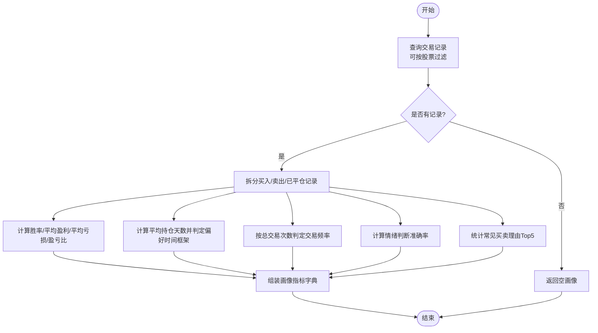
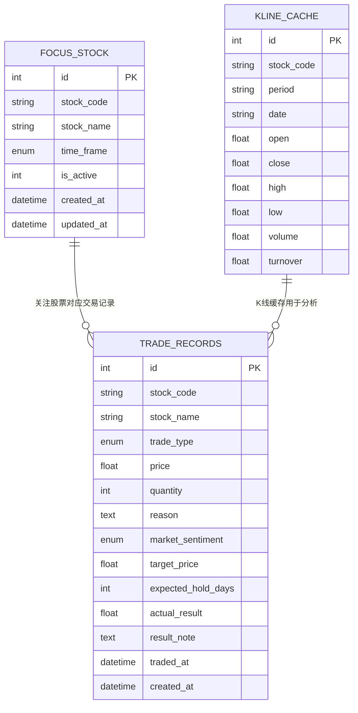
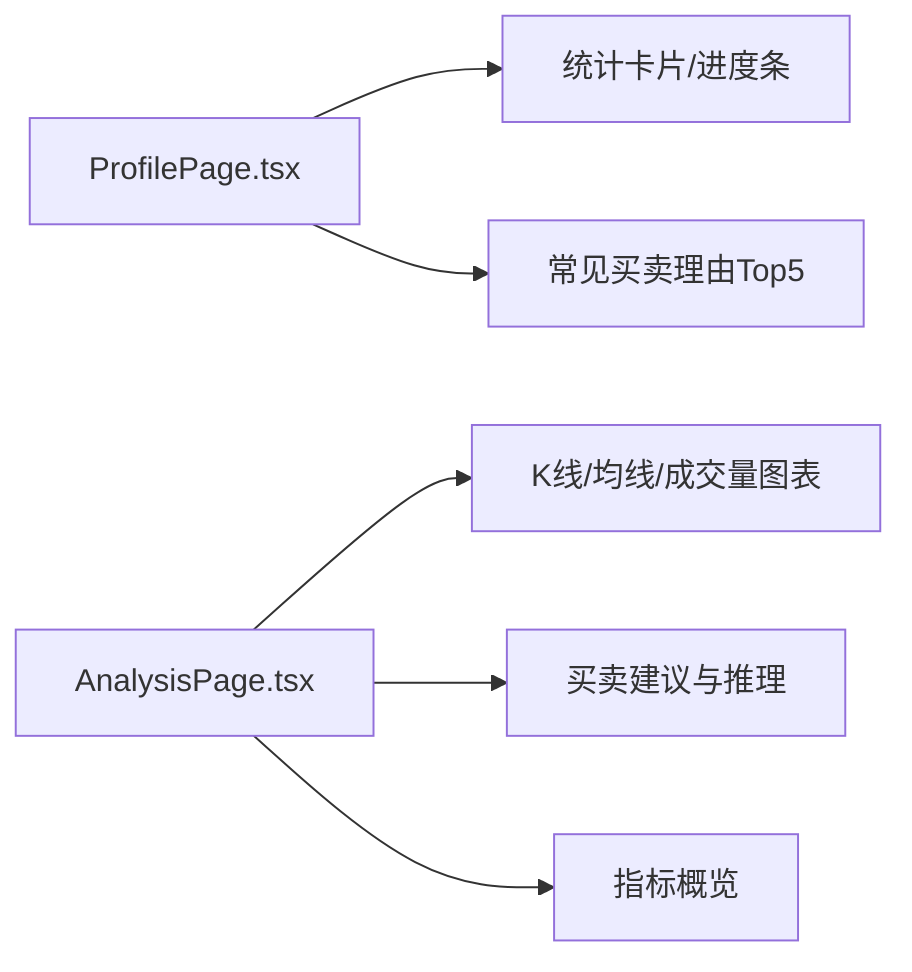
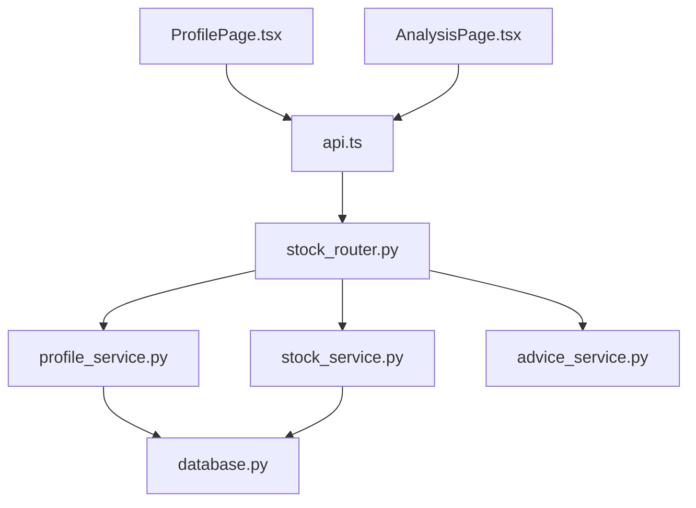

# 炒股画像分析

<cite>
**本文引用的文件**   
- [backend/app/services/profile_service.py](file://backend/app/services/profile_service.py)
- [backend/app/services/advice_service.py](file://backend/app/services/advice_service.py)
- [backend/app/services/stock_service.py](file://backend/app/services/stock_service.py)
- [backend/app/models/models.py](file://backend/app/models/models.py)
- [backend/app/models/schemas.py](file://backend/app/models/schemas.py)
- [backend/app/routers/stock_router.py](file://backend/app/routers/stock_router.py)
- [backend/app/db/database.py](file://backend/app/db/database.py)
- [frontend/src/pages/AnalysisPage.tsx](file://frontend/src/pages/AnalysisPage.tsx)
- [frontend/src/pages/ProfilePage.tsx](file://frontend/src/pages/ProfilePage.tsx)
- [frontend/src/services/api.ts](file://frontend/src/services/api.ts)
- [frontend/src/types/index.ts](file://frontend/src/types/index.ts)
- [doc/产品设计文档.md](file://doc/产品设计文档.md)
- [doc/技术架构文档.md](file://doc/技术架构文档.md)
</cite>

## 目录
1. [简介](#简介)
2. [项目结构](#项目结构)
3. [核心组件](#核心组件)
4. [架构总览](#架构总览)
5. [详细组件分析](#详细组件分析)
6. [依赖关系分析](#依赖关系分析)
7. [性能考量](#性能考量)
8. [故障排查指南](#故障排查指南)
9. [结论](#结论)
10. [附录](#附录)

## 简介
本文件围绕“炒股画像分析”功能，系统阐述其概念、分析维度、算法实现、交易类型识别、可视化展示以及在投资决策中的应用。炒股画像以用户的交易记录为基础，输出交易频率、持仓时间、盈亏分布、风险偏好、情绪判断能力等特征指标，并据此生成个性化标签，帮助用户认识自身交易习惯与改进方向。

## 项目结构
后端采用 FastAPI + SQLAlchemy + SQLite；前端采用 React + Ant Design + ECharts。核心模块包括：
- 路由层：统一暴露 /api 路由，包含关注股票、K线与分析、交易记录、炒股画像等接口
- 服务层：行情与技术指标计算、买卖建议生成、炒股画像生成
- 模型与Schema：定义数据库表结构与前后端数据契约
- 前端页面：分析页（K线+指标+建议）、画像页（统计卡片+图表）



**图表来源**
- [backend/app/routers/stock_router.py:1-197](file://backend/app/routers/stock_router.py#L1-L197)
- [backend/app/services/profile_service.py:1-114](file://backend/app/services/profile_service.py#L1-L114)
- [backend/app/services/stock_service.py:1-327](file://backend/app/services/stock_service.py#L1-L327)
- [backend/app/services/advice_service.py:1-193](file://backend/app/services/advice_service.py#L1-L193)
- [backend/app/db/database.py:1-24](file://backend/app/db/database.py#L1-L24)
- [backend/app/models/models.py:1-75](file://backend/app/models/models.py#L1-L75)
- [backend/app/models/schemas.py:1-118](file://backend/app/models/schemas.py#L1-L118)
- [frontend/src/pages/AnalysisPage.tsx:1-213](file://frontend/src/pages/AnalysisPage.tsx#L1-L213)
- [frontend/src/pages/ProfilePage.tsx:1-173](file://frontend/src/pages/ProfilePage.tsx#L1-L173)
- [frontend/src/services/api.ts:1-68](file://frontend/src/services/api.ts#L1-L68)

**章节来源**
- [doc/技术架构文档.md:1-197](file://doc/技术架构文档.md#L1-L197)

## 核心组件
- 炒股画像服务：基于交易记录统计生成画像指标，包括总交易次数、胜率、平均盈亏、盈亏比、平均持仓天数、交易频率、偏好时间框架、情绪判断准确率、常见买卖理由等
- 技术分析与买卖建议：基于K线与技术指标（MACD、KDJ、RSI、均线、布林带）生成买卖建议与推理过程
- 数据模型与Schema：定义交易记录、关注股票、K线缓存等实体及前后端数据契约
- 前端页面：画像页以卡片与进度条直观展示画像指标；分析页以ECharts展示K线与指标

**章节来源**
- [backend/app/services/profile_service.py:6-114](file://backend/app/services/profile_service.py#L6-L114)
- [backend/app/services/advice_service.py:4-193](file://backend/app/services/advice_service.py#L4-L193)
- [backend/app/models/models.py:25-75](file://backend/app/models/models.py#L25-L75)
- [backend/app/models/schemas.py:97-118](file://backend/app/models/schemas.py#L97-L118)
- [frontend/src/pages/ProfilePage.tsx:26-173](file://frontend/src/pages/ProfilePage.tsx#L26-L173)
- [frontend/src/pages/AnalysisPage.tsx:28-213](file://frontend/src/pages/AnalysisPage.tsx#L28-L213)

## 架构总览
炒股画像分析贯穿“数据采集—指标计算—画像生成—可视化呈现”的完整链路。后端通过路由聚合画像与分析服务，前端通过API封装统一调用，最终在页面中以统计卡片、进度条、图表等形式呈现。



**图表来源**
- [backend/app/routers/stock_router.py:98-196](file://backend/app/routers/stock_router.py#L98-L196)
- [backend/app/services/profile_service.py:6-114](file://backend/app/services/profile_service.py#L6-L114)
- [backend/app/services/stock_service.py:131-327](file://backend/app/services/stock_service.py#L131-L327)
- [backend/app/services/advice_service.py:4-193](file://backend/app/services/advice_service.py#L4-L193)
- [frontend/src/services/api.ts:63-67](file://frontend/src/services/api.ts#L63-L67)
- [frontend/src/pages/AnalysisPage.tsx:35-43](file://frontend/src/pages/AnalysisPage.tsx#L35-L43)
- [frontend/src/pages/ProfilePage.tsx:31-37](file://frontend/src/pages/ProfilePage.tsx#L31-L37)

## 详细组件分析

### 炒股画像服务（profile_service）
- 输入：数据库会话、可选股票代码
- 输出：画像指标字典（总交易次数、胜率、平均盈亏、平均亏损、盈亏比、平均持仓天数、交易频率、偏好时间框架、情绪判断准确率、常见买卖理由TOP5）
- 关键逻辑：
  - 统计已平仓交易的胜率、平均盈利/亏损、盈亏比
  - 计算平均持仓天数并划分偏好时间框架（短/中/长）
  - 基于交易频率划分高频/中频/低频
  - 计算情绪判断准确率（基于市场情绪与实际盈亏的一致性）
  - 统计常见买卖理由Top5
  - 无数据时返回默认空画像



**图表来源**
- [backend/app/services/profile_service.py:6-114](file://backend/app/services/profile_service.py#L6-L114)

**章节来源**
- [backend/app/services/profile_service.py:6-114](file://backend/app/services/profile_service.py#L6-L114)

### 技术分析与买卖建议（advice_service）
- 输入：技术指标字典、K线数据
- 输出：买卖建议（buy/sell/hold）、置信度、推理过程、指标概览
- 关键逻辑：
  - 校验数据完整性，不足则建议持有
  - 逐项分析MACD（金叉/死叉、多头/空头排列）、KDJ（超买/超卖、偏多/偏空）、RSI（超买/超卖）、均线多空排列、布林带位置
  - 综合评分：对各指标信号加权求平均，得到综合评分；根据阈值判定买卖或持有
  - 置信度：综合评分绝对值归一化至[0,1]
  - 推理过程：逐条列出各指标的判断依据与结论

```mermaid
flowchart TD
Start(["开始"]) --> CheckData["校验K线长度与指标是否存在"]
CheckData --> Enough{"数据充足?"}
Enough --> |否| Hold["返回持有建议与理由"]
Enough --> |是| Init["初始化信号列表/推理列表/指标概览"]
Init --> MACD["MACD分析：金叉/死叉/多头/空头排列"]
MACD --> KDJ["KDJ分析：超买/超卖/偏多/偏空"]
KDJ --> RSI["RSI分析：超买/超卖/中性"]
RSI --> MA["均线分析：多头/空头/交织"]
MA --> BOLL["布林带分析：触及上轨/下轨/未触及"]
BOLL --> Sum["综合评分=平均信号值"]
Sum --> Thresh{"综合评分阈值判定"}
Thresh --> |>0.3| Buy["建议买入"]
Thresh --> |<-0.3| Sell["建议卖出"]
Thresh --> |[-0.3,0.3]| Hold2["建议持有观望"]
Buy --> Build["组装结果：信号/置信度/推理/指标概览"]
Sell --> Build
Hold2 --> Build
Hold --> End(["结束"])
Build --> End
```

**图表来源**
- [backend/app/services/advice_service.py:4-193](file://backend/app/services/advice_service.py#L4-L193)

**章节来源**
- [backend/app/services/advice_service.py:4-193](file://backend/app/services/advice_service.py#L4-L193)

### 数据模型与Schema
- 数据模型（SQLAlchemy）：
  - FocusStock：当前关注股票（含时间框架）
  - TradeRecord：交易记录（含买卖类型、价格数量、理由、情绪、目标价、预期持有天数、实际盈亏、时间等）
  - KlineCache：K线缓存（按stock_code+period+date去重）
- Schema（Pydantic）：
  - TradingProfile：画像指标
  - TradingAdvice：买卖建议
  - 技术指标与K线数据结构



**图表来源**
- [backend/app/models/models.py:25-75](file://backend/app/models/models.py#L25-L75)

**章节来源**
- [backend/app/models/models.py:1-75](file://backend/app/models/models.py#L1-L75)
- [backend/app/models/schemas.py:97-118](file://backend/app/models/schemas.py#L97-L118)

### 前端可视化与交互
- 画像页（ProfilePage.tsx）：
  - 使用Ant Design卡片与统计组件展示总交易次数、胜率、盈亏比、平均持仓天数
  - 使用进度条展示胜率与情绪判断准确率
  - 展示常见买卖理由Top5
- 分析页（AnalysisPage.tsx）：
  - 使用ECharts绘制K线图与均线、成交量
  - 展示买卖建议与置信度、推理过程、指标概览



**图表来源**
- [frontend/src/pages/ProfilePage.tsx:46-173](file://frontend/src/pages/ProfilePage.tsx#L46-L173)
- [frontend/src/pages/AnalysisPage.tsx:162-213](file://frontend/src/pages/AnalysisPage.tsx#L162-L213)

**章节来源**
- [frontend/src/pages/ProfilePage.tsx:26-173](file://frontend/src/pages/ProfilePage.tsx#L26-L173)
- [frontend/src/pages/AnalysisPage.tsx:28-213](file://frontend/src/pages/AnalysisPage.tsx#L28-L213)

## 依赖关系分析
- 路由依赖服务：/api/profile 调用画像服务；/api/stocks/{code}/analysis 调用行情/指标与建议服务
- 服务依赖数据库：画像与行情服务均通过数据库会话访问交易记录与K线缓存
- 前端依赖后端API：通过api.ts封装统一调用



**图表来源**
- [backend/app/routers/stock_router.py:187-196](file://backend/app/routers/stock_router.py#L187-L196)
- [backend/app/services/profile_service.py:1-114](file://backend/app/services/profile_service.py#L1-L114)
- [backend/app/services/stock_service.py:1-327](file://backend/app/services/stock_service.py#L1-L327)
- [backend/app/services/advice_service.py:1-193](file://backend/app/services/advice_service.py#L1-L193)
- [backend/app/db/database.py:1-24](file://backend/app/db/database.py#L1-L24)
- [frontend/src/services/api.ts:1-68](file://frontend/src/services/api.ts#L1-L68)

**章节来源**
- [backend/app/routers/stock_router.py:1-197](file://backend/app/routers/stock_router.py#L1-L197)
- [frontend/src/services/api.ts:1-68](file://frontend/src/services/api.ts#L1-L68)

## 性能考量
- 数据缓存：K线数据本地缓存，避免重复抓取；仅增量更新，减少网络与计算开销
- 指标计算：使用pandas-ta一次性批量计算多指标，避免多次遍历
- 前端渲染：ECharts按需渲染，分网格与双轴展示，保证交互流畅
- API聚合：分析页一次性返回K线、指标与建议，减少往返次数

**章节来源**
- [backend/app/services/stock_service.py:131-327](file://backend/app/services/stock_service.py#L131-L327)
- [frontend/src/pages/AnalysisPage.tsx:54-157](file://frontend/src/pages/AnalysisPage.tsx#L54-L157)

## 故障排查指南
- 画像为空或指标异常
  - 检查是否存在交易记录；若无记录，画像返回默认空数据
  - 确认交易记录是否包含实际盈亏字段
- 技术分析建议为持有
  - 检查K线数据长度是否满足要求（少于最小长度将返回持有）
  - 检查技术指标是否成功计算（MACD/KDJ/RSI/均线/布林带）
- 前端无法加载数据
  - 确认Vite代理已正确转发 /api 到后端
  - 检查后端CORS与路由是否可用
- 数据库问题
  - 确认SQLite数据库文件存在且可写
  - 初始化数据库表结构（首次运行）

**章节来源**
- [backend/app/services/profile_service.py:100-114](file://backend/app/services/profile_service.py#L100-L114)
- [backend/app/services/advice_service.py:9-15](file://backend/app/services/advice_service.py#L9-L15)
- [frontend/src/services/api.ts](file://frontend/src/services/api.ts#L11)
- [backend/app/db/database.py:22-24](file://backend/app/db/database.py#L22-L24)

## 结论
炒股画像分析通过结构化交易记录与技术指标，形成可量化的交易画像，帮助用户识别交易频率、持仓偏好、盈亏分布与情绪判断能力等关键特征。配合可视化界面，用户可以直观地审视自身交易习惯，并据此优化策略。建议持续补充更多交易类型识别规则与风险控制模块，进一步提升画像的解释力与实用性。

## 附录

### 炒股画像分析维度与算法要点
- 交易频率：基于总交易次数划分高频/中频/低频
- 持仓时间：基于已平仓交易的预期/实际持有天数，划分偏好时间框架（短/中/长）
- 盈亏分布：胜率、平均盈利、平均亏损、盈亏比
- 风险偏好：结合盈亏比与情绪判断准确率，评估风险承受与认知偏差
- 情绪判断：基于市场情绪与实际盈亏一致性计算准确率
- 个性化标签：交易频率、偏好时间框架、常见买卖理由Top5

**章节来源**
- [backend/app/services/profile_service.py:6-114](file://backend/app/services/profile_service.py#L6-L114)
- [doc/产品设计文档.md:108-119](file://doc/产品设计文档.md#L108-L119)

### 交易类型识别算法（短线/中线/长线）
- 短线：平均持仓天数 ≤ 5天
- 中线：平均持仓天数 5 < 天数 ≤ 30天
- 长线：平均持仓天数 > 30天

该分类用于生成“偏好时间框架”标签，便于用户识别自身交易风格。

**章节来源**
- [backend/app/services/profile_service.py:43-48](file://backend/app/services/profile_service.py#L43-L48)

### 可视化展示建议
- 画像页：统计卡片（总交易次数、胜率、盈亏比、平均持仓天数）、进度条（胜率与情绪准确率）、列表（常见买卖理由Top5）
- 分析页：K线图（蜡烛图+均线+成交量）、买卖建议与置信度、推理过程、指标概览

**章节来源**
- [frontend/src/pages/ProfilePage.tsx:46-173](file://frontend/src/pages/ProfilePage.tsx#L46-L173)
- [frontend/src/pages/AnalysisPage.tsx:162-213](file://frontend/src/pages/AnalysisPage.tsx#L162-L213)

### 在投资决策中的应用场景
- 自我认知：通过画像识别交易频率、持仓偏好、盈亏分布与情绪判断能力，发现潜在问题（如追涨杀跌、频繁交易等）
- 策略优化：结合偏好时间框架与盈亏比，调整止盈止损与仓位管理
- 风险控制：利用情绪判断准确率与胜率趋势，设定冷静期与风控阈值
- 复盘与改进：周期性查看画像变化，评估策略有效性并迭代

**章节来源**
- [doc/产品设计文档.md:108-119](file://doc/产品设计文档.md#L108-L119)