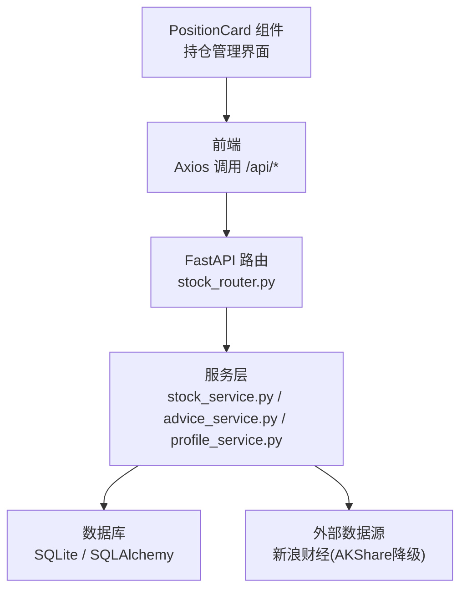
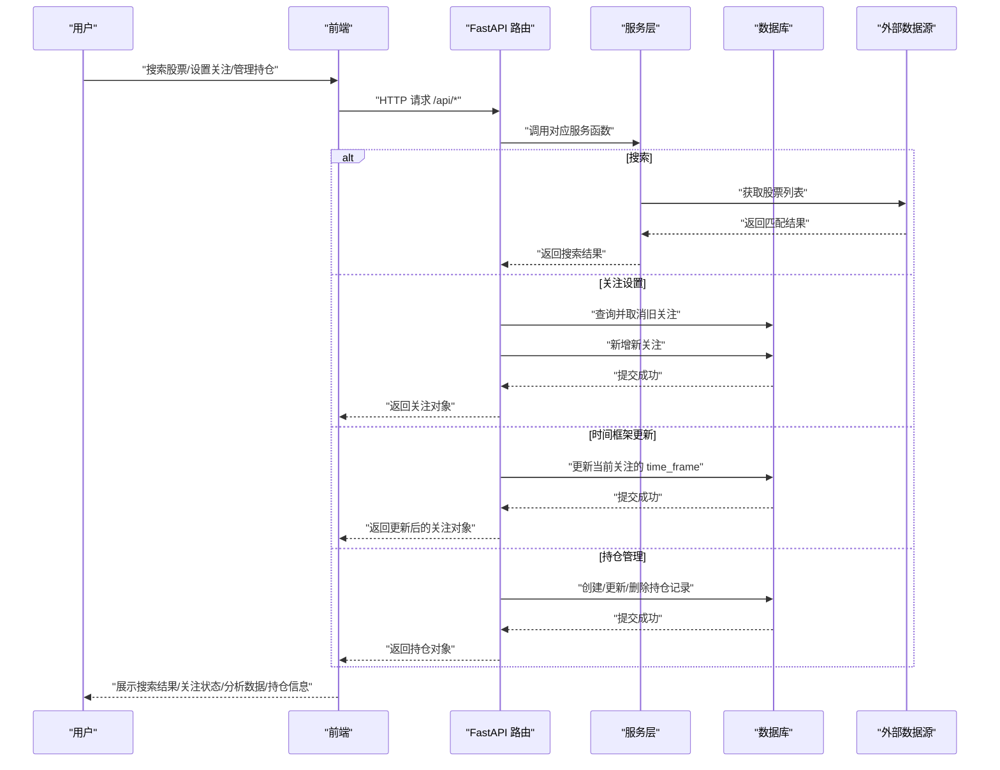
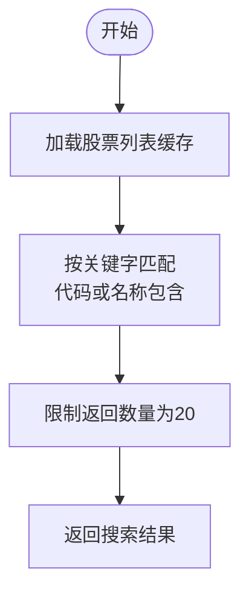
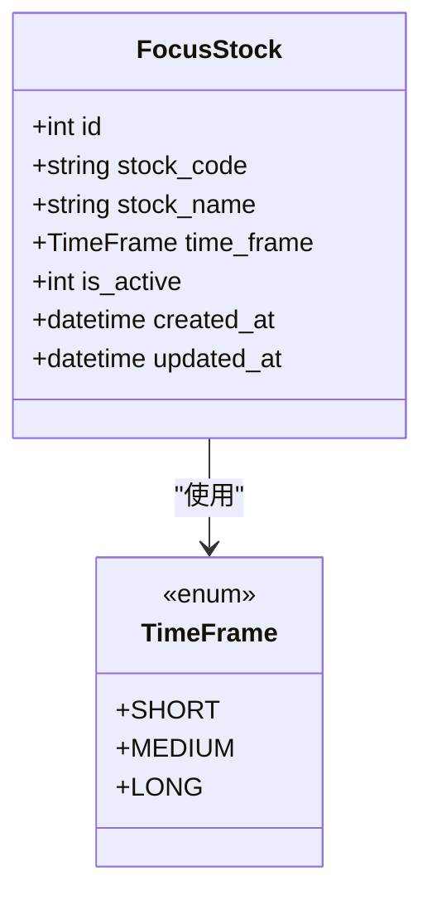
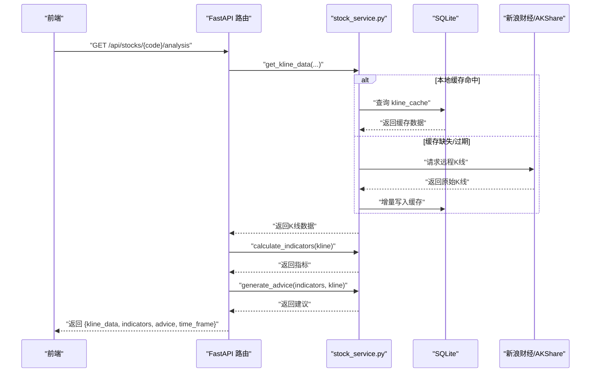
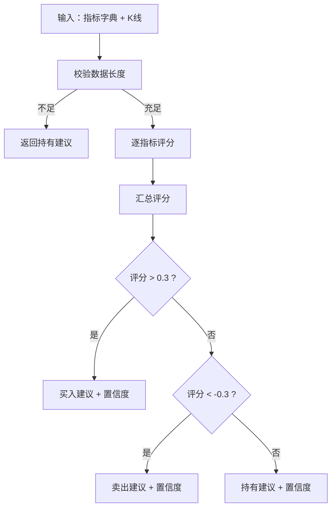
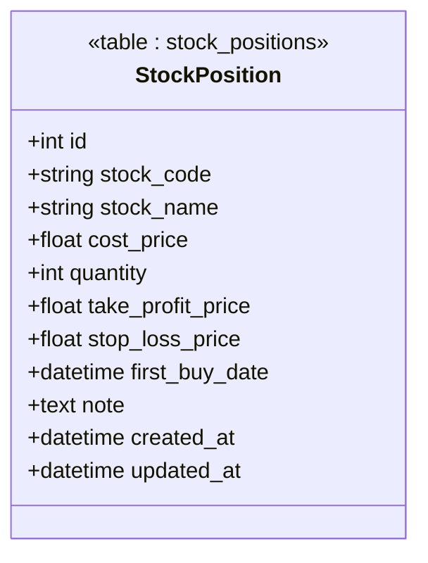
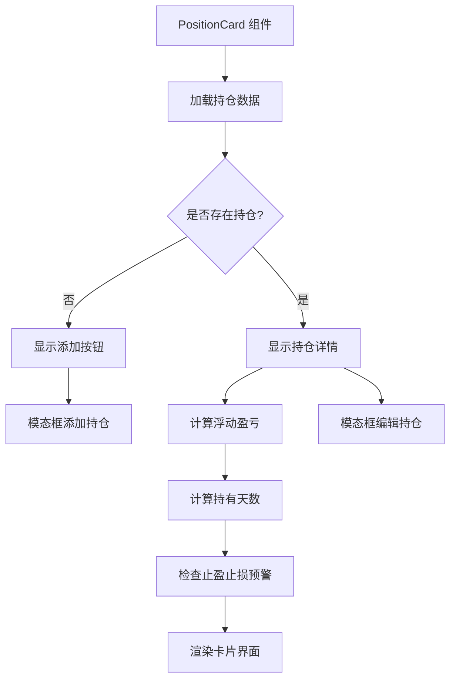
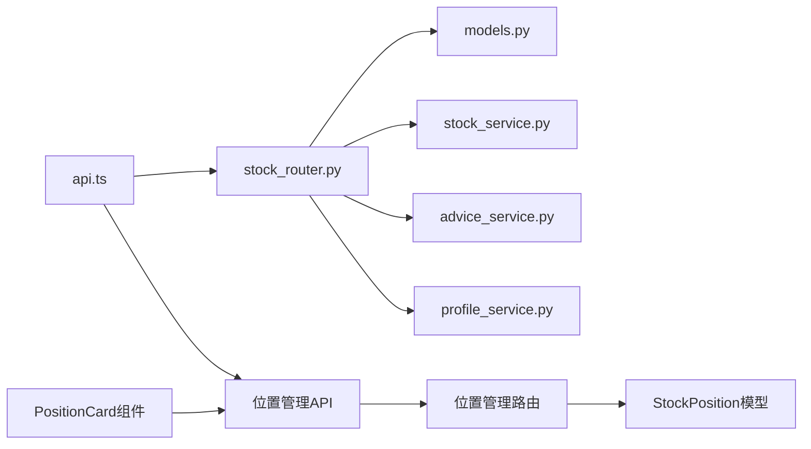

# 股票关注管理

<cite>
**本文引用的文件**
- [backend/app/main.py](file://backend/app/main.py)
- [backend/app/routers/stock_router.py](file://backend/app/routers/stock_router.py)
- [backend/app/services/stock_service.py](file://backend/app/services/stock_service.py)
- [backend/app/services/advice_service.py](file://backend/app/services/advice_service.py)
- [backend/app/services/profile_service.py](file://backend/app/services/profile_service.py)
- [backend/app/models/models.py](file://backend/app/models/models.py)
- [backend/app/models/schemas.py](file://backend/app/models/schemas.py)
- [backend/app/db/database.py](file://backend/app/db/database.py)
- [frontend/src/services/api.ts](file://frontend/src/services/api.ts)
- [frontend/src/types/index.ts](file://frontend/src/types/index.ts)
- [frontend/src/components/PositionCard.tsx](file://frontend/src/components/PositionCard.tsx)
- [frontend/src/pages/AnalysisPage.tsx](file://frontend/src/pages/AnalysisPage.tsx)
- [frontend/src/pages/TradesPage.tsx](file://frontend/src/pages/TradesPage.tsx)
- [doc/产品设计文档.md](file://doc/产品设计文档.md)
- [doc/技术架构文档.md](file://doc/技术架构文档.md)
- [doc/MVP实现说明.md](file://doc/MVP实现说明.md)
</cite>

## 更新摘要
**所做更改**
- 新增位置管理功能章节，包含StockPosition模型和PositionCard组件的详细说明
- 更新API接口说明，增加持仓管理相关接口
- 扩展用户操作流程，包含持仓添加、编辑、删除功能
- 增强交易记录与持仓管理的关联关系说明

## 目录
1. [简介](#简介)
2. [项目结构](#项目结构)
3. [核心组件](#核心组件)
4. [架构概览](#架构概览)
5. [详细组件分析](#详细组件分析)
6. [位置管理功能](#位置管理功能)
7. [依赖分析](#依赖分析)
8. [性能考量](#性能考量)
9. [故障排查指南](#故障排查指南)
10. [结论](#结论)
11. [附录](#附录)

## 简介
本文件面向"股票关注管理"功能，系统性说明如何设置与管理当前关注的股票，包括：
- 股票搜索与关注切换
- 时间框架（日线、周线、月线）选择与业务逻辑
- 股票搜索算法与股票列表缓存机制
- K线与技术指标计算、买卖建议生成
- **新增**：位置管理功能，包括持仓记录的创建、编辑、删除与实时同步
- 用户操作流程与API接口说明

本功能以"单股票聚焦"为核心，所有分析与建议围绕当前关注的股票展开，并支持历史关注记录的查询与归档。新增的位置管理功能为用户提供完整的投资跟踪能力。

**章节来源**
- [doc/产品设计文档.md:22-39](file://doc/产品设计文档.md#L22-L39)
- [doc/技术架构文档.md:119-152](file://doc/技术架构文档.md#L119-L152)

## 项目结构
后端采用FastAPI + SQLAlchemy + SQLite；前端采用React + Vite + Axios。核心关注管理相关模块如下：
- 后端路由与服务：/api/focus、/api/stocks/search、/api/stocks/{code}/analysis、**新增**：/api/positions
- 数据模型：FocusStock、KlineCache、TradeRecord、**新增**：StockPosition
- 服务层：stock_service（搜索、K线与缓存、指标计算）、advice_service（买卖建议）、profile_service（炒股画像）
- **新增**：PositionCard组件，提供直观的持仓信息展示与管理界面

**图表来源**
- [backend/app/routers/stock_router.py:15-197](file://backend/app/routers/stock_router.py#L15-L197)
- [backend/app/services/stock_service.py:131-327](file://backend/app/services/stock_service.py#L131-L327)
- [backend/app/db/database.py:1-24](file://backend/app/db/database.py#L1-L24)
- [frontend/src/components/PositionCard.tsx:1-312](file://frontend/src/components/PositionCard.tsx#L1-L312)

**章节来源**
- [doc/技术架构文档.md:19-67](file://doc/技术架构文档.md#L19-L67)

## 核心组件
- 股票关注模型与枚举：TimeFrame（short/medium/long）、FocusStock
- **新增**：StockPosition模型，管理用户的实际持仓信息
- 股票搜索与K线服务：search_stocks、get_kline_data、calculate_indicators
- 买卖建议服务：generate_advice
- 炒股画像服务：generate_profile
- **新增**：PositionCard组件，提供持仓信息的可视化展示与交互管理
- 前后端API封装：/api/focus、/api/stocks/search、/api/stocks/{code}/analysis、**新增**：/api/positions

**章节来源**
- [backend/app/models/models.py:8-36](file://backend/app/models/models.py#L8-L36)
- [backend/app/models/models.py:133-151](file://backend/app/models/models.py#L133-L151)
- [backend/app/models/schemas.py:8-27](file://backend/app/models/schemas.py#L8-L27)
- [frontend/src/types/index.ts:100-131](file://frontend/src/types/index.ts#L100-L131)
- [frontend/src/components/PositionCard.tsx:36-40](file://frontend/src/components/PositionCard.tsx#L36-L40)
- [backend/app/services/stock_service.py:54-327](file://backend/app/services/stock_service.py#L54-L327)
- [backend/app/services/advice_service.py:4-193](file://backend/app/services/advice_service.py#L4-L193)
- [backend/app/services/profile_service.py:6-114](file://backend/app/services/profile_service.py#L6-L114)
- [frontend/src/services/api.ts:93-104](file://frontend/src/services/api.ts#L93-L104)

## 架构概览
关注管理涉及的关键流程：
- 用户在前端发起搜索与关注设置
- 后端路由接收请求，调用服务层处理
- 服务层负责数据获取、缓存与计算
- **新增**：位置管理流程包括持仓的创建、更新、删除与实时同步
- 将结果返回给前端渲染

**图表来源**
- [backend/app/routers/stock_router.py:20-53](file://backend/app/routers/stock_router.py#L20-L53)
- [backend/app/services/stock_service.py:54-65](file://backend/app/services/stock_service.py#L54-L65)
- [backend/app/routers/stock_router.py:150-194](file://backend/app/routers/stock_router.py#L150-L194)

**章节来源**
- [backend/app/routers/stock_router.py:15-197](file://backend/app/routers/stock_router.py#L15-L197)
- [doc/技术架构文档.md:153-178](file://doc/技术架构文档.md#L153-L178)

## 详细组件分析

### 股票搜索与关注管理
- 搜索接口：GET /api/stocks/search?keyword=xxx
  - 服务层实现：search_stocks(keyword)
  - 算法：加载A股股票列表缓存，按股票代码或名称包含匹配，返回前20条
  - 缓存：_stock_list_cache 全局缓存，首次加载后复用
- 关注设置接口：POST /api/focus
  - 业务：自动取消之前 is_active=1 的关注，新增当前关注
  - 参数：stock_code、stock_name、time_frame（默认short）
- 时间框架更新接口：PUT /api/focus/timeframe
  - 业务：更新当前关注的 time_frame（short/medium/long）
- 历史关注接口：GET /api/focus/history
  - 业务：返回最近关注记录（最多50条）

**图表来源**
- [backend/app/services/stock_service.py:38-65](file://backend/app/services/stock_service.py#L38-L65)

**章节来源**
- [backend/app/routers/stock_router.py:20-65](file://backend/app/routers/stock_router.py#L20-L65)
- [backend/app/services/stock_service.py:38-65](file://backend/app/services/stock_service.py#L38-L65)
- [frontend/src/services/api.ts:14-28](file://frontend/src/services/api.ts#L14-L28)

### 时间框架选择与业务逻辑
- 时间框架枚举：short（短线）、medium（中线）、long（长线）
- 当前关注记录包含 time_frame 字段，用于指导技术分析与建议策略
- 在分析接口中，若当前关注存在则读取其 time_frame，否则回退为默认值
- 建议生成逻辑会结合时间框架偏好进行权重调整（如持有周期偏好）

**图表来源**
- [backend/app/models/models.py:8-36](file://backend/app/models/models.py#L8-L36)

**章节来源**
- [backend/app/models/models.py:8-36](file://backend/app/models/models.py#L8-L36)
- [backend/app/routers/stock_router.py:118-122](file://backend/app/routers/stock_router.py#L118-L122)
- [doc/产品设计文档.md:30-33](file://doc/产品设计文档.md#L30-L33)

### K线与技术指标计算
- K线数据获取：GET /api/stocks/{code}/kline?period=daily|weekly|monthly&start_date&end_date
  - 服务层：get_kline_data(stock_code, period, start_date, end_date)
  - 本地缓存策略：SQLite kline_cache 表，按 stock_code + period + date 唯一
  - 增量更新：仅写入本地没有的日期，当日允许覆盖更新
  - 数据源：优先新浪财经，失败则降级至AKShare
- 技术指标：calculate_indicators(kline_data)
  - 指标：MA5/10/20/60、MACD、KDJ、RSI、布林带、成交量
  - 输出：标准化结构，便于前端渲染与建议生成
- 完整分析：GET /api/stocks/{code}/analysis
  - 流程：获取K线 → 计算指标 → 读取当前关注 time_frame → 生成买卖建议 → 返回组合数据

**图表来源**
- [backend/app/routers/stock_router.py:82-131](file://backend/app/routers/stock_router.py#L82-L131)
- [backend/app/services/stock_service.py:131-253](file://backend/app/services/stock_service.py#L131-L253)

**章节来源**
- [backend/app/routers/stock_router.py:82-131](file://backend/app/routers/stock_router.py#L82-L131)
- [backend/app/services/stock_service.py:131-253](file://backend/app/services/stock_service.py#L131-L253)

### 买卖建议生成
- 输入：技术指标字典、K线数据
- 输出：signal（buy/sell/hold）、confidence、reasoning、indicators_summary
- 策略要点：综合MACD、KDJ、RSI、均线、布林带，给出评分与推理过程
- 评分阈值：>0.3 买入，<-0.3 卖出，否则持有

**图表来源**
- [backend/app/services/advice_service.py:4-173](file://backend/app/services/advice_service.py#L4-L173)

**章节来源**
- [backend/app/services/advice_service.py:4-173](file://backend/app/services/advice_service.py#L4-L173)
- [doc/MVP实现说明.md:27-41](file://doc/MVP实现说明.md#L27-L41)

### 炒股画像
- 输入：交易记录（可按股票过滤）
- 输出：总交易数、胜率、平均盈亏、盈亏比、平均持有天数、交易频率、偏好时间框架、情绪准确率、常见买卖理由TopN
- 用途：帮助用户认识自身交易风格与弱点，指导策略优化

**章节来源**
- [backend/app/services/profile_service.py:6-97](file://backend/app/services/profile_service.py#L6-L97)
- [doc/产品设计文档.md:93-119](file://doc/产品设计文档.md#L93-L119)

## 位置管理功能

### StockPosition模型设计
StockPosition模型用于存储用户的实际持仓信息，提供完整的投资跟踪能力：

- **字段定义**：
  - id：自增主键
  - stock_code：股票代码（唯一约束）
  - stock_name：股票名称
  - cost_price：成本价
  - quantity：持仓数量
  - take_profit_price：止盈价位
  - stop_loss_price：止损价位
  - first_buy_date：首次买入日期
  - note：备注信息
  - created_at/updated_at：创建与更新时间戳

- **数据库约束**：
  - stock_code唯一约束，防止重复持仓
  - stock_code建立索引，优化查询性能

**图表来源**
- [backend/app/models/models.py:133-151](file://backend/app/models/models.py#L133-L151)

**章节来源**
- [backend/app/models/models.py:133-151](file://backend/app/models/models.py#L133-L151)

### PositionCard组件实现
PositionCard组件提供直观的持仓信息展示与管理界面：

- **核心功能**：
  - **显示模式**：展示持仓成本价、数量、市值、浮动盈亏、持有天数、止盈止损设置
  - **编辑模式**：支持成本价、数量、止盈止损价位、备注的修改
  - **预警功能**：当股价触及止盈或止损价位时显示相应警告标签
  - **实时计算**：根据当前股价动态计算浮动盈亏和盈亏百分比

- **交互特性**：
  - 支持添加新持仓、编辑现有持仓、删除持仓记录
  - 使用Ant Design组件库构建响应式界面
  - 集成表单验证和错误处理机制
  - 提供加载状态和确认对话框

- **数据计算**：
  - 浮动盈亏 = (当前价格 - 成本价) × 持仓数量
  - 盈亏百分比 = ((当前价格 - 成本价) / 成本价) × 100%
  - 持有天数 = 从首次买入日期到今天的天数

**图表来源**
- [frontend/src/components/PositionCard.tsx:42-312](file://frontend/src/components/PositionCard.tsx#L42-L312)

**章节来源**
- [frontend/src/components/PositionCard.tsx:1-312](file://frontend/src/components/PositionCard.tsx#L1-L312)
- [frontend/src/types/index.ts:100-131](file://frontend/src/types/index.ts#L100-L131)

### 持仓管理API接口
位置管理功能提供完整的RESTful API接口：

- **获取持仓**：GET /api/positions/{stock_code}
  - 功能：查询指定股票的持仓信息
  - 返回：Position对象或null
- **创建持仓**：POST /api/positions
  - 功能：创建新的持仓记录
  - 参数：PositionCreate对象
  - 异常：若股票已有持仓则返回409冲突
- **更新持仓**：PUT /api/positions/{stock_code}
  - 功能：更新现有持仓信息
  - 参数：PositionUpdate对象（支持部分更新）
  - 异常：若持仓不存在则返回404
- **删除持仓**：DELETE /api/positions/{stock_code}
  - 功能：删除指定股票的持仓记录
  - 异常：若持仓不存在则返回404

**章节来源**
- [backend/app/routers/stock_router.py:144-194](file://backend/app/routers/stock_router.py#L144-L194)
- [frontend/src/services/api.ts:93-104](file://frontend/src/services/api.ts#L93-L104)

### 交易记录与持仓同步
系统支持实时交易模式下的自动持仓同步：

- **买入同步**：
  - 若存在持仓：计算加权平均成本价，更新持仓数量
  - 若无持仓：自动创建新的StockPosition记录
- **卖出同步**：
  - 验证持仓数量是否足够
  - 减少相应的持仓数量
  - 异常处理：数量不足时抛出400错误

**章节来源**
- [backend/app/routers/stock_router.py:212-260](file://backend/app/routers/stock_router.py#L212-L260)

## 依赖分析
- 路由依赖：stock_router.py 依赖数据库会话、模型与服务层
- 服务层依赖：stock_service.py 依赖外部数据源（akshare、requests）、pandas/pandas-ta；advice_service.py 依赖指标计算结果；profile_service.py 依赖交易记录
- **新增**：位置管理依赖：PositionCard组件依赖API服务和类型定义
- 数据模型：FocusStock、KlineCache、TradeRecord、**新增**：StockPosition 定义关注、缓存、交易记录与持仓的数据结构
- 前后端通信：frontend/src/services/api.ts 封装 /api/* 接口调用

**图表来源**
- [backend/app/routers/stock_router.py:15-197](file://backend/app/routers/stock_router.py#L15-L197)
- [backend/app/models/models.py:1-75](file://backend/app/models/models.py#L1-L75)
- [backend/app/services/stock_service.py:1-327](file://backend/app/services/stock_service.py#L1-L327)
- [backend/app/services/advice_service.py:1-193](file://backend/app/services/advice_service.py#L1-L193)
- [backend/app/services/profile_service.py:1-114](file://backend/app/services/profile_service.py#L1-L114)
- [frontend/src/services/api.ts:1-65](file://frontend/src/services/api.ts#L1-L65)
- [frontend/src/components/PositionCard.tsx:1-312](file://frontend/src/components/PositionCard.tsx#L1-L312)

**章节来源**
- [backend/app/routers/stock_router.py:15-197](file://backend/app/routers/stock_router.py#L15-L197)
- [backend/app/models/models.py:1-75](file://backend/app/models/models.py#L1-L75)
- [backend/app/services/stock_service.py:1-327](file://backend/app/services/stock_service.py#L1-L327)
- [backend/app/services/advice_service.py:1-193](file://backend/app/services/advice_service.py#L1-L193)
- [backend/app/services/profile_service.py:1-114](file://backend/app/services/profile_service.py#L1-L114)
- [frontend/src/services/api.ts:1-65](file://frontend/src/services/api.ts#L1-L65)
- [frontend/src/components/PositionCard.tsx:1-312](file://frontend/src/components/PositionCard.tsx#L1-L312)

## 性能考量
- 搜索性能：股票列表缓存全局生效，首次加载后 O(n) 匹配，返回前20条，延迟极低
- K线缓存：按 stock_code + period + date 唯一，增量写入，命中后直接返回，远程失败时回退缓存
- 指标计算：pandas-ta 计算，数据量大时注意内存与CPU占用
- 外部数据源：新浪为主，AKShare为备，失败重试与降级保障可用性
- **新增**：位置管理性能：StockPosition表对stock_code建立索引，查询效率高；PositionCard组件使用useCallback优化重新渲染

**章节来源**
- [backend/app/services/stock_service.py:35-65](file://backend/app/services/stock_service.py#L35-L65)
- [backend/app/services/stock_service.py:153-237](file://backend/app/services/stock_service.py#L153-L237)
- [backend/app/models/models.py:141](file://backend/app/models/models.py#L141)
- [frontend/src/components/PositionCard.tsx:50](file://frontend/src/components/PositionCard.tsx#L50)
- [doc/MVP实现说明.md:43-63](file://doc/MVP实现说明.md#L43-L63)

## 故障排查指南
- 搜索失败：检查网络与 akshare 可用性；确认缓存是否异常
- 关注设置无效：确认旧关注是否正确取消；检查 time_frame 是否合法
- K线为空：确认股票代码正确；检查缓存写入与远程数据源可用性
- 指标异常：确认 K线数据完整性；检查 pandas-ta 版本与依赖
- 建议不稳定：确认数据长度是否满足最小样本；检查时间框架设置
- **新增**：持仓管理问题：
  - 创建失败：检查股票是否已有持仓记录
  - 更新失败：确认持仓记录是否存在
  - 删除失败：确认要删除的持仓是否存在
  - 实时交易同步：检查买入数量是否超过持仓数量

**章节来源**
- [backend/app/routers/stock_router.py:47-53](file://backend/app/routers/stock_router.py#L47-L53)
- [backend/app/services/stock_service.py:240-253](file://backend/app/services/stock_service.py#L240-L253)
- [backend/app/services/advice_service.py:9-15](file://backend/app/services/advice_service.py#L9-L15)
- [backend/app/routers/stock_router.py:150-194](file://backend/app/routers/stock_router.py#L150-L194)
- [backend/app/routers/stock_router.py:212-260](file://backend/app/routers/stock_router.py#L212-L260)

## 结论
股票关注管理功能以"单股票聚焦"为核心，结合搜索、关注切换、时间框架选择与K线/指标/建议一体化流程，形成闭环的数据驱动决策体系。**新增的位置管理功能**进一步完善了系统的投资跟踪能力，通过StockPosition模型和PositionCard组件，为用户提供直观的持仓管理和实时盈亏计算。通过本地缓存与双数据源容灾，确保性能与稳定性；通过买卖建议与炒股画像，帮助用户持续优化交易行为。

## 附录

### 用户操作流程
- 搜索股票：在搜索框输入关键词，点击搜索，选择目标股票
- 设置关注：点击"设为关注"，系统自动取消旧关注，保存新关注及默认时间框架
- 切换时间框架：在关注设置界面选择 short/medium/long，提交后立即生效
- 查看分析：进入分析页面，自动加载当前关注股票的K线、指标与买卖建议
- **新增**：管理持仓：
  - 添加持仓：在分析页面或交易页面点击"添加持仓"，填写成本价、数量等信息
  - 编辑持仓：点击"编辑"按钮，修改止盈止损价位或备注信息
  - 删除持仓：使用确认对话框删除不需要的持仓记录
  - 实时同步：在交易页面选择"实时交易"模式，系统自动同步买卖操作到持仓

**章节来源**
- [doc/产品设计文档.md:22-39](file://doc/产品设计文档.md#L22-L39)
- [frontend/src/services/api.ts:14-28](file://frontend/src/services/api.ts#L14-L28)
- [frontend/src/components/PositionCard.tsx:114-132](file://frontend/src/components/PositionCard.tsx#L114-L132)

### API接口说明
- 获取当前关注：GET /api/focus
- 设置关注：POST /api/focus（参数：stock_code、stock_name、time_frame）
- 更新时间框架：PUT /api/focus/timeframe（参数：time_frame）
- 搜索股票：GET /api/stocks/search?keyword=xxx
- 获取K线：GET /api/stocks/{code}/kline?period=daily|weekly|monthly&start_date&end_date
- 获取完整分析：GET /api/stocks/{code}/analysis?period&start_date&end_date
- 获取历史关注：GET /api/focus/history
- **新增**：获取持仓：GET /api/positions/{stock_code}
- **新增**：创建持仓：POST /api/positions（参数：PositionCreate）
- **新增**：更新持仓：PUT /api/positions/{stock_code}（参数：PositionUpdate）
- **新增**：删除持仓：DELETE /api/positions/{stock_code}

**章节来源**
- [doc/技术架构文档.md:119-152](file://doc/技术架构文档.md#L119-L152)
- [backend/app/routers/stock_router.py:20-131](file://backend/app/routers/stock_router.py#L20-L131)
- [backend/app/routers/stock_router.py:144-194](file://backend/app/routers/stock_router.py#L144-L194)
- [frontend/src/services/api.ts:93-104](file://frontend/src/services/api.ts#L93-L104)

### 位置管理组件使用示例
PositionCard组件可在多个页面中使用：

- **AnalysisPage**：在分析页面顶部展示当前关注股票的持仓信息
- **TradesPage**：在交易记录上方展示对应股票的持仓状态
- **交互方式**：组件接收stockCode、stockName和currentPrice参数，自动加载并显示持仓详情

**章节来源**
- [frontend/src/pages/AnalysisPage.tsx:438-442](file://frontend/src/pages/AnalysisPage.tsx#L438-L442)
- [frontend/src/pages/TradesPage.tsx:295-297](file://frontend/src/pages/TradesPage.tsx#L295-L297)
- [frontend/src/components/PositionCard.tsx:36-40](file://frontend/src/components/PositionCard.tsx#L36-L40)