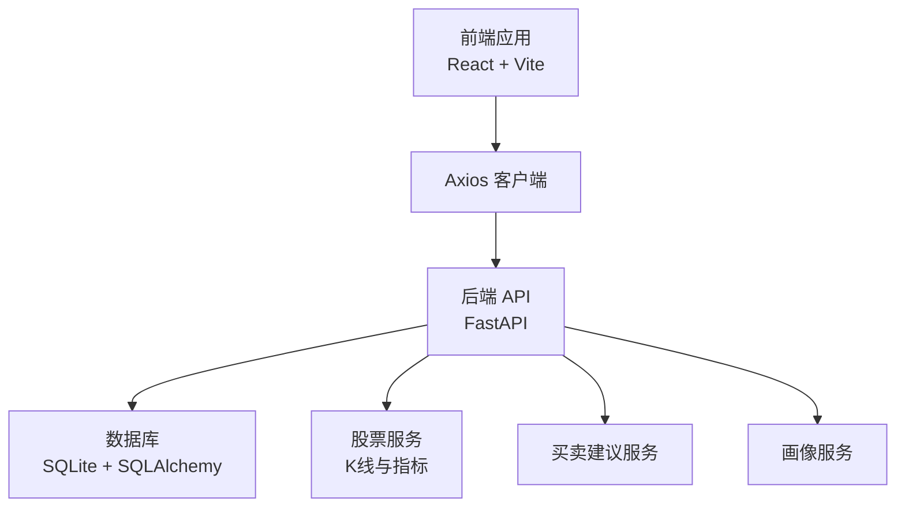
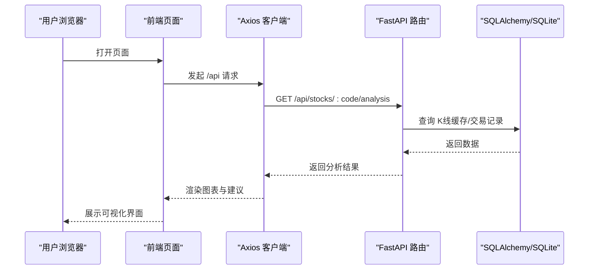
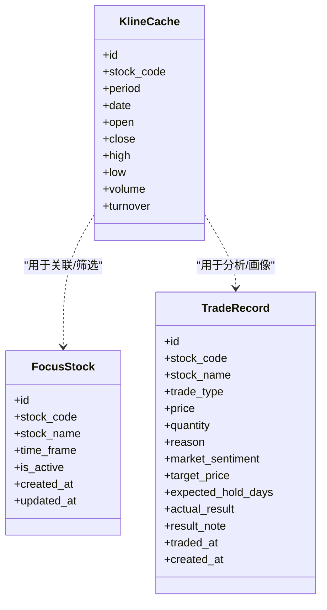
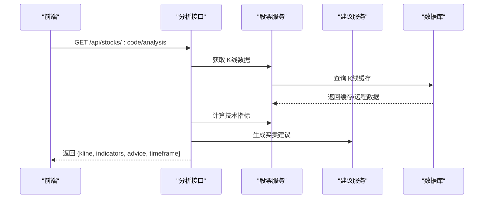
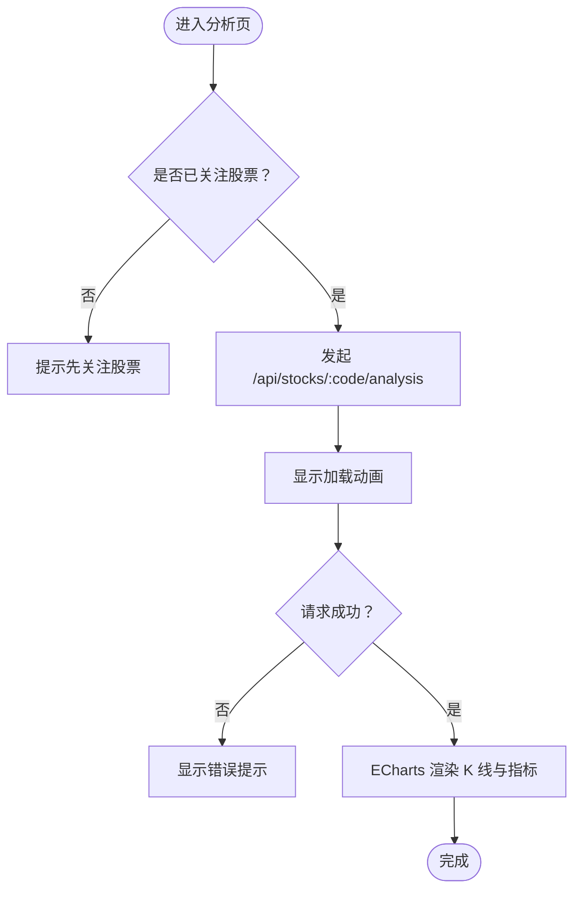
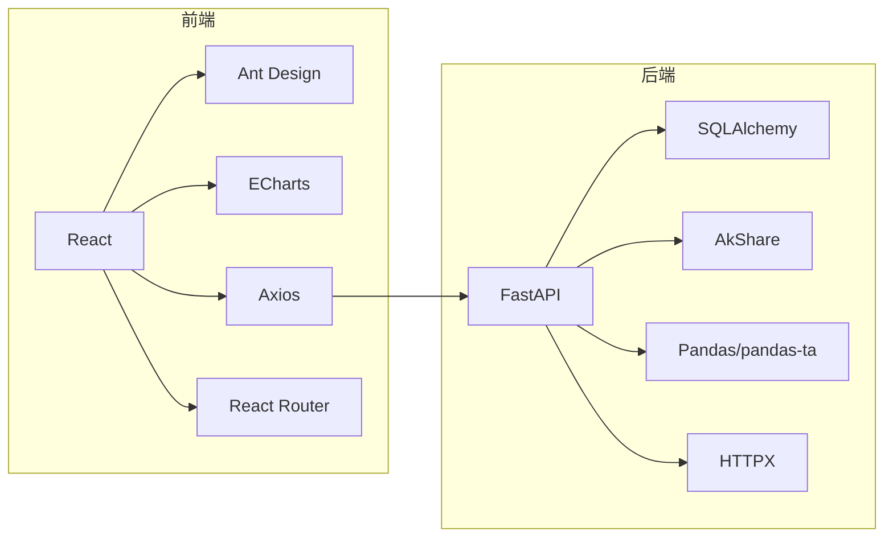

# 性能优化

<cite>
**本文引用的文件**

- [backend/app/main.py](file://backend/app/main.py)

- [backend/app/db/database.py](file://backend/app/db/database.py)

- [backend/app/routers/stock_router.py](file://backend/app/routers/stock_router.py)

- [backend/app/models/models.py](file://backend/app/models/models.py)

- [backend/app/services/stock_service.py](file://backend/app/services/stock_service.py)

- [backend/app/services/advice_service.py](file://backend/app/services/advice_service.py)

- [backend/app/services/profile_service.py](file://backend/app/services/profile_service.py)

- [frontend/src/services/api.ts](file://frontend/src/services/api.ts)

- [frontend/src/pages/AnalysisPage.tsx](file://frontend/src/pages/AnalysisPage.tsx)

- [frontend/src/pages/TradesPage.tsx](file://frontend/src/pages/TradesPage.tsx)

- [frontend/src/pages/ProfilePage.tsx](file://frontend/src/pages/ProfilePage.tsx)

- [frontend/vite.config.ts](file://frontend/vite.config.ts)

- [backend/requirements.txt](file://backend/requirements.txt)

- [frontend/package.json](file://frontend/package.json)
</cite>

## 目录
1. [简介](#简介)

2. [项目结构](#项目结构)

3. [核心组件](#核心组件)

4. [架构总览](#架构总览)

5. [详细组件分析](#详细组件分析)

6. [依赖分析](#依赖分析)

7. [性能考量](#性能考量)

8. [故障排查指南](#故障排查指南)

9. [结论](#结论)

10. [附录](#附录)

## 简介
本文件面向 Stock Foker 应用，系统化梳理后端 FastAPI 与前端 React 的性能优化路径，聚焦以下方面：

- 数据库查询优化：索引、查询限制、事务与连接管理

- API 响应时间优化：缓存策略、远程接口降级与重试、批量写入

- 前端渲染性能提升：图表渲染优化、分页与懒加载、虚拟滚动

- 缓存策略：数据缓存（K线）、图片缓存（建议）、API 响应缓存（建议）

- 内存与连接池：SQLite 连接与会话生命周期、并发控制

- 大数据量处理：分页加载、懒加载、虚拟滚动

- 性能测试与基准测试：方法论与工具建议

## 项目结构
应用采用前后端分离架构：

- 后端：FastAPI + SQLAlchemy（SQLite），提供 REST 接口

- 前端：React + Vite，通过 Axios 访问后端 /api 路由

- 开发代理：Vite 将 /api 请求转发至后端 127.0.0.1:8000

图示来源

- [frontend/vite.config.ts:1-16](file://frontend/vite.config.ts#L1-L16)

- [backend/app/main.py:1-28](file://backend/app/main.py#L1-L28)

- [backend/app/db/database.py:1-24](file://backend/app/db/database.py#L1-L24)

- [backend/app/services/stock_service.py:1-327](file://backend/app/services/stock_service.py#L1-L327)

- [backend/app/services/advice_service.py:1-193](file://backend/app/services/advice_service.py#L1-L193)

- [backend/app/services/profile_service.py:1-114](file://backend/app/services/profile_service.py#L1-L114)

章节来源

- [backend/app/main.py:1-28](file://backend/app/main.py#L1-L28)

- [frontend/vite.config.ts:1-16](file://frontend/vite.config.ts#L1-L16)

## 核心组件
- 后端路由与服务

  - 股票关注、历史、搜索、K线与分析、交易记录、画像

  - K线缓存表与本地增量更新策略

  - 技术指标计算与买卖建议生成

- 前端页面与服务

  - 分析页（K线与指标可视化）、交易页（表格分页）、画像页（统计卡片）

  - Axios 封装的 API 客户端

章节来源

- [backend/app/routers/stock_router.py:1-197](file://backend/app/routers/stock_router.py#L1-L197)

- [backend/app/models/models.py:58-75](file://backend/app/models/models.py#L58-L75)

- [backend/app/services/stock_service.py:131-238](file://backend/app/services/stock_service.py#L131-L238)

- [backend/app/services/advice_service.py:4-173](file://backend/app/services/advice_service.py#L4-L173)

- [frontend/src/services/api.ts:1-68](file://frontend/src/services/api.ts#L1-L68)

- [frontend/src/pages/AnalysisPage.tsx:1-229](file://frontend/src/pages/AnalysisPage.tsx#L1-L229)

- [frontend/src/pages/TradesPage.tsx:1-260](file://frontend/src/pages/TradesPage.tsx#L1-L260)

- [frontend/src/pages/ProfilePage.tsx:1-173](file://frontend/src/pages/ProfilePage.tsx#L1-L173)

## 架构总览
后端以 FastAPI 提供统一入口，SQLAlchemy 连接 SQLite；前端通过 Axios 发起请求，Vite 在开发环境进行 /api 代理。

图示来源

- [frontend/src/services/api.ts:34-44](file://frontend/src/services/api.ts#L34-L44)

- [backend/app/routers/stock_router.py:98-131](file://backend/app/routers/stock_router.py#L98-L131)

- [backend/app/db/database.py:14-19](file://backend/app/db/database.py#L14-L19)

## 详细组件分析

### 数据库层与查询优化
- 连接与会话

  - 使用 SQLAlchemy 创建 engine 与 sessionmaker，全局单例 engine，每个请求创建独立会话

  - 通过依赖注入在路由中获取 db 会话，确保请求结束关闭连接

- 表与索引

  - K线缓存表按 stock_code、period 建立唯一约束与索引，加速查询与去重

  - 关注表与交易表具备常用过滤字段

- 查询限制

  - 历史关注与交易记录默认限制返回条数，避免一次性返回大量数据

- 事务与写入

  - K线缓存采用批量写入与条件更新，减少 IO 次数

图示来源

- [backend/app/models/models.py:25-75](file://backend/app/models/models.py#L25-L75)

章节来源

- [backend/app/db/database.py:1-24](file://backend/app/db/database.py#L1-L24)

- [backend/app/models/models.py:25-75](file://backend/app/models/models.py#L25-L75)

- [backend/app/routers/stock_router.py:56-65](file://backend/app/routers/stock_router.py#L56-L65)

- [backend/app/routers/stock_router.py:136-146](file://backend/app/routers/stock_router.py#L136-L146)

### API 层与响应时间优化
- 路由职责清晰，按功能模块划分，便于定位性能瓶颈

- K线与分析接口串联：K线缓存读取 → 指标计算 → 买卖建议生成 → 返回组合数据

- 异常处理：对外抛出 HTTP 500，前端统一提示

图示来源

- [backend/app/routers/stock_router.py:98-131](file://backend/app/routers/stock_router.py#L98-L131)

- [backend/app/services/stock_service.py:131-238](file://backend/app/services/stock_service.py#L131-L238)

- [backend/app/services/advice_service.py:4-173](file://backend/app/services/advice_service.py#L4-L173)

章节来源

- [backend/app/routers/stock_router.py:98-131](file://backend/app/routers/stock_router.py#L98-L131)

### 前端渲染性能优化
- 图表渲染

  - 使用 ECharts 渲染 K 线与指标，支持 dataZoom、滑块缩放与内部缩放

  - 通过分组 grid 与双轴布局，合理分配空间

- 页面交互

  - 分析页：按周期切换，异步加载数据，加载态与错误态处理

  - 交易页：表格分页（每页固定条目），减少 DOM 节点数量

  - 画像页：卡片式布局，进度条与统计信息展示

图示来源

- [frontend/src/pages/AnalysisPage.tsx:35-43](file://frontend/src/pages/AnalysisPage.tsx#L35-L43)

- [frontend/src/services/api.ts:34-44](file://frontend/src/services/api.ts#L34-L44)

章节来源

- [frontend/src/pages/AnalysisPage.tsx:1-229](file://frontend/src/pages/AnalysisPage.tsx#L1-L229)

- [frontend/src/pages/TradesPage.tsx:178-186](file://frontend/src/pages/TradesPage.tsx#L178-L186)

- [frontend/src/pages/ProfilePage.tsx:1-173](file://frontend/src/pages/ProfilePage.tsx#L1-L173)

### 缓存策略
- 数据缓存（K线）

  - 本地 SQLite 缓存 K 线，按 stock_code + period 分类

  - 仅增量拉取缺失日期，避免重复下载

  - 盘中更新当日数据，保证实时性

- 图片缓存（建议）

  - 建议使用浏览器缓存与 CDN 缓存策略，结合静态资源指纹化

- API 响应缓存（建议）

  - 对热点接口（如分析页）可引入 Redis 缓存，设置合理过期时间与失效策略

章节来源

- [backend/app/models/models.py:58-75](file://backend/app/models/models.py#L58-L75)

- [backend/app/services/stock_service.py:153-238](file://backend/app/services/stock_service.py#L153-L238)

### 大数据量处理
- 分页加载

  - 交易记录接口默认限制返回条数，前端表格分页

- 懒加载

  - 分析页仅在关注变更或周期切换时触发请求

- 虚拟滚动（建议）

  - 对于超大数据集，可在表格组件中引入虚拟滚动以降低 DOM 压力

章节来源

- [backend/app/routers/stock_router.py:136-146](file://backend/app/routers/stock_router.py#L136-L146)

- [frontend/src/pages/TradesPage.tsx:184-185](file://frontend/src/pages/TradesPage.tsx#L184-L185)

- [frontend/src/pages/AnalysisPage.tsx:35-43](file://frontend/src/pages/AnalysisPage.tsx#L35-L43)

## 依赖分析
- 后端依赖

  - FastAPI、SQLAlchemy、AkShare、Pandas、pandas-ta、HTTPX

- 前端依赖

  - React、Ant Design、ECharts、Axios、Day.js、React Router

图示来源

- [backend/requirements.txt:1-10](file://backend/requirements.txt#L1-L10)

- [frontend/package.json:11-29](file://frontend/package.json#L11-L29)

章节来源

- [backend/requirements.txt:1-10](file://backend/requirements.txt#L1-L10)

- [frontend/package.json:11-29](file://frontend/package.json#L11-L29)

## 性能考量

### 数据库查询优化
- 索引与唯一约束

  - K 线缓存表对 stock_code、period 建立唯一约束与索引，避免重复写入与加速查询

- 查询限制

  - 历史关注与交易记录默认限制返回条数，防止大结果集导致网络与前端压力

- 事务与批量写入

  - K 线缓存采用批量 add_all 与 commit，减少多次 IO

- 连接与会话

  - 每个请求创建独立会话，请求结束关闭，避免连接泄漏

章节来源

- [backend/app/models/models.py:61-63](file://backend/app/models/models.py#L61-L63)

- [backend/app/routers/stock_router.py:56-65](file://backend/app/routers/stock_router.py#L56-L65)

- [backend/app/routers/stock_router.py:136-146](file://backend/app/routers/stock_router.py#L136-L146)

- [backend/app/services/stock_service.py:202-234](file://backend/app/services/stock_service.py#L202-L234)

- [backend/app/db/database.py:14-19](file://backend/app/db/database.py#L14-L19)

### API 响应时间优化
- 远程接口降级与重试

  - K 线获取优先新浪接口，失败则降级至 AkShare，并内置重试机制

- 指标计算与建议生成

  - 指标计算基于 Pandas 与 pandas-ta，建议生成聚合多指标，注意输入数据长度校验

- 错误处理

  - 统一捕获运行时异常并返回 HTTP 500，前端友好提示

章节来源

- [backend/app/services/stock_service.py:22-33](file://backend/app/services/stock_service.py#L22-L33)

- [backend/app/services/stock_service.py:240-252](file://backend/app/services/stock_service.py#L240-L252)

- [backend/app/services/advice_service.py:9-15](file://backend/app/services/advice_service.py#L9-L15)

- [backend/app/routers/stock_router.py:70-78](file://backend/app/routers/stock_router.py#L70-L78)

- [backend/app/routers/stock_router.py:82-95](file://backend/app/routers/stock_router.py#L82-L95)

- [backend/app/routers/stock_router.py:98-131](file://backend/app/routers/stock_router.py#L98-L131)

### 前端渲染性能提升
- 图表渲染

  - ECharts 配置 dataZoom、滑块缩放与内部缩放，减少全量渲染

  - 仅在必要时更新 series 数据，避免频繁重建

- 分页与懒加载

  - 交易记录分页，分析页按需请求，避免一次性加载过多数据

- 虚拟滚动（建议）

  - 对超大数据集引入虚拟滚动，降低 DOM 节点数量

章节来源

- [frontend/src/pages/AnalysisPage.tsx:69-88](file://frontend/src/pages/AnalysisPage.tsx#L69-L88)

- [frontend/src/pages/TradesPage.tsx:178-186](file://frontend/src/pages/TradesPage.tsx#L178-L186)

### 缓存策略
- 数据缓存（K线）

  - 本地 SQLite 缓存，按日期增量更新，减少远程调用

- 图片缓存（建议）

  - 静态资源指纹化与 CDN 缓存

- API 响应缓存（建议）

  - 对热点接口引入 Redis 缓存，设置过期时间与失效策略

章节来源

- [backend/app/models/models.py:58-75](file://backend/app/models/models.py#L58-L75)

- [backend/app/services/stock_service.py:153-238](file://backend/app/services/stock_service.py#L153-L238)

### 内存使用优化与连接池配置
- SQLite 连接

  - 当前使用单实例 engine，适合开发/小规模场景；生产建议启用连接池参数（最大连接数、空闲连接、超时）

- 会话生命周期

  - 严格遵循“每次请求创建会话，请求结束关闭”的模式，避免连接泄漏

- 前端内存

  - 控制图表数据长度，及时清理不再使用的状态与事件监听

章节来源

- [backend/app/db/database.py:6-7](file://backend/app/db/database.py#L6-L7)

- [backend/app/db/database.py:14-19](file://backend/app/db/database.py#L14-L19)

### 大数据量处理技巧
- 分页加载

  - 交易记录接口限制返回条数，前端表格分页

- 懒加载

  - 分析页仅在关注或周期切换时请求

- 虚拟滚动（建议）

  - 对超大数据集引入虚拟滚动

章节来源

- [backend/app/routers/stock_router.py:136-146](file://backend/app/routers/stock_router.py#L136-L146)

- [frontend/src/pages/TradesPage.tsx:184-185](file://frontend/src/pages/TradesPage.tsx#L184-L185)

- [frontend/src/pages/AnalysisPage.tsx:35-43](file://frontend/src/pages/AnalysisPage.tsx#L35-L43)

### 性能测试与基准测试
- 方法论

  - 前端：使用浏览器开发者工具的 Performance/Network 面板观测首屏、交互延迟与网络请求

  - 后端：对关键接口（如分析页）进行压测，观察 CPU、内存、数据库连接占用

- 工具建议

  - 前端：Lighthouse、WebPageTest、Browser DevTools

  - 后端：Locust、Artillery、wrk、Postman/Newman

- 指标关注

  - P50/P90/P99 响应时间、吞吐量、错误率、数据库慢查询比例

[本节为通用指导，不直接分析具体文件]

## 故障排查指南
- 常见问题

  - K线数据为空：检查远程接口可用性与降级逻辑

  - 图表渲染卡顿：检查数据长度与 series 更新频率

  - 交易记录加载失败：检查后端限流与前端错误提示

- 排查步骤

  - 后端：查看启动日志、数据库连接状态、远程接口返回

  - 前端：Network 面板查看请求状态码与耗时，Console 查看异常堆栈

章节来源

- [backend/app/routers/stock_router.py:70-78](file://backend/app/routers/stock_router.py#L70-L78)

- [backend/app/services/stock_service.py:240-252](file://backend/app/services/stock_service.py#L240-L252)

- [frontend/src/pages/AnalysisPage.tsx:41-42](file://frontend/src/pages/AnalysisPage.tsx#L41-L42)

## 结论
Stock Foker 的性能优化应围绕“数据库查询限制与索引、API 响应时间与缓存、前端渲染与懒加载”三大方向展开。当前项目已具备基础缓存与分页能力，建议在生产环境中引入连接池、Redis 缓存与虚拟滚动等进一步优化手段，并建立完善的性能测试流程以持续监控与改进。

## 附录
- 开发代理配置

  - Vite 将 /api 请求代理至后端 127.0.0.1:8000，便于前后端联调

- 依赖版本

  - 后端与前端关键依赖版本已在对应文件中声明

章节来源

- [frontend/vite.config.ts:8-13](file://frontend/vite.config.ts#L8-L13)

- [backend/requirements.txt:1-10](file://backend/requirements.txt#L1-L10)

- [frontend/package.json:11-29](file://frontend/package.json#L11-L29)
