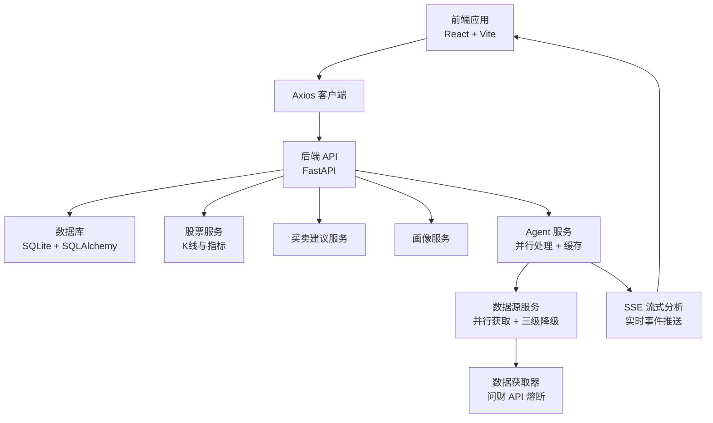
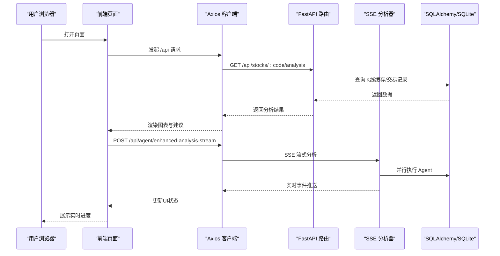
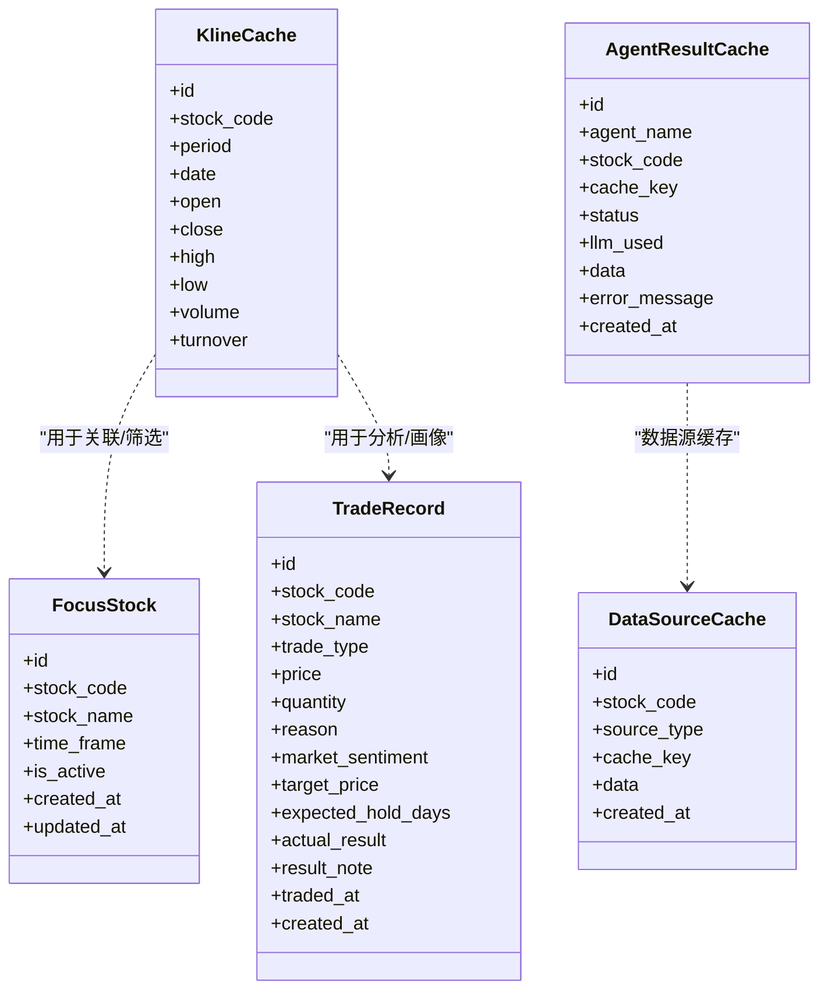
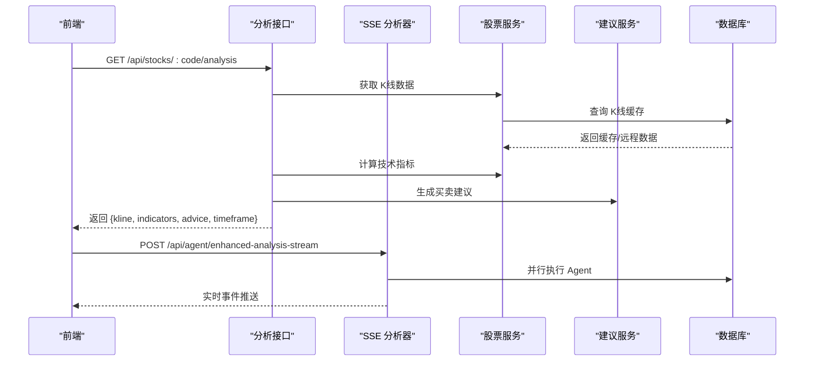
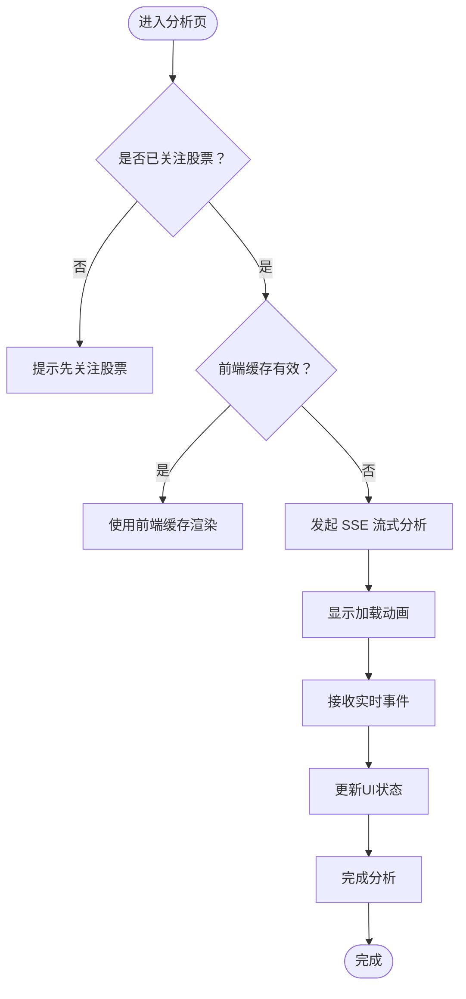
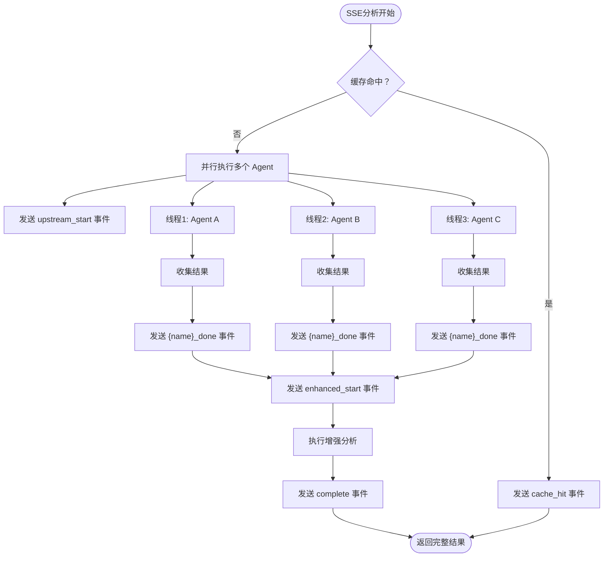
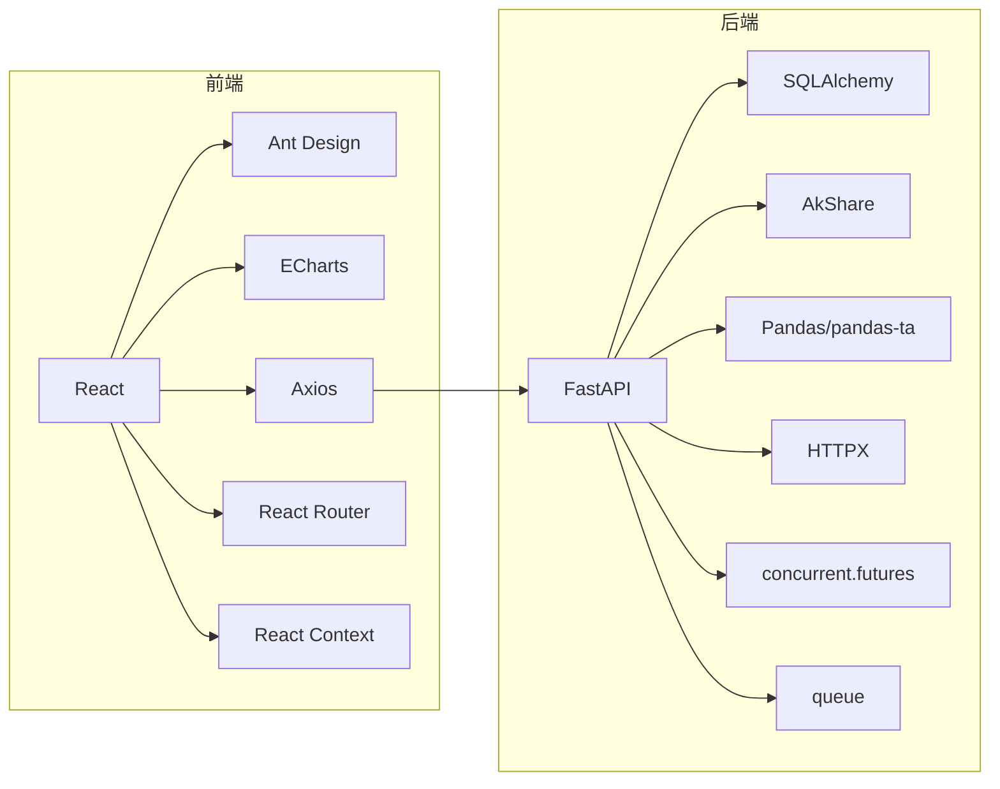

# 性能优化

<cite>
**本文引用的文件**
- [backend/app/main.py](file://backend/app/main.py)
- [backend/app/db/database.py](file://backend/app/db/database.py)
- [backend/app/routers/stock_router.py](file://backend/app/routers/stock_router.py)
- [backend/app/routers/agent_router.py](file://backend/app/routers/agent_router.py)
- [backend/app/models/models.py](file://backend/app/models/models.py)
- [backend/app/services/stock_service.py](file://backend/app/services/stock_service.py)
- [backend/app/services/advice_service.py](file://backend/app/services/advice_service.py)
- [backend/app/services/data_source_service.py](file://backend/app/services/data_source_service.py)
- [backend/app/services/data_fetcher.py](file://backend/app/services/data_fetcher.py)
- [backend/app/agents/base_agent.py](file://backend/app/agents/base_agent.py)
- [backend/app/agents/sentiment_agent.py](file://backend/app/agents/sentiment_agent.py)
- [backend/app/agents/sector_agent.py](file://backend/app/agents/sector_agent.py)
- [backend/app/agents/macro_agent.py](file://backend/app/agents/macro_agent.py)
- [backend/app/agents/enhanced_advice_agent.py](file://backend/app/agents/enhanced_advice_agent.py)
- [frontend/src/services/api.ts](file://frontend/src/services/api.ts)
- [frontend/src/pages/AnalysisPage.tsx](file://frontend/src/pages/AnalysisPage.tsx)
- [frontend/src/pages/TradesPage.tsx](file://frontend/src/pages/TradesPage.tsx)
- [frontend/src/pages/ProfilePage.tsx](file://frontend/src/pages/ProfilePage.tsx)
- [frontend/src/pages/SettingsPage.tsx](file://frontend/src/pages/SettingsPage.tsx)
- [frontend/src/contexts/AgentCacheContext.tsx](file://frontend/src/contexts/AgentCacheContext.tsx)
- [frontend/src/types/index.ts](file://frontend/src/types/index.ts)
- [frontend/vite.config.ts](file://frontend/vite.config.ts)
- [backend/requirements.txt](file://backend/requirements.txt)
- [frontend/package.json](file://frontend/package.json)
</cite>

## 目录
1. [简介](#简介)
2. [项目结构](#项目结构)
3. [核心组件](#核心组件)
4. [架构总览](#架构总览)
5. [详细组件分析](#详细组件分析)
6. [依赖分析](#依赖分析)
7. [性能考量](#性能考量)
8. [故障排查指南](#故障排查指南)
9. [结论](#结论)
10. [附录](#附录)

## 简介
本文件面向 Stock Foker 应用，系统化梳理后端 FastAPI 与前端 React 的性能优化路径，聚焦以下方面：
- 数据库查询优化：索引、查询限制、事务与连接管理
- API 响应时间优化：缓存策略、远程接口降级与重试、批量写入
- 前端渲染性能提升：图表渲染优化、分页与懒加载、虚拟滚动
- 缓存策略：数据缓存（K线）、图片缓存（建议）、API 响应缓存（建议）
- 内存与连接池：SQLite 连接与会话生命周期、并发控制
- 大数据量处理：分页加载、懒加载、虚拟滚动
- 性能测试与基准测试：方法论与工具建议

**更新** 本次更新重点反映了新的流式分析系统和增强的并行处理机制，包括：
- SSE（Server-Sent Events）流式分析系统，提供实时进度反馈
- 增强的并行执行策略，支持线程池管理和队列通信
- 改进的缓存优化，包括三级降级策略和熔断机制
- 前端流式事件处理，支持实时UI更新
- 问财API熔断机制，避免额度耗尽导致的超时
- **新增** 并行数据获取统一接口，显著提升Agent执行效率
- **新增** 问财API熔断机制，Sentiment Agent从44秒优化到20.9秒
- **新增** 备用数据源机制，AKShare兜底确保服务稳定性

## 项目结构
应用采用前后端分离架构：
- 后端：FastAPI + SQLAlchemy（SQLite），提供 REST 接口
- 前端：React + Vite，通过 Axios 访问后端 /api 路由
- 开发代理：Vite 将 /api 请求转发至后端 127.0.0.1:8000

图示来源
- [frontend/vite.config.ts:1-16](file://frontend/vite.config.ts#L1-L16)
- [backend/app/main.py:1-28](file://backend/app/main.py#L1-L28)
- [backend/app/db/database.py:1-24](file://backend/app/db/database.py#L1-L24)
- [backend/app/services/stock_service.py:1-327](file://backend/app/services/stock_service.py#L1-L327)
- [backend/app/services/advice_service.py:1-193](file://backend/app/services/advice_service.py#L1-L193)
- [backend/app/services/profile_service.py:1-114](file://backend/app/services/profile_service.py#L1-L114)
- [backend/app/services/data_source_service.py:1-273](file://backend/app/services/data_source_service.py#L1-L273)
- [backend/app/services/data_fetcher.py:1-590](file://backend/app/services/data_fetcher.py#L1-L590)
- [backend/app/routers/agent_router.py:360-490](file://backend/app/routers/agent_router.py#L360-L490)

章节来源
- [backend/app/main.py:1-28](file://backend/app/main.py#L1-L28)
- [frontend/vite.config.ts:1-16](file://frontend/vite.config.ts#L1-L16)

## 核心组件
- 后端路由与服务
  - 股票关注、历史、搜索、K线与分析、交易记录、画像
  - K线缓存表与本地增量更新策略
  - 技术指标计算与买卖建议生成
  - Agent 路由与并行执行机制
  - 数据源服务与三级降级策略
  - SSE流式分析系统，支持实时事件推送
- 前端页面与服务
  - 分析页（K线与指标可视化）、交易页（表格分页）、画像页（统计卡片）
  - Axios 封装的 API 客户端
  - Agent 缓存上下文，支持内存级缓存和淘汰策略
  - SSE事件处理器，支持实时UI更新

章节来源
- [backend/app/routers/stock_router.py:1-197](file://backend/app/routers/stock_router.py#L1-L197)
- [backend/app/models/models.py:58-75](file://backend/app/models/models.py#L58-L75)
- [backend/app/services/stock_service.py:131-238](file://backend/app/services/stock_service.py#L131-L238)
- [backend/app/services/advice_service.py:4-173](file://backend/app/services/advice_service.py#L4-L173)
- [frontend/src/services/api.ts:1-68](file://frontend/src/services/api.ts#L1-L68)
- [frontend/src/pages/AnalysisPage.tsx:1-229](file://frontend/src/pages/AnalysisPage.tsx#L1-L229)
- [frontend/src/pages/TradesPage.tsx:1-260](file://frontend/src/pages/TradesPage.tsx#L1-L260)
- [frontend/src/pages/ProfilePage.tsx:1-173](file://frontend/src/pages/ProfilePage.tsx#L1-L173)
- [frontend/src/contexts/AgentCacheContext.tsx:1-139](file://frontend/src/contexts/AgentCacheContext.tsx#L1-L139)

## 架构总览
后端以 FastAPI 提供统一入口，SQLAlchemy 连接 SQLite；前端通过 Axios 发起请求，Vite 在开发环境进行 /api 代理。新增的SSE流式分析系统提供实时事件推送功能。

图示来源
- [frontend/src/services/api.ts:164-217](file://frontend/src/services/api.ts#L164-L217)
- [backend/app/routers/agent_router.py:483-490](file://backend/app/routers/agent_router.py#L483-L490)
- [backend/app/db/database.py:14-19](file://backend/app/db/database.py#L14-L19)

## 详细组件分析

### 数据库层与查询优化
- 连接与会话
  - 使用 SQLAlchemy 创建 engine 与 sessionmaker，全局单例 engine，每个请求创建独立会话
  - 通过依赖注入在路由中获取 db 会话，确保请求结束关闭连接
- 表与索引
  - K线缓存表按 stock_code、period 建立唯一约束与索引，加速查询与去重
  - 关注表与交易表具备常用过滤字段
  - Agent 结果缓存表和数据源缓存表建立相应索引
- 查询限制
  - 历史关注与交易记录默认限制返回条数，避免一次性返回大量数据
- 事务与写入
  - K线缓存采用批量写入与条件更新，减少 IO 次数
  - Agent 结果缓存按日期键进行唯一约束，避免重复写入

图示来源
- [backend/app/models/models.py:25-75](file://backend/app/models/models.py#L25-L75)
- [backend/app/models/models.py:83-131](file://backend/app/models/models.py#L83-L131)

章节来源
- [backend/app/db/database.py:1-24](file://backend/app/db/database.py#L1-L24)
- [backend/app/models/models.py:25-75](file://backend/app/models/models.py#L25-L75)
- [backend/app/routers/stock_router.py:56-65](file://backend/app/routers/stock_router.py#L56-L65)
- [backend/app/routers/stock_router.py:136-146](file://backend/app/routers/stock_router.py#L136-L146)

### API 层与响应时间优化
- 路由职责清晰，按功能模块划分，便于定位性能瓶颈
- K线与分析接口串联：K线缓存读取 → 指标计算 → 买卖建议生成 → 返回组合数据
- 异常处理：对外抛出 HTTP 500，前端统一提示
- Agent 路由支持并行执行多个 Agent，显著提升响应速度
- 数据源服务支持并行获取多个数据源，每个线程使用独立数据库会话
- SSE流式分析：支持实时事件推送，提供更好的用户体验

图示来源
- [backend/app/routers/stock_router.py:98-131](file://backend/app/routers/stock_router.py#L98-L131)
- [backend/app/services/stock_service.py:131-238](file://backend/app/services/stock_service.py#L131-L238)
- [backend/app/services/advice_service.py:4-173](file://backend/app/services/advice_service.py#L4-L173)
- [backend/app/routers/agent_router.py:483-490](file://backend/app/routers/agent_router.py#L483-L490)

章节来源
- [backend/app/routers/stock_router.py:98-131](file://backend/app/routers/stock_router.py#L98-L131)

### 前端渲染性能优化
- 图表渲染
  - 使用 ECharts 渲染 K 线与指标，支持 dataZoom、滑块缩放与内部缩放
  - 通过分组 grid 与双轴布局，合理分配空间
- 页面交互
  - 分析页：按周期切换，异步加载数据，加载态与错误态处理
  - 交易页：表格分页（每页固定条目），减少 DOM 节点数量
  - 画像页：卡片式布局，进度条与统计信息展示
- Agent 缓存
  - 前端提供 AgentCacheContext，支持内存级缓存和淘汰策略
  - 缓存有效期与后端保持一致，按 09:00 为边界
  - 支持手动刷新和批量清理
- SSE事件处理
  - 实时UI更新，提供更好的用户体验
  - 支持中断操作，避免长时间等待

图示来源
- [frontend/src/pages/AnalysisPage.tsx:159-182](file://frontend/src/pages/AnalysisPage.tsx#L159-L182)
- [frontend/src/services/api.ts:164-217](file://frontend/src/services/api.ts#L164-L217)

章节来源
- [frontend/src/pages/AnalysisPage.tsx:1-229](file://frontend/src/pages/AnalysisPage.tsx#L1-L229)
- [frontend/src/pages/TradesPage.tsx:178-186](file://frontend/src/pages/TradesPage.tsx#L178-L186)
- [frontend/src/pages/ProfilePage.tsx:1-173](file://frontend/src/pages/ProfilePage.tsx#L1-L173)
- [frontend/src/contexts/AgentCacheContext.tsx:1-139](file://frontend/src/contexts/AgentCacheContext.tsx#L1-L139)

### 缓存策略
- 数据缓存（K线）
  - 本地 SQLite 缓存 K 线，按 stock_code + period 分类
  - 仅增量拉取缺失日期，避免重复下载
  - 盘中更新当日数据，保证实时性
- Agent 缓存（新增）
  - 后端：按日期键的 Agent 结果缓存，支持新鲜度检查
  - 前端：内存级 Agent 缓存，支持淘汰策略和手动刷新
  - 缓存有效期：当天 09:00 之后的数据视为新鲜
- 数据源缓存（新增）
  - 独立于 Agent 的数据源缓存，支持三级降级策略
  - 问财 API 熔断机制，额度耗尽时快速失败
  - 历史缓存回退，避免完全失败
- 图片缓存（建议）
  - 建议使用浏览器缓存与 CDN 缓存策略，结合静态资源指纹化
- API 响应缓存（建议）
  - 对热点接口（如分析页）可引入 Redis 缓存，设置合理过期时间与失效策略

章节来源
- [backend/app/models/models.py:58-75](file://backend/app/models/models.py#L58-L75)
- [backend/app/services/stock_service.py:153-238](file://backend/app/services/stock_service.py#L153-L238)
- [backend/app/routers/agent_router.py:47-116](file://backend/app/routers/agent_router.py#L47-L116)
- [backend/app/services/data_source_service.py:88-273](file://backend/app/services/data_source_service.py#L88-L273)
- [backend/app/services/data_fetcher.py:31-112](file://backend/app/services/data_fetcher.py#L31-L112)
- [frontend/src/contexts/AgentCacheContext.tsx:1-139](file://frontend/src/contexts/AgentCacheContext.tsx#L1-L139)

### 大数据量处理
- 分页加载
  - 交易记录接口默认限制返回条数，前端表格分页
- 懒加载
  - 分析页仅在关注变更或周期切换时触发请求
  - Agent 仅在需要时才执行，支持缓存命中
- 虚拟滚动（建议）
  - 对于超大数据集，可在表格组件中引入虚拟滚动以降低 DOM 压力
- 并行处理（新增）
  - Agent 执行支持 ThreadPoolExecutor 并行处理
  - 数据源获取支持并行获取多个数据源
  - 每个线程使用独立数据库会话，避免跨线程共享问题
  - SSE流式分析支持队列通信和结果收集

章节来源
- [backend/app/routers/stock_router.py:136-146](file://backend/app/routers/stock_router.py#L136-L146)
- [frontend/src/pages/TradesPage.tsx:184-185](file://frontend/src/pages/TradesPage.tsx#L184-L185)
- [frontend/src/pages/AnalysisPage.tsx:35-43](file://frontend/src/pages/AnalysisPage.tsx#L35-L43)
- [backend/app/routers/agent_router.py:294-322](file://backend/app/routers/agent_router.py#L294-L322)
- [backend/app/services/data_source_service.py:224-273](file://backend/app/services/data_source_service.py#L224-L273)

### Agent 性能优化（新增）
- SSE流式分析系统
  - 支持实时事件推送，提供更好的用户体验
  - 每个阶段完成后发送事件，前端实时更新UI状态
  - 支持缓存命中、上游Agent执行、增强分析等阶段事件
- 增强的并行处理机制
  - 综合分析接口支持并行执行 3 个上游 Agent
  - 每个 Agent 在独立线程中执行，使用独立数据库会话
  - 支持缓存优先策略，未命中缓存的 Agent 才执行
  - 使用队列进行线程间通信，避免阻塞
- 三级降级策略
  - 当日新鲜缓存 → API 实时调用 → 历史缓存回退
  - API 返回空数据时自动回退到最近一次有效缓存
  - 支持最多 5 条历史记录扫描，跳过空数据
- 熔断机制（新增）
  - 问财 API 额度耗尽（403）时触发熔断
  - 熔断状态下所有问财调用立即返回空数据
  - 支持手动重置熔断状态
- 缓存优化
  - **Sentiment Agent 8 个数据源统一并行获取**，从44秒优化到20.9秒
  - Sector Agent 4 个缓存数据源改为并行获取
  - 去重处理，避免重复调用相同数据源
  - **Macro Agent 已纳入缓存体系**，4个全局数据源统一走缓存

图示来源
- [backend/app/routers/agent_router.py:376-480](file://backend/app/routers/agent_router.py#L376-L480)
- [backend/app/services/data_source_service.py:176-273](file://backend/app/services/data_source_service.py#L176-L273)
- [backend/app/services/data_fetcher.py:31-66](file://backend/app/services/data_fetcher.py#L31-L66)

章节来源
- [backend/app/routers/agent_router.py:376-480](file://backend/app/routers/agent_router.py#L376-L480)
- [backend/app/services/data_source_service.py:176-273](file://backend/app/services/data_source_service.py#L176-L273)
- [backend/app/services/data_fetcher.py:31-66](file://backend/app/services/data_fetcher.py#L31-L66)
- [backend/app/agents/sentiment_agent.py:11-64](file://backend/app/agents/sentiment_agent.py#L11-L64)
- [backend/app/agents/sector_agent.py:11-53](file://backend/app/agents/sector_agent.py#L11-L53)
- [backend/app/agents/macro_agent.py:20-35](file://backend/app/agents/macro_agent.py#L20-L35)

### SSE流式分析系统（新增）
- 事件定义
  - cache_hit：缓存命中，直接返回完整结果
  - upstream_start：上游Agent开始执行，包含执行的Agent列表
  - {agent}_done：某个Agent执行完成，包含结果和是否来自缓存
  - enhanced_start：增强分析开始
  - complete：所有分析完成，返回完整结果
- 前端处理
  - 使用AbortController支持中断操作
  - 实时解析SSE事件，更新UI状态
  - 支持错误处理和连接中断
- 后端实现
  - Generator函数逐阶段产生事件
  - 每个阶段完成后yield事件
  - 支持异常处理和错误事件

章节来源
- [backend/app/routers/agent_router.py:364-490](file://backend/app/routers/agent_router.py#L364-L490)
- [frontend/src/services/api.ts:164-217](file://frontend/src/services/api.ts#L164-L217)
- [frontend/src/pages/AnalysisPage.tsx:159-182](file://frontend/src/pages/AnalysisPage.tsx#L159-L182)

### 并行数据获取统一接口（新增）
- **parallel_get_data_sources**：统一并行获取多个数据源的接口
- **数据源优先级排序**：综合搜索API（0）> AKShare兜底（1）> query2data（2）
- **线程安全**：每个线程创建独立数据库会话，避免跨线程共享问题
- **性能提升**：Sentiment Agent 8个数据源从串行优化为并行，从44秒降至20.9秒
- **错误处理**：单个数据源失败不影响其他数据源的获取

章节来源
- [backend/app/services/data_source_service.py:232-273](file://backend/app/services/data_source_service.py#L232-L273)
- [backend/app/agents/sentiment_agent.py:33-52](file://backend/app/agents/sentiment_agent.py#L33-L52)
- [backend/app/agents/sector_agent.py:35-45](file://backend/app/agents/sector_agent.py#L35-L45)
- [backend/app/agents/macro_agent.py:24-35](file://backend/app/agents/macro_agent.py#L24-L35)

### 问财API熔断机制（新增）
- **熔断触发条件**：检测到HTTP 403且包含"user limit"或"user_limit"
- **熔断状态管理**：全局状态变量控制，所有问财调用跳过
- **熔断状态查询**：提供/get接口查询当前状态
- **熔断重置**：支持手动重置熔断状态
- **性能影响**：避免403导致的超时，提升整体响应速度

章节来源
- [backend/app/services/data_fetcher.py:25-66](file://backend/app/services/data_fetcher.py#L25-L66)
- [backend/app/routers/agent_router.py:500-514](file://backend/app/routers/agent_router.py#L500-L514)
- [frontend/src/pages/SettingsPage.tsx:129-171](file://frontend/src/pages/SettingsPage.tsx#L129-L171)

### 备用数据源机制（新增）
- **AKShare兜底**：问财API不可用时自动切换到AKShare数据源
- **数据源映射**：不同API返回格式映射到统一格式
- **错误处理**：单个数据源失败不影响其他数据源的获取
- **性能保障**：确保服务稳定性，避免单点故障

章节来源
- [backend/app/services/data_fetcher.py:178-262](file://backend/app/services/data_fetcher.py#L178-L262)
- [backend/app/services/data_fetcher.py:265-287](file://backend/app/services/data_fetcher.py#L265-L287)
- [backend/app/services/data_fetcher.py:525-556](file://backend/app/services/data_fetcher.py#L525-L556)
- [backend/app/services/data_fetcher.py:559-589](file://backend/app/services/data_fetcher.py#L559-L589)

## 依赖分析
- 后端依赖
  - FastAPI、SQLAlchemy、AkShare、Pandas、pandas-ta、HTTPX
  - concurrent.futures：支持并行处理
  - queue：支持线程间通信
- 前端依赖
  - React、Ant Design、ECharts、Axios、Day.js、React Router
  - React Context：支持缓存上下文

图示来源
- [backend/requirements.txt:1-10](file://backend/requirements.txt#L1-L10)
- [frontend/package.json:11-29](file://frontend/package.json#L11-L29)

章节来源
- [backend/requirements.txt:1-10](file://backend/requirements.txt#L1-L10)
- [frontend/package.json:11-29](file://frontend/package.json#L11-L29)

## 性能考量

### 数据库查询优化
- 索引与唯一约束
  - K 线缓存表对 stock_code、period 建立唯一约束与索引，避免重复写入与加速查询
  - Agent 结果缓存表和数据源缓存表建立相应索引
- 查询限制
  - 历史关注与交易记录默认限制返回条数，防止大结果集导致网络与前端压力
- 事务与批量写入
  - K线缓存采用批量 add_all 与 commit，减少多次 IO
  - Agent 结果缓存按日期键唯一约束，避免重复写入
- 连接与会话
  - 每个请求创建独立会话，请求结束关闭，避免连接泄漏
  - Agent 并行执行时每个线程使用独立数据库会话

章节来源
- [backend/app/models/models.py:61-63](file://backend/app/models/models.py#L61-L63)
- [backend/app/routers/stock_router.py:56-65](file://backend/app/routers/stock_router.py#L56-L65)
- [backend/app/routers/stock_router.py:136-146](file://backend/app/routers/stock_router.py#L136-L146)
- [backend/app/services/stock_service.py:202-234](file://backend/app/services/stock_service.py#L202-L234)
- [backend/app/db/database.py:14-19](file://backend/app/db/database.py#L14-L19)
- [backend/app/routers/agent_router.py:124-131](file://backend/app/routers/agent_router.py#L124-L131)

### API 响应时间优化
- 远程接口降级与重试
  - K 线获取优先新浪接口，失败则降级至 AkShare，并内置重试机制
  - Agent 数据源获取支持三级降级策略：当日缓存 → API 调用 → 历史缓存回退
- 指标计算与建议生成
  - 指标计算基于 Pandas 与 pandas-ta，建议生成聚合多指标，注意输入数据长度校验
  - Agent 并行执行，显著提升响应速度
- 错误处理
  - 统一捕获运行时异常并返回 HTTP 500，前端友好提示
  - 问财 API 熔断机制，额度耗尽时快速失败并记录日志
- SSE流式分析
  - 实时事件推送，提供更好的用户体验
  - 支持中断操作，避免长时间等待

章节来源
- [backend/app/services/stock_service.py:22-33](file://backend/app/services/stock_service.py#L22-L33)
- [backend/app/services/stock_service.py:240-252](file://backend/app/services/stock_service.py#L240-L252)
- [backend/app/services/advice_service.py:9-15](file://backend/app/services/advice_service.py#L9-L15)
- [backend/app/routers/stock_router.py:70-78](file://backend/app/routers/stock_router.py#L70-L78)
- [backend/app/routers/stock_router.py:82-95](file://backend/app/routers/stock_router.py#L82-L95)
- [backend/app/routers/stock_router.py:98-131](file://backend/app/routers/stock_router.py#L98-L131)
- [backend/app/services/data_source_service.py:176-273](file://backend/app/services/data_source_service.py#L176-L273)
- [backend/app/services/data_fetcher.py:31-66](file://backend/app/services/data_fetcher.py#L31-L66)
- [backend/app/routers/agent_router.py:483-490](file://backend/app/routers/agent_router.py#L483-L490)

### 前端渲染性能提升
- 图表渲染
  - ECharts 配置 dataZoom、滑块缩放与内部缩放，减少全量渲染
  - 仅在必要时更新 series 数据，避免频繁重建
- 分页与懒加载
  - 交易记录分页，分析页按需请求，避免一次性加载过多数据
  - Agent 缓存支持前端内存级缓存，避免重复请求
- 虚拟滚动（建议）
  - 对超大数据集引入虚拟滚动，降低 DOM 节点数量
- 缓存优化
  - 前端 Agent 缓存支持淘汰策略，最多缓存 20 只股票 × 4 种 Agent
  - 缓存有效期与后端保持一致，按 09:00 为边界
- SSE事件处理
  - 实时UI更新，提供更好的用户体验
  - 支持中断操作，避免长时间等待

章节来源
- [frontend/src/pages/AnalysisPage.tsx:69-88](file://frontend/src/pages/AnalysisPage.tsx#L69-L88)
- [frontend/src/pages/TradesPage.tsx:178-186](file://frontend/src/pages/TradesPage.tsx#L178-L186)
- [frontend/src/contexts/AgentCacheContext.tsx:58-72](file://frontend/src/contexts/AgentCacheContext.tsx#L58-L72)

### 缓存策略
- 数据缓存（K线）
  - 本地 SQLite 缓存，按日期增量更新，减少远程调用
- Agent 缓存（新增）
  - 后端：按日期键的 Agent 结果缓存，支持新鲜度检查
  - 前端：内存级 Agent 缓存，支持淘汰策略和手动刷新
  - 缓存有效期：当天 09:00 之后的数据视为新鲜
- 数据源缓存（新增）
  - 独立于 Agent 的数据源缓存，支持三级降级策略
  - 问财 API 熔断机制，额度耗尽时快速失败
  - 历史缓存回退，避免完全失败
- 图片缓存（建议）
  - 静态资源指纹化与 CDN 缓存
- API 响应缓存（建议）
  - 对热点接口引入 Redis 缓存，设置过期时间与失效策略

章节来源
- [backend/app/models/models.py:58-75](file://backend/app/models/models.py#L58-L75)
- [backend/app/services/stock_service.py:153-238](file://backend/app/services/stock_service.py#L153-L238)
- [backend/app/routers/agent_router.py:47-116](file://backend/app/routers/agent_router.py#L47-L116)
- [backend/app/services/data_source_service.py:88-273](file://backend/app/services/data_source_service.py#L88-L273)
- [frontend/src/contexts/AgentCacheContext.tsx:1-139](file://frontend/src/contexts/AgentCacheContext.tsx#L1-L139)

### 内存使用优化与连接池配置
- SQLite 连接
  - 当前使用单实例 engine，适合开发/小规模场景；生产建议启用连接池参数（最大连接数、空闲连接、超时）
- 会话生命周期
  - 严格遵循"每次请求创建会话，请求结束关闭"的模式，避免连接泄漏
  - Agent 并行执行时每个线程使用独立数据库会话
- 前端内存
  - 控制图表数据长度，及时清理不再使用的状态与事件监听
  - Agent 缓存支持淘汰策略，避免内存无限增长
  - SSE事件处理支持中断，避免内存泄漏
- 并行处理优化
  - ThreadPoolExecutor 限制最大工作线程数，避免过度并发
  - 每个线程使用独立数据库会话，避免跨线程共享问题
  - 使用队列进行线程间通信，提高效率

章节来源
- [backend/app/db/database.py:6-7](file://backend/app/db/database.py#L6-L7)
- [backend/app/db/database.py:14-19](file://backend/app/db/database.py#L14-L19)
- [backend/app/routers/agent_router.py:294-322](file://backend/app/routers/agent_router.py#L294-L322)
- [backend/app/services/data_source_service.py:250-273](file://backend/app/services/data_source_service.py#L250-L273)

### 大数据量处理技巧
- 分页加载
  - 交易记录接口限制返回条数，前端表格分页
- 懒加载
  - 分析页仅在关注或周期切换时请求
  - Agent 仅在需要时才执行，支持缓存命中
- 虚拟滚动（建议）
  - 对超大数据集引入虚拟滚动
- 并行处理（新增）
  - Agent 执行支持 ThreadPoolExecutor 并行处理
  - 数据源获取支持并行获取多个数据源
  - 支持最大工作线程数限制，避免过度并发
  - 使用队列进行线程间通信

章节来源
- [backend/app/routers/stock_router.py:136-146](file://backend/app/routers/stock_router.py#L136-L146)
- [frontend/src/pages/TradesPage.tsx:184-185](file://frontend/src/pages/TradesPage.tsx#L184-L185)
- [frontend/src/pages/AnalysisPage.tsx:35-43](file://frontend/src/pages/AnalysisPage.tsx#L35-L43)
- [backend/app/routers/agent_router.py:294-322](file://backend/app/routers/agent_router.py#L294-L322)
- [backend/app/services/data_source_service.py:250-273](file://backend/app/services/data_source_service.py#L250-L273)

### 性能测试与基准测试
- 方法论
  - 前端：使用浏览器开发者工具的 Performance/Network 面板观测首屏、交互延迟与网络请求
  - 后端：对关键接口（如分析页、Agent 接口）进行压测，观察 CPU、内存、数据库连接占用
  - Agent 性能：测试并行执行效果，验证缓存命中率
  - SSE性能：测试事件推送延迟和前端处理性能
- 工具建议
  - 前端：Lighthouse、WebPageTest、Browser DevTools
  - 后端：Locust、Artillery、wrk、Postman/Newman
  - 性能监控：Prometheus + Grafana
- 指标关注
  - P50/P90/P99 响应时间、吞吐量、错误率、数据库慢查询比例
  - Agent 并行执行时间、缓存命中率、熔断触发次数
  - SSE事件推送延迟、前端处理时间

## 故障排查指南
- 常见问题
  - K线数据为空：检查远程接口可用性与降级逻辑
  - 图表渲染卡顿：检查数据长度与 series 更新频率
  - 交易记录加载失败：检查后端限流与前端错误提示
  - Agent 执行超时：检查并行线程数和数据库连接池配置
  - 问财 API 403：检查熔断状态和 API 额度
  - SSE连接中断：检查网络连接和服务器配置
- 排查步骤
  - 后端：查看启动日志、数据库连接状态、远程接口返回、Agent 执行日志、SSE事件日志
  - 前端：Network 面板查看请求状态码与耗时，Console 查看异常堆栈，检查SSE连接状态
  - 缓存：检查 Agent 缓存和数据源缓存的有效性
  - 性能：使用性能分析工具观察 CPU 和内存使用情况

章节来源
- [backend/app/routers/stock_router.py:70-78](file://backend/app/routers/stock_router.py#L70-L78)
- [backend/app/services/stock_service.py:240-252](file://backend/app/services/stock_service.py#L240-L252)
- [frontend/src/pages/AnalysisPage.tsx:41-42](file://frontend/src/pages/AnalysisPage.tsx#L41-L42)
- [backend/app/services/data_fetcher.py:31-66](file://backend/app/services/data_fetcher.py#L31-L66)
- [backend/app/routers/agent_router.py:294-322](file://backend/app/routers/agent_router.py#L294-L322)

## 结论
Stock Foker 的性能优化应围绕"数据库查询限制与索引、API 响应时间与缓存、前端渲染与懒加载、SSE流式分析"四大方向展开。当前项目已具备基础缓存与分页能力，新增的流式分析系统和增强的并行处理机制显著提升了响应速度和用户体验。

**更新要点总结**：
- SSE流式分析系统，提供实时事件推送和更好的用户体验
- Agent 数据源并行化处理，显著提升响应速度
- 三级缓存降级策略，包括当日缓存、API 调用和历史缓存回退
- 问财 API 熔断机制，避免额度耗尽导致的超时
- 前端 Agent 缓存上下文，支持内存级缓存和淘汰策略
- 增强的并行执行机制，支持 ThreadPoolExecutor 并行处理多个 Agent
- 队列通信机制，提高线程间通信效率
- **新增** 并行数据获取统一接口，Sentiment Agent从44秒优化到20.9秒
- **新增** 备用数据源机制，AKShare兜底确保服务稳定性
- **新增** 数据源优先级排序，优化API使用效率

## 附录
- 开发代理配置
  - Vite 将 /api 请求代理至后端 127.0.0.1:8000，便于前后端联调
- 依赖版本
  - 后端与前端关键依赖版本已在对应文件中声明
- 性能优化最佳实践
  - 缓存策略：合理设置缓存有效期，避免缓存污染
  - 并行处理：根据硬件资源调整最大线程数
  - 监控告警：建立性能指标监控和告警机制
  - SSE优化：合理设置事件间隔，避免过于频繁的事件推送

章节来源
- [frontend/vite.config.ts:8-13](file://frontend/vite.config.ts#L8-L13)
- [backend/requirements.txt:1-10](file://backend/requirements.txt#L1-L10)
- [frontend/package.json:11-29](file://frontend/package.json#L11-L29)