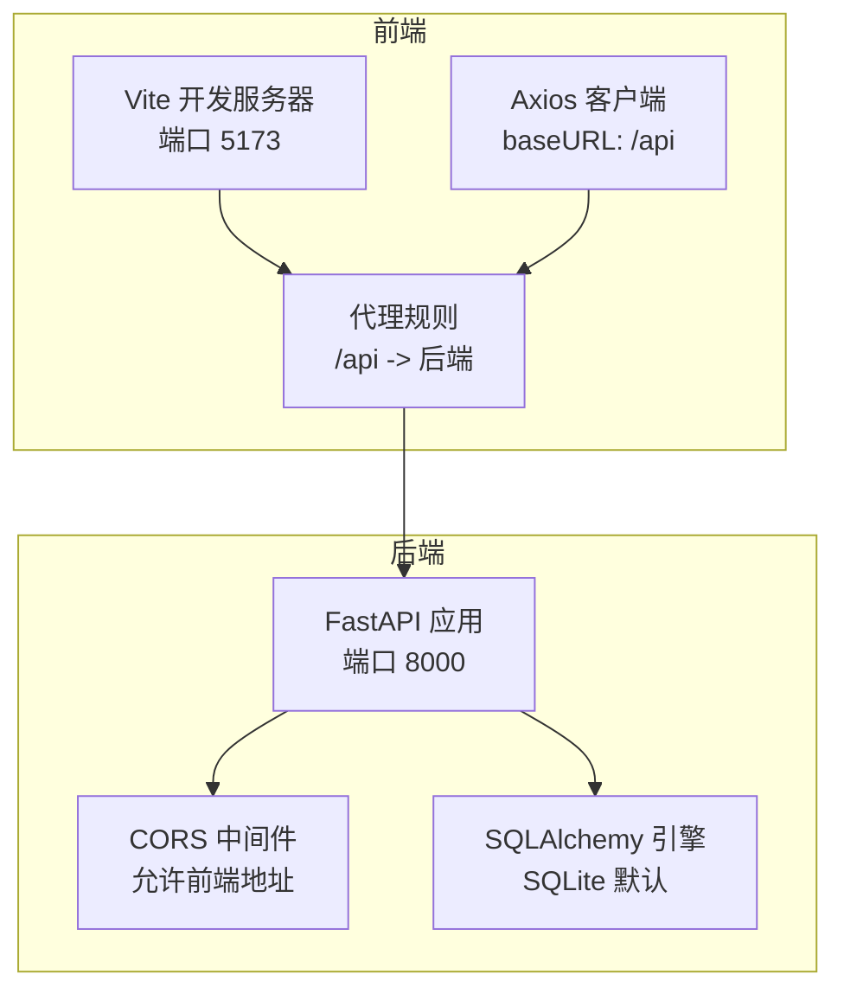
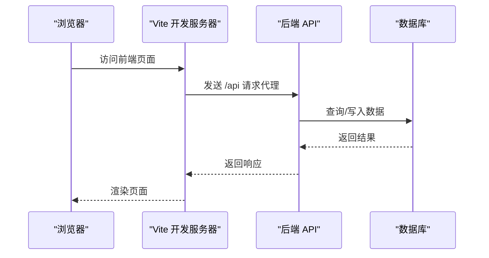
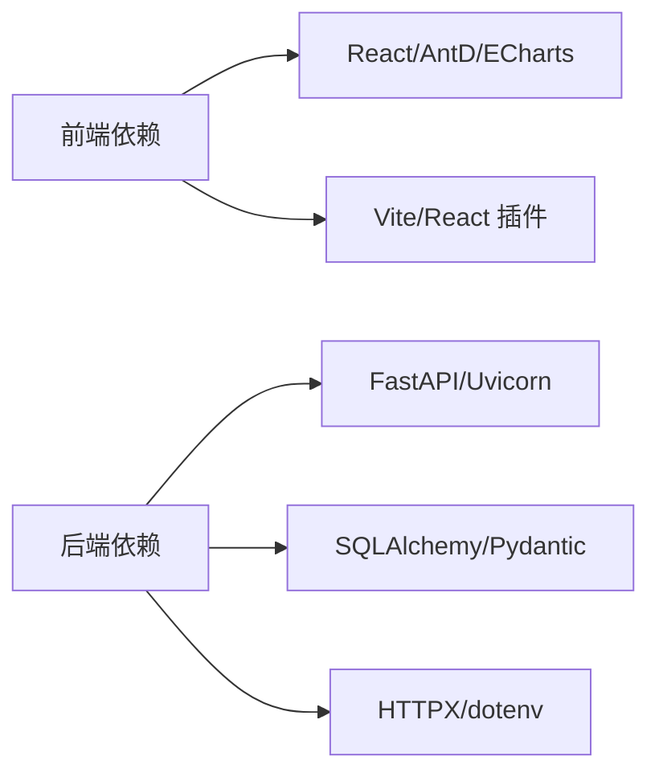

# 环境配置

<cite>
**本文引用的文件**
- [backend/app/main.py](file://backend/app/main.py)
- [backend/app/db/database.py](file://backend/app/db/database.py)
- [backend/app/routers/stock_router.py](file://backend/app/routers/stock_router.py)
- [backend/requirements.txt](file://backend/requirements.txt)
- [frontend/vite.config.ts](file://frontend/vite.config.ts)
- [frontend/src/services/api.ts](file://frontend/src/services/api.ts)
- [frontend/package.json](file://frontend/package.json)
- [frontend/tsconfig.json](file://frontend/tsconfig.json)
- [start.sh](file://start.sh)
- [stop.sh](file://stop.sh)
</cite>

## 目录
1. [简介](#简介)
2. [项目结构](#项目结构)
3. [核心组件](#核心组件)
4. [架构总览](#架构总览)
5. [详细组件分析](#详细组件分析)
6. [依赖分析](#依赖分析)
7. [性能考虑](#性能考虑)
8. [故障排查指南](#故障排查指南)
9. [结论](#结论)
10. [附录](#附录)

## 简介
本文件面向Stock Foker应用的环境配置，系统性说明开发与生产环境的差异、数据库与API配置、静态资源与代理策略、Vite开发服务器配置要点、以及部署与安全最佳实践。文档基于仓库中现有配置文件进行分析与总结，帮助开发者在不同环境下快速搭建与稳定运行。

## 项目结构
- 前端采用Vite + React + TypeScript，通过代理将/api前缀转发至后端服务。
- 后端采用FastAPI + SQLAlchemy，使用SQLite作为默认数据库，并在启动时初始化表结构。
- 启动脚本统一管理前后端进程的启动、停止与健康检查。

图表来源
- [frontend/vite.config.ts:1-16](file://frontend/vite.config.ts#L1-L16)
- [frontend/src/services/api.ts:11](file://frontend/src/services/api.ts#L11)
- [backend/app/main.py:9-15](file://backend/app/main.py#L9-L15)
- [backend/app/db/database.py:4-7](file://backend/app/db/database.py#L4-L7)

章节来源
- [frontend/vite.config.ts:1-16](file://frontend/vite.config.ts#L1-L16)
- [backend/app/main.py:1-28](file://backend/app/main.py#L1-L28)
- [backend/app/db/database.py:1-24](file://backend/app/db/database.py#L1-L24)

## 核心组件
- 开发环境
  - 前端：Vite开发服务器监听本地端口，启用代理将/api请求转发到后端。
  - 后端：FastAPI应用监听本地端口，启用CORS允许前端访问；默认使用SQLite数据库。
- 生产环境
  - 建议使用反向代理（如Nginx）将/api路径转发到后端服务，静态资源由反向代理提供。
  - 数据库可替换为生产级数据库（需调整连接字符串与迁移策略）。
- 配置文件与脚本
  - 前端：Vite配置、包管理与TypeScript配置。
  - 后端：依赖清单与数据库初始化逻辑。
  - 启停脚本：统一启动/停止前后端进程并做健康检查。

章节来源
- [frontend/vite.config.ts:1-16](file://frontend/vite.config.ts#L1-L16)
- [backend/app/main.py:9-15](file://backend/app/main.py#L9-L15)
- [backend/app/db/database.py:4-7](file://backend/app/db/database.py#L4-L7)
- [start.sh:1-113](file://start.sh#L1-L113)
- [stop.sh:1-56](file://stop.sh#L1-L56)

## 架构总览
下图展示开发与生产环境的关键配置交互：

图表来源
- [frontend/vite.config.ts:6-14](file://frontend/vite.config.ts#L6-L14)
- [frontend/src/services/api.ts:11](file://frontend/src/services/api.ts#L11)
- [backend/app/routers/stock_router.py:15](file://backend/app/routers/stock_router.py#L15)
- [backend/app/db/database.py:14-19](file://backend/app/db/database.py#L14-L19)

## 详细组件分析

### 数据库连接配置
- 默认配置
  - 使用SQLite文件型数据库，连接字符串在数据库模块中定义。
  - 初始化函数在应用启动事件中调用，创建所有模型对应的表。
- 开发与生产差异
  - 开发：SQLite便于本地调试与快速迭代。
  - 生产：建议替换为PostgreSQL/MySQL等持久化数据库，配合连接池与迁移工具。
- 敏感信息保护
  - 建议将连接字符串放入环境变量并通过dotenv加载，避免硬编码。

章节来源
- [backend/app/db/database.py:4](file://backend/app/db/database.py#L4)
- [backend/app/db/database.py:22-24](file://backend/app/db/database.py#L22-L24)

### API端点配置
- 路由前缀
  - 后端路由统一以/api为前缀，前端通过代理转发该前缀。
- CORS配置
  - 允许来自前端开发地址的跨域请求，便于本地联调。
- 健康检查
  - 后端根路径返回简单消息，启动脚本用于轮询确认就绪状态。

章节来源
- [backend/app/routers/stock_router.py:15](file://backend/app/routers/stock_router.py#L15)
- [backend/app/main.py:9-15](file://backend/app/main.py#L9-L15)
- [backend/app/main.py:25-27](file://backend/app/main.py#L25-L27)
- [start.sh:92-106](file://start.sh#L92-L106)

### 静态资源配置与代理
- 前端代理
  - 将/api前缀的请求转发到后端地址，解决开发期跨域问题。
- 基础路径
  - Axios客户端以/api为baseURL，确保与后端路由前缀一致。
- 构建产物
  - TypeScript与Vite配置控制编译目标与模块解析策略，构建输出由Vite负责。

章节来源
- [frontend/vite.config.ts:8-13](file://frontend/vite.config.ts#L8-L13)
- [frontend/src/services/api.ts:11](file://frontend/src/services/api.ts#L11)
- [frontend/tsconfig.json:1-22](file://frontend/tsconfig.json#L1-L22)
- [frontend/package.json:8-9](file://frontend/package.json#L8-L9)

### Vite开发服务器配置
- 端口与代理
  - 开发端口默认5173；代理将/api转发到后端地址。
- 插件与脚本
  - 使用React插件；提供dev/build/preview脚本。
- 热重载与构建优化
  - 热重载由Vite内置支持；构建优化可通过Vite插件链与打包器参数进一步配置（本仓库未显式覆盖）。

章节来源
- [frontend/vite.config.ts:6-15](file://frontend/vite.config.ts#L6-L15)
- [frontend/package.json:6-10](file://frontend/package.json#L6-L10)

### 启停脚本与进程管理
- 启动流程
  - 自动创建/激活Python虚拟环境并安装依赖。
  - 启动后端Uvicorn服务与前端Vite开发服务器，并记录PID与日志。
  - 轮询检测后端与前端就绪状态。
- 停止流程
  - 读取PID文件终止进程，兜底清理残留端口占用。

章节来源
- [start.sh:15-50](file://start.sh#L15-L50)
- [start.sh:52-87](file://start.sh#L52-L87)
- [start.sh:92-106](file://start.sh#L92-L106)
- [stop.sh:10-48](file://stop.sh#L10-L48)

### 配置文件管理策略
- 环境变量与dotenv
  - 后端依赖包含加载环境变量的库，建议通过.env文件集中管理敏感配置（如数据库连接、密钥等）。
- 配置分层
  - 开发：本地代理与SQLite。
  - 生产：反向代理、外部数据库、CDN静态资源。
- 版本控制
  - 不提交真实密钥与生产数据库凭据；提供示例文件与忽略规则。

章节来源
- [backend/requirements.txt:8](file://backend/requirements.txt#L8)

## 依赖分析
- 前端依赖
  - React、Ant Design、ECharts、Axios、React Router等。
  - Vite与React插件用于开发与构建。
- 后端依赖
  - FastAPI、Uvicorn、SQLAlchemy、Pydantic、HTTPX等。
  - 支持dotenv加载环境变量。

图表来源
- [frontend/package.json:11-28](file://frontend/package.json#L11-L28)
- [backend/requirements.txt:1-10](file://backend/requirements.txt#L1-L10)

章节来源
- [frontend/package.json:1-30](file://frontend/package.json#L1-L30)
- [backend/requirements.txt:1-10](file://backend/requirements.txt#L1-L10)

## 性能考虑
- 开发期
  - 使用Vite热重载提升迭代效率；代理仅在开发环境启用。
- 生产期
  - 建议开启Gzip/缓存、CDN分发静态资源；数据库连接池与查询优化。
  - 反向代理统一处理静态资源与跨域，减少后端压力。

## 故障排查指南
- 启动失败
  - 检查端口占用（8000/5173），必要时使用停止脚本清理残留进程。
  - 查看日志文件定位错误原因。
- 跨域问题
  - 确认CORS允许的源包含前端地址；开发环境代理生效时仍可能出现跨域，需核对代理配置。
- 数据库异常
  - 确认数据库连接字符串与权限；生产环境需验证连接池与迁移脚本。

章节来源
- [stop.sh:40-48](file://stop.sh#L40-L48)
- [backend/app/main.py:9-15](file://backend/app/main.py#L9-L15)
- [backend/app/db/database.py:4](file://backend/app/db/database.py#L4)

## 结论
本项目在开发环境提供了开箱即用的前后端联动方案：Vite代理与FastAPI+CORS组合满足本地联调需求；SQLite简化了数据持久化。生产环境建议替换为外部数据库与反向代理，并通过环境变量集中管理敏感配置，确保安全与可维护性。

## 附录

### 开发环境配置要点
- 前端
  - 保持代理规则与后端端口一致；如需自定义，同步修改代理与CORS配置。
- 后端
  - 保持SQLite默认配置用于开发；生产请替换为生产数据库。

章节来源
- [frontend/vite.config.ts:6-14](file://frontend/vite.config.ts#L6-L14)
- [backend/app/main.py:9-15](file://backend/app/main.py#L9-L15)
- [backend/app/db/database.py:4](file://backend/app/db/database.py#L4)

### 生产环境配置模板与最佳实践
- 反向代理（Nginx）
  - 将/api前缀转发至后端服务；静态资源由Nginx提供并开启缓存。
- 数据库
  - 替换为生产数据库，配置连接池与只读副本（如需）。
- 环境变量
  - 数据库连接、密钥、第三方API凭据等放入环境变量，通过dotenv加载。
- 安全
  - 限制CORS范围；启用HTTPS与安全头；定期轮换密钥；最小权限原则。

### 敏感信息保护
- 禁止提交真实密钥与数据库凭据至版本库。
- 使用dotenv加载环境变量，提供示例文件与忽略规则。
- 在CI/CD中使用受控的密文存储与注入机制。