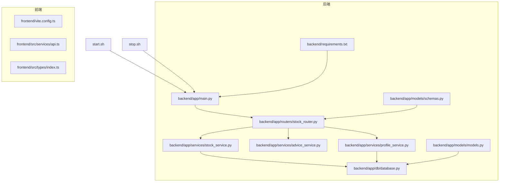
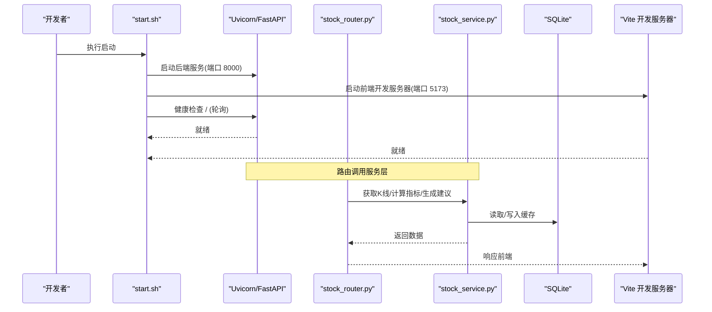
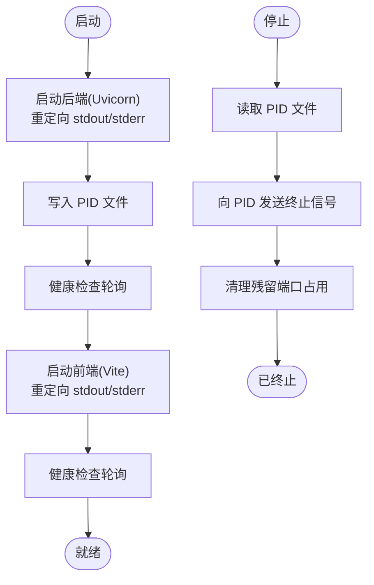
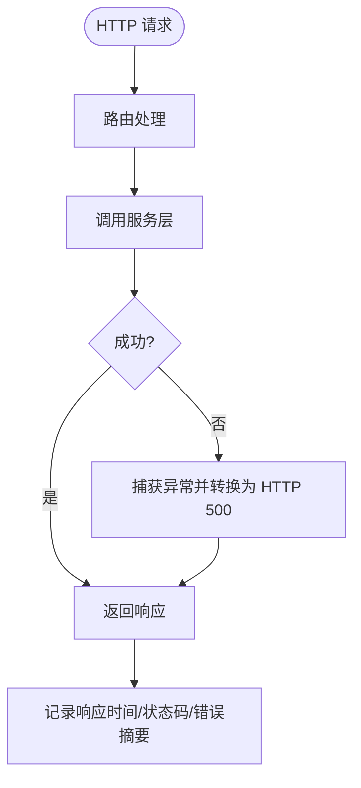
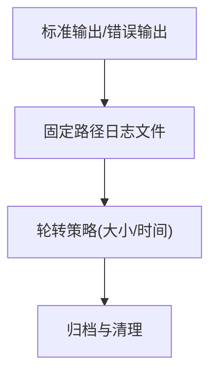
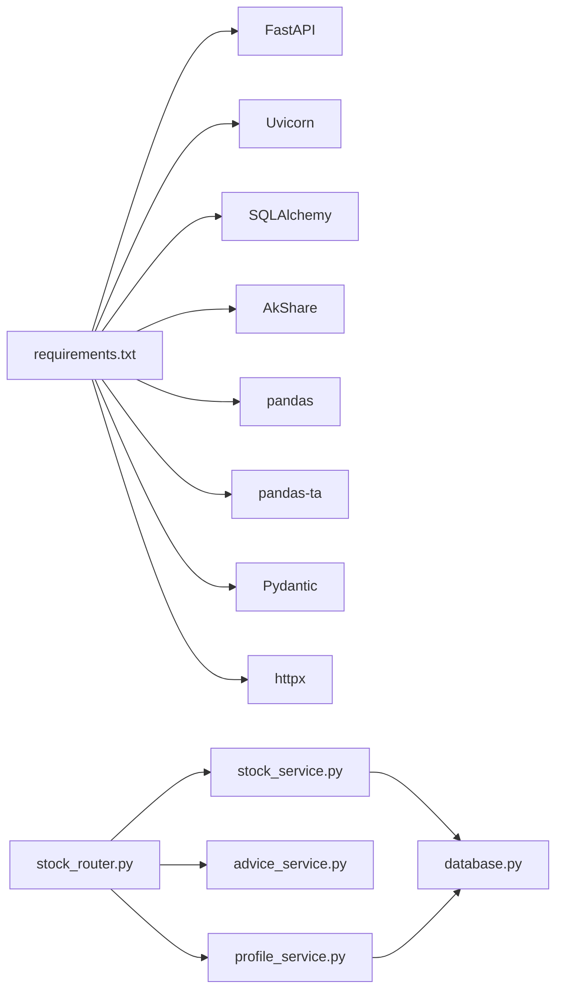

# 监控日志

<cite>
**本文引用的文件**
- [backend/app/main.py](file://backend/app/main.py)
- [backend/app/db/database.py](file://backend/app/db/database.py)
- [backend/app/routers/stock_router.py](file://backend/app/routers/stock_router.py)
- [backend/app/services/stock_service.py](file://backend/app/services/stock_service.py)
- [backend/app/services/advice_service.py](file://backend/app/services/advice_service.py)
- [backend/app/services/profile_service.py](file://backend/app/services/profile_service.py)
- [backend/app/models/models.py](file://backend/app/models/models.py)
- [backend/app/models/schemas.py](file://backend/app/models/schemas.py)
- [backend/requirements.txt](file://backend/requirements.txt)
- [start.sh](file://start.sh)
- [stop.sh](file://stop.sh)
- [doc/MVP实现说明.md](file://doc/MVP实现说明.md)
- [doc/技术架构文档.md](file://doc/技术架构文档.md)
</cite>

## 目录
1. [简介](#简介)
2. [项目结构](#项目结构)
3. [核心组件](#核心组件)
4. [架构总览](#架构总览)
5. [详细组件分析](#详细组件分析)
6. [依赖分析](#依赖分析)
7. [性能考量](#性能考量)
8. [故障排查指南](#故障排查指南)
9. [结论](#结论)
10. [附录](#附录)

## 简介
本文件面向 Stock Foker 应用的运行时监控与日志管理，围绕以下目标展开：
- 进程状态监控：后端服务进程、前端开发服务器的启动、停止与健康检查
- API 响应时间与错误率统计：结合现有路由与异常处理路径进行指标采集建议
- 日志位置、格式与轮转策略：基于启动脚本输出与标准输出重定向现状，提出可落地的改进方案
- 日志分析方法与关键错误识别：结合业务流程与异常抛出点，建立定位思路
- 告警规则与异常通知机制：给出可执行的阈值与触发条件建议
- 性能监控工具与系统资源使用分析：结合 FastAPI/Uvicorn 的运行特性与数据流
- 日志清理与归档最佳实践：在不破坏现有启动脚本的前提下，提供可操作建议

## 项目结构
Stock Foker 采用前后端分离架构，后端基于 FastAPI，前端基于 React/Vite。启动脚本负责虚拟环境准备、依赖安装、进程启动与健康检查，并将后端与前端的日志输出重定向至固定文件，便于集中查看与轮转。

**图表来源**
- [backend/app/main.py:1-28](file://backend/app/main.py#L1-L28)
- [backend/app/db/database.py:1-24](file://backend/app/db/database.py#L1-L24)
- [backend/app/routers/stock_router.py:1-197](file://backend/app/routers/stock_router.py#L1-L197)
- [backend/app/services/stock_service.py:1-327](file://backend/app/services/stock_service.py#L1-L327)
- [backend/app/services/advice_service.py:1-193](file://backend/app/services/advice_service.py#L1-L193)
- [backend/app/services/profile_service.py:1-114](file://backend/app/services/profile_service.py#L1-L114)
- [backend/app/models/models.py:1-75](file://backend/app/models/models.py#L1-L75)
- [backend/app/models/schemas.py:1-118](file://backend/app/models/schemas.py#L1-L118)
- [backend/requirements.txt:1-10](file://backend/requirements.txt#L1-L10)
- [start.sh:1-113](file://start.sh#L1-L113)
- [stop.sh:1-56](file://stop.sh#L1-L56)

**章节来源**
- [doc/技术架构文档.md:19-67](file://doc/技术架构文档.md#L19-L67)
- [start.sh:1-113](file://start.sh#L1-L113)
- [stop.sh:1-56](file://stop.sh#L1-L56)

## 核心组件
- 后端入口与中间件：FastAPI 应用实例、CORS 中间件、启动事件
- 数据库层：SQLite 引擎、会话工厂、模型基类与数据库初始化
- 路由层：股票关注、搜索、K线与分析、交易记录、炒股画像等 API
- 服务层：行情数据获取与缓存、技术指标计算、买卖建议生成、炒股画像生成
- 启停脚本：自动创建虚拟环境、安装依赖、启动后端与前端、健康检查、进程终止与端口清理

**章节来源**
- [backend/app/main.py:1-28](file://backend/app/main.py#L1-L28)
- [backend/app/db/database.py:1-24](file://backend/app/db/database.py#L1-L24)
- [backend/app/routers/stock_router.py:1-197](file://backend/app/routers/stock_router.py#L1-L197)
- [backend/app/services/stock_service.py:1-327](file://backend/app/services/stock_service.py#L1-L327)
- [backend/app/services/advice_service.py:1-193](file://backend/app/services/advice_service.py#L1-L193)
- [backend/app/services/profile_service.py:1-114](file://backend/app/services/profile_service.py#L1-L114)
- [start.sh:1-113](file://start.sh#L1-L113)
- [stop.sh:1-56](file://stop.sh#L1-L56)

## 架构总览
后端通过 Uvicorn 运行 FastAPI，前端通过 Vite 提供开发服务器。启动脚本统一管理进程生命周期与健康检查；路由层调用服务层完成数据获取与计算，最终返回给前端渲染。

**图表来源**
- [start.sh:92-106](file://start.sh#L92-L106)
- [backend/app/main.py:20-27](file://backend/app/main.py#L20-L27)
- [backend/app/routers/stock_router.py:70-131](file://backend/app/routers/stock_router.py#L70-L131)
- [backend/app/services/stock_service.py:131-252](file://backend/app/services/stock_service.py#L131-L252)
- [backend/app/db/database.py:14-23](file://backend/app/db/database.py#L14-L23)

## 详细组件分析

### 进程状态监控
- 后端进程：由启动脚本通过 nohup 启动 Uvicorn 并将标准输出与错误输出重定向到固定日志文件，同时写入 PID 文件以便停止脚本终止进程。
- 前端进程：同样通过 nohup 启动 Vite 开发服务器，输出重定向到独立日志文件。
- 健康检查：启动脚本对后端与前端分别进行轮询检测，确认服务就绪。
- 终止流程：停止脚本读取 PID 文件，向对应 PID 发送终止信号，并兜底清理残留端口占用。

**图表来源**
- [start.sh:36-106](file://start.sh#L36-L106)
- [stop.sh:10-48](file://stop.sh#L10-L48)

**章节来源**
- [start.sh:36-106](file://start.sh#L36-L106)
- [stop.sh:10-48](file://stop.sh#L10-L48)

### API 响应时间与错误率统计
- 响应时间：当前路由层对部分外部调用（如搜索、K线获取）进行了异常捕获并转换为 HTTP 异常，便于统一返回与错误统计。可在现有异常处理基础上扩展中间件或装饰器，记录请求开始时间、结束时间与状态码，从而统计平均响应时间与 P95/P99。
- 错误率：通过捕获异常并返回 HTTP 500，可按路径与方法统计错误率。建议在路由层增加统一的异常中间件或装饰器，记录错误类型、参数与堆栈摘要，用于后续分析。
- 关键异常点：
  - 搜索股票：当底层数据源异常时抛出运行时错误并转换为 500
  - K线获取：外部接口失败时抛出运行时错误并转换为 500
  - 交易记录更新/删除：未找到记录时抛出 404

**图表来源**
- [backend/app/routers/stock_router.py:70-95](file://backend/app/routers/stock_router.py#L70-L95)
- [backend/app/routers/stock_router.py:82-96](file://backend/app/routers/stock_router.py#L82-L96)
- [backend/app/routers/stock_router.py:159-184](file://backend/app/routers/stock_router.py#L159-L184)

**章节来源**
- [backend/app/routers/stock_router.py:70-95](file://backend/app/routers/stock_router.py#L70-L95)
- [backend/app/routers/stock_router.py:82-96](file://backend/app/routers/stock_router.py#L82-L96)
- [backend/app/routers/stock_router.py:159-184](file://backend/app/routers/stock_router.py#L159-L184)

### 日志文件位置、格式与轮转策略
- 日志位置与输出：
  - 后端日志：由启动脚本重定向至固定路径下的日志文件
  - 前端日志：由启动脚本重定向至固定路径下的日志文件
- 日志格式：当前为标准输出/错误输出重定向，未指定特定格式。建议在生产环境中引入结构化日志（JSON），包含时间戳、级别、服务名、请求路径、耗时、状态码、错误摘要等字段。
- 日志轮转：当前未配置轮转策略。建议使用系统自带的 logrotate 或第三方工具（如 RotatingFileHandler）实现按大小/时间轮转，并保留一定历史版本。

**图表来源**
- [start.sh:48-87](file://start.sh#L48-L87)

**章节来源**
- [start.sh:48-87](file://start.sh#L48-L87)

### 日志分析方法与关键错误识别
- 分析方法：
  - 使用正则或结构化解析工具提取关键字段（时间、路径、状态码、耗时、错误消息）
  - 按路径、方法、状态码聚合统计，识别慢请求与高频错误
  - 结合业务场景（搜索、K线、分析、画像）定位异常高峰时段
- 关键错误识别：
  - 搜索失败：当底层数据源异常时抛出运行时错误并返回 500
  - K线获取失败：外部接口失败时抛出运行时错误并返回 500
  - 交易记录不存在：更新/删除时未找到记录返回 404
  - 数据不足：分析阶段若数据长度不足，返回持有建议与提示

**章节来源**
- [backend/app/routers/stock_router.py:70-95](file://backend/app/routers/stock_router.py#L70-L95)
- [backend/app/routers/stock_router.py:82-96](file://backend/app/routers/stock_router.py#L82-L96)
- [backend/app/routers/stock_router.py:159-184](file://backend/app/routers/stock_router.py#L159-L184)
- [backend/app/services/advice_service.py:9-15](file://backend/app/services/advice_service.py#L9-L15)

### 告警规则与异常通知机制
- 告警规则建议：
  - 错误率：API 错误率在 5 分钟窗口内超过阈值（例如 5%）
  - 响应时间：P95/P99 响应时间超过阈值（例如 5 秒）
  - 进程存活：健康检查连续失败次数超过阈值（例如 3 次）
  - 数据源异常：K线/搜索接口连续失败次数超过阈值
- 通知机制：
  - 通过日志采集器（如 Fluent Bit/Fluentd）将结构化日志发送到监控平台（如 Prometheus/Grafana/ELK）
  - 配置告警规则与通知渠道（邮件/企业微信/钉钉）

[本节为通用建议，无需特定文件引用]

### 性能监控工具与系统资源使用分析
- 工具建议：
  - 进程与资源：top/htop、iotop、netstat/ss、vmstat/iostat
  - 指标采集：Prometheus + Grafana（自建或云服务）
  - 日志采集：Fluent Bit/Fluentd + Elasticsearch/OpenSearch
- 分析维度：
  - CPU/内存/IO：观察后端与前端进程的资源占用峰值与持续时间
  - 网络：监控对外数据源（新浪财经/AKShare）的请求耗时与失败率
  - 数据库：观察 SQLite 写入与查询的延迟分布

[本节为通用建议，无需特定文件引用]

### 日志清理与归档最佳实践
- 清理策略：
  - 按大小轮转：当日志达到阈值（如 100MB）时轮转
  - 按时间轮转：每日/每周轮转，保留最近 N 份
- 归档策略：
  - 归档到远端存储（对象存储/冷存储），保留一定期限
  - 清理过期日志前先校验完整性与合规要求
- 不破坏现有启动脚本：
  - 在启动脚本中加入轮转配置或在系统层面配置 logrotate
  - 保持日志文件路径与权限不变，避免影响现有监控脚本

[本节为通用建议，无需特定文件引用]

## 依赖分析
- 后端依赖：FastAPI、Uvicorn、SQLAlchemy、AkShare、pandas、pandas-ta、Pydantic、httpx 等
- 数据流依赖：路由层依赖服务层，服务层依赖数据库层与外部数据源
- 运行时依赖：启动脚本负责虚拟环境与依赖安装，确保服务稳定运行

**图表来源**
- [backend/requirements.txt:1-10](file://backend/requirements.txt#L1-L10)
- [backend/app/routers/stock_router.py:1-197](file://backend/app/routers/stock_router.py#L1-L197)
- [backend/app/services/stock_service.py:1-327](file://backend/app/services/stock_service.py#L1-L327)
- [backend/app/services/advice_service.py:1-193](file://backend/app/services/advice_service.py#L1-L193)
- [backend/app/services/profile_service.py:1-114](file://backend/app/services/profile_service.py#L1-L114)
- [backend/app/db/database.py:1-24](file://backend/app/db/database.py#L1-L24)

**章节来源**
- [backend/requirements.txt:1-10](file://backend/requirements.txt#L1-L10)
- [doc/技术架构文档.md:3-18](file://doc/技术架构文档.md#L3-L18)

## 性能考量
- 数据缓存与回退：K线数据采用本地缓存与双数据源容灾策略，显著降低外部依赖与网络波动的影响
- 指标计算：使用 pandas-ta 进行批量指标计算，建议在服务层对输入数据进行长度与完整性校验，避免无效计算
- 响应时间：建议在路由层增加统一的中间件记录请求耗时，结合数据库事务与外部接口调用进行瓶颈定位

**章节来源**
- [doc/MVP实现说明.md:43-62](file://doc/MVP实现说明.md#L43-L62)
- [backend/app/services/stock_service.py:255-327](file://backend/app/services/stock_service.py#L255-L327)

## 故障排查指南
- 后端无法启动：
  - 检查虚拟环境与依赖是否安装成功
  - 查看后端日志文件，确认端口占用与健康检查失败原因
- 前端无法访问：
  - 检查前端日志文件，确认 Vite 启动与代理配置
- API 返回 500：
  - 定位异常抛出点（搜索、K线、分析），结合日志中的错误摘要与堆栈
- API 返回 404：
  - 检查交易记录是否存在，确认 ID 与参数正确性

**章节来源**
- [start.sh:109-112](file://start.sh#L109-L112)
- [stop.sh:1-56](file://stop.sh#L1-L56)
- [backend/app/routers/stock_router.py:70-95](file://backend/app/routers/stock_router.py#L70-L95)
- [backend/app/routers/stock_router.py:82-96](file://backend/app/routers/stock_router.py#L82-L96)
- [backend/app/routers/stock_router.py:159-184](file://backend/app/routers/stock_router.py#L159-L184)

## 结论
当前项目已具备基本的进程生命周期管理与日志输出能力。为进一步提升可观测性，建议：
- 在路由层引入统一的中间件记录响应时间与错误摘要
- 在启动脚本中集成结构化日志与轮转策略
- 建立基于阈值的告警规则与通知机制
- 使用系统工具与监控平台对进程、网络与数据库进行持续观测

[本节为总结性内容，无需特定文件引用]

## 附录
- 启动与停止命令参考：见启动脚本与停止脚本
- API 路由清单：见技术架构文档中的接口定义
- 数据库表结构：见技术架构文档中的数据库设计

**章节来源**
- [start.sh:182-192](file://start.sh#L182-L192)
- [doc/技术架构文档.md:119-152](file://doc/技术架构文档.md#L119-L152)
- [doc/技术架构文档.md:69-118](file://doc/技术架构文档.md#L69-L118)