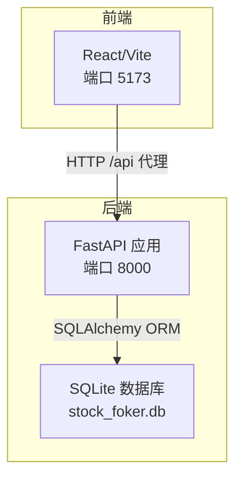
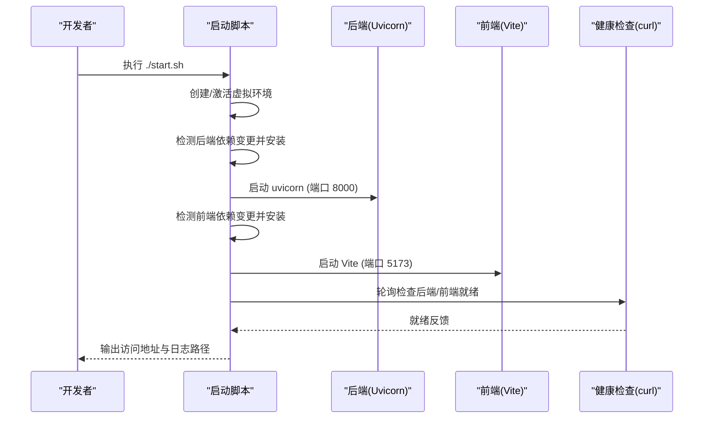
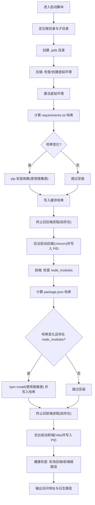
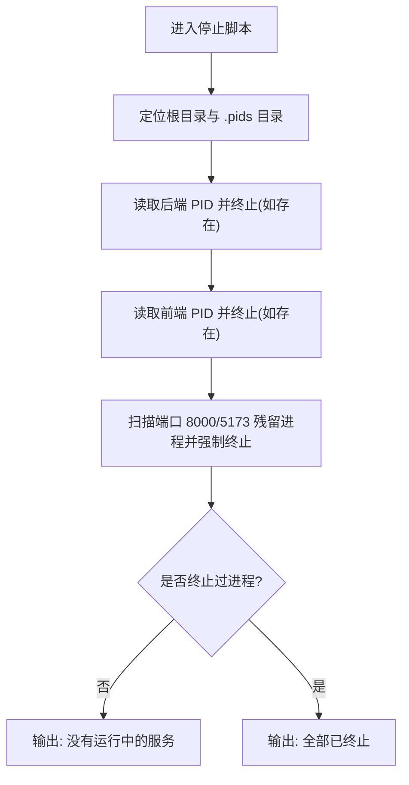
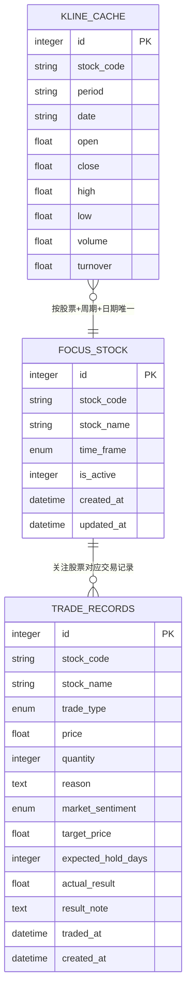

# 部署流程

> **本文引用的文件**
>
> - [start.sh](file://start.sh)
> - [stop.sh](file://stop.sh)
> - [backend/requirements.txt](file://backend/requirements.txt)
> - [frontend/package.json](file://frontend/package.json)
> - [backend/app/main.py](file://backend/app/main.py)
> - [backend/app/db/database.py](file://backend/app/db/database.py)
> - [backend/app/routers/stock_router.py](file://backend/app/routers/stock_router.py)
> - [backend/app/services/stock_service.py](file://backend/app/services/stock_service.py)
> - [backend/app/models/models.py](file://backend/app/models/models.py)
> - [frontend/vite.config.ts](file://frontend/vite.config.ts)
> - [doc/技术架构文档.md](file://doc/技术架构文档.md)

## 目录

1. [简介](#简介)

2. [项目结构](#项目结构)

3. [核心组件](#核心组件)

4. [架构总览](#架构总览)

5. [详细组件分析](#详细组件分析)

6. [依赖分析](#依赖分析)

7. [性能考虑](#性能考虑)

8. [故障排查指南](#故障排查指南)

9. [结论](#结论)

10. [附录](#附录)

## 简介

本文件面向从零开始部署 Stock Foker 应用的工程师与运维人员，提供系统化的部署流程说明，涵盖服务器环境准备、依赖检查、虚拟环境创建、应用启动与停止、健康检查、跨平台兼容性、部署验证与常见问题排查。文档同时解释启动脚本的工作原理，包括 Python 虚拟环境管理、依赖自动安装、进程管理与健康检查机制，并给出停止脚本的功能与进程清理流程。

## 项目结构

Stock Foker 采用前后端分离架构：

- 后端使用 Python FastAPI，提供 REST API；数据库为 SQLite，使用 SQLAlchemy 进行 ORM 映射。

- 前端使用 React + Vite + TypeScript，开发服务器默认监听 5173 端口；Vite 配置了对 /api 的反向代理，转发至后端 8000 端口。

- 项目根目录提供启动与停止脚本，用于一键启动/停止后端与前端服务，并进行健康检查。

图表来源

- [frontend/vite.config.ts:1-16](file://frontend/vite.config.ts#L1-L16)

- [backend/app/main.py:1-28](file://backend/app/main.py#L1-L28)

- [backend/app/db/database.py:1-24](file://backend/app/db/database.py#L1-L24)

章节来源

- [doc/技术架构文档.md:19-67](file://doc/技术架构文档.md#L19-L67)

## 核心组件

- 启动脚本：负责创建/激活 Python 虚拟环境、安装/更新后端依赖、启动后端服务（uvicorn）、检查依赖变更并按需安装前端依赖、启动前端开发服务器（Vite），并在启动完成后进行健康检查。

- 停止脚本：根据 PID 文件终止后端与前端进程，并兜底清理端口占用。

- 后端依赖清单：定义后端所需 Python 包版本范围。

- 前端依赖清单：定义前端所需包及开发工具链。

- FastAPI 应用入口：定义 CORS、路由注册与启动事件。

- 数据库与模型：定义 SQLite 连接、会话与数据模型（关注股票、交易记录、K 线缓存）。

- 股票服务：实现股票搜索、K 线数据获取与缓存、技术指标计算与买卖建议生成。

章节来源

- [start.sh:1-113](file://start.sh#L1-L113)

- [stop.sh:1-56](file://stop.sh#L1-L56)

- [backend/requirements.txt:1-10](file://backend/requirements.txt#L1-L10)

- [frontend/package.json:1-30](file://frontend/package.json#L1-L30)

- [backend/app/main.py:1-28](file://backend/app/main.py#L1-L28)

- [backend/app/db/database.py:1-24](file://backend/app/db/database.py#L1-L24)

- [backend/app/routers/stock_router.py:1-197](file://backend/app/routers/stock_router.py#L1-L197)

- [backend/app/services/stock_service.py:1-200](file://backend/app/services/stock_service.py#L1-L200)

- [backend/app/models/models.py:1-75](file://backend/app/models/models.py#L1-L75)

## 架构总览

下图展示启动脚本如何协调后端与前端的启动流程，以及健康检查的触发时机。

图表来源

- [start.sh:1-113](file://start.sh#L1-L113)

- [backend/app/main.py:25-28](file://backend/app/main.py#L25-L28)

- [frontend/vite.config.ts:1-16](file://frontend/vite.config.ts#L1-L16)

## 详细组件分析

### 启动脚本工作原理

- 虚拟环境管理

  - 若后端目录不存在虚拟环境，则创建；随后激活该虚拟环境。

  - 通过哈希校验 requirements.txt 变更，决定是否重新安装依赖。

- 依赖安装

  - 使用清华镜像源加速安装，并将安装结果写入缓存哈希文件。

- 进程管理

  - 启动前尝试终止旧的后端/前端进程（若存在 PID 文件且进程仍存活）。

  - 使用 nohup 后台启动后端与前端，并将 PID 写入 .pids 目录。

- 健康检查

  - 启动完成后循环检查后端与前端根路径可达性，最多等待若干秒。

- 日志与输出

  - 后端与前端分别输出到 .pids 目录下的日志文件，便于排障。

图表来源

- [start.sh:1-113](file://start.sh#L1-L113)

章节来源

- [start.sh:1-113](file://start.sh#L1-L113)

### 停止脚本工作原理

- 读取 PID 文件并判断进程是否存在，存在则终止并移除 PID 文件。

- 若无 PID 文件或进程不存在，输出相应提示。

- 兜底清理：扫描 8000 与 5173 端口的残留进程并强制终止。

- 输出统计：统计被终止的进程数量，若为 0 则提示“没有运行中的服务”。

图表来源

- [stop.sh:1-56](file://stop.sh#L1-L56)

章节来源

- [stop.sh:1-56](file://stop.sh#L1-L56)

### 后端服务与数据库

- FastAPI 应用入口

  - 注册 CORS 中间件，允许前端访问。

  - 包含路由模块与启动事件，启动时初始化数据库。

  - 提供根路径健康检查接口。

- 数据库与模型

  - 使用 SQLite 作为本地数据库，ORM 基于 SQLAlchemy。

  - 定义三张表：关注股票、交易记录、K 线缓存，并建立唯一约束与索引。

- 股票服务

  - 提供股票搜索、K 线数据获取与缓存、技术指标计算与买卖建议生成。

  - 采用双数据源策略：优先新浪财经，失败时回退 AKShare，并将数据写入本地缓存。

图表来源

- [backend/app/models/models.py:25-75](file://backend/app/models/models.py#L25-L75)

- [backend/app/db/database.py:1-24](file://backend/app/db/database.py#L1-L24)

章节来源

- [backend/app/main.py:1-28](file://backend/app/main.py#L1-L28)

- [backend/app/db/database.py:1-24](file://backend/app/db/database.py#L1-L24)

- [backend/app/routers/stock_router.py:1-197](file://backend/app/routers/stock_router.py#L1-L197)

- [backend/app/services/stock_service.py:1-200](file://backend/app/services/stock_service.py#L1-L200)

- [backend/app/models/models.py:1-75](file://backend/app/models/models.py#L1-L75)

### 前端开发服务器与代理

- Vite 配置

  - 默认端口 5173。

  - 对 /api 路径进行反向代理，转发至后端 8000 端口。

- 依赖管理

  - package.json 定义了 React、Ant Design、ECharts、Axios、TypeScript、Vite 等依赖与脚本命令。

章节来源

- [frontend/vite.config.ts:1-16](file://frontend/vite.config.ts#L1-L16)

- [frontend/package.json:1-30](file://frontend/package.json#L1-L30)

## 依赖分析

- 后端依赖

  - FastAPI、Uvicorn：Web 框架与 ASGI 服务器。

  - SQLAlchemy：数据库 ORM。

  - AKShare、pandas、pandas-ta：行情数据获取与技术指标计算。

  - Pydantic、httpx、python-dotenv：数据校验、HTTP 客户端与环境变量。

- 前端依赖

  - React、Ant Design、ECharts、Axios、React Router、TypeScript、Vite。

- 启动脚本依赖

  - Bash、python3、pip、node/npm、curl、lsof、nohup、kill、md5sum/md5。

章节来源

- [backend/requirements.txt:1-10](file://backend/requirements.txt#L1-L10)

- [frontend/package.json:1-30](file://frontend/package.json#L1-L30)

- [start.sh:1-113](file://start.sh#L1-L113)

- [stop.sh:1-56](file://stop.sh#L1-L56)

## 性能考虑

- 本地缓存与增量更新

  - 后端在获取 K 线数据时优先读取本地 SQLite 缓存，仅对缺失日期进行远程拉取，减少网络请求与重复计算。

- 技术指标计算

  - 使用 pandas-ta 进行批量计算，避免逐条计算带来的开销。

- 镜像源与并发

  - 启动脚本使用国内镜像源加速依赖安装，缩短首次部署时间。

- 健康检查

  - 启动脚本在启动后轮询检查后端与前端根路径可达性，确保服务真正可用后再输出访问地址。

章节来源

- [backend/app/services/stock_service.py:131-200](file://backend/app/services/stock_service.py#L131-L200)

- [backend/app/db/database.py:1-24](file://backend/app/db/database.py#L1-L24)

- [start.sh:90-106](file://start.sh#L90-L106)

## 故障排查指南

- 启动脚本无法创建虚拟环境

  - 检查系统是否安装了 python3 与 venv 模块；确认磁盘空间与权限。

- 依赖安装失败

  - 确认网络可访问镜像源；查看 .pids 目录下的日志文件；必要时手动执行 pip 安装。

- 前端依赖安装失败

  - 检查 npm registry 配置；确认 node 版本满足要求；查看 .pids/frontend.log。

- 服务未就绪

  - 查看健康检查输出；确认后端与前端端口未被占用；使用 lsof 或 netstat 检查端口占用。

- 进程无法终止

  - 使用停止脚本；若仍无法终止，检查 .pids 目录下的 PID 文件是否正确；必要时手动清理残留进程。

- CORS 问题

  - 确认前端代理已正确配置；检查后端 CORS 中间件允许的来源是否包含前端地址。

章节来源

- [start.sh:1-113](file://start.sh#L1-L113)

- [stop.sh:1-56](file://stop.sh#L1-L56)

- [backend/app/main.py:9-15](file://backend/app/main.py#L9-L15)

- [frontend/vite.config.ts:8-13](file://frontend/vite.config.ts#L8-L13)

## 结论

通过启动脚本与停止脚本，Stock Foker 实现了从零开始的一键部署与清理。脚本具备虚拟环境管理、依赖自动安装、进程管理与健康检查能力，适合本地开发与快速验证。生产环境建议结合容器化与反向代理进行部署，以提升稳定性与可维护性。

## 附录

### 部署步骤总览

- 准备服务器环境

  - 安装 Python 3、Node.js、Git、lsof、curl。

  - 确保防火墙放行 8000 与 5173 端口。

- 克隆仓库并进入根目录
- 执行启动脚本

  - ./start.sh

  - 观察输出的访问地址与日志路径。

- 访问应用
  - 前端：<http://127.0.0.1:5173>

  - 后端：<http://127.0.0.1:8000>

- 停止应用
  - ./stop.sh

章节来源

- [start.sh:1-113](file://start.sh#L1-L113)

- [stop.sh:1-56](file://stop.sh#L1-L56)

- [doc/技术架构文档.md:180-197](file://doc/技术架构文档.md#L180-L197)

### 不同操作系统下的注意事项

- macOS

  - 默认可能使用 md5（BSD 版本），启动脚本已兼容 md5 -q 与 md5sum 两种形式。

  - 如遇权限问题，请检查终端与脚本执行权限。

- Linux

  - 确保系统安装了 lsof、curl、nohup、kill、md5sum 等工具。

  - 若系统默认 shell 不是 bash，请显式使用 bash ./start.sh。

- Windows

  - 建议在 WSL2 下运行，以便获得更好的 Unix 工具链支持。

  - 若直接在 Windows 命令行中运行，需自行适配脚本语法或改用 PowerShell 版本。

章节来源

- [start.sh:24-26](file://start.sh#L24-L26)

- [start.sh:41-48](file://start.sh#L41-L48)

- [start.sh:83-87](file://start.sh#L83-L87)

### 部署验证方法

- 后端验证

  - 访问根路径：GET <http://127.0.0.1:8000/>

  - 检查返回消息确认服务正常。

- 前端验证

  - 访问首页：<http://127.0.0.1:5173>

  - 确认页面加载成功且可访问 /api 路由（经 Vite 代理转发）。

- 日志检查

  - 查看 .pids 目录下的 backend.log 与 frontend.log，确认无异常错误。

章节来源

- [backend/app/main.py:25-28](file://backend/app/main.py#L25-L28)

- [frontend/vite.config.ts:8-13](file://frontend/vite.config.ts#L8-L13)

- [start.sh:110-112](file://start.sh#L110-L112)
