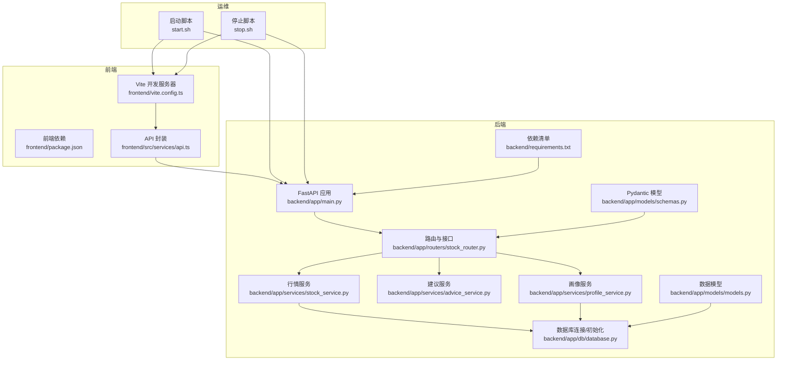
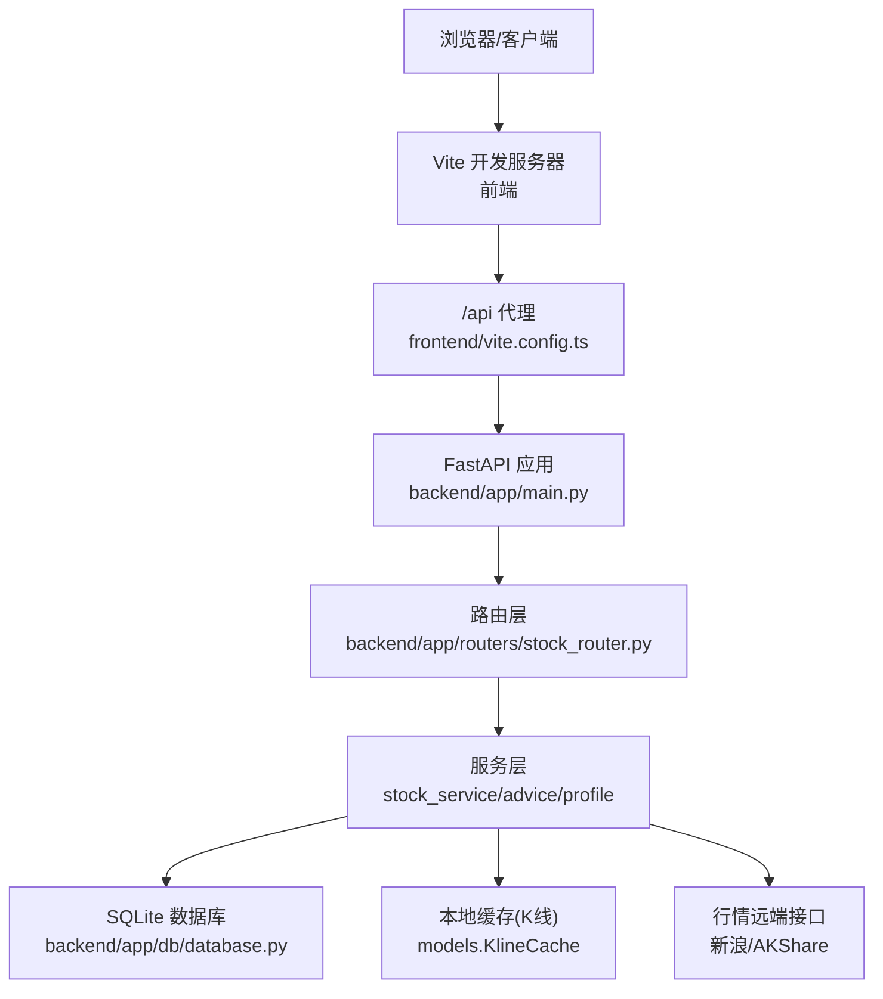
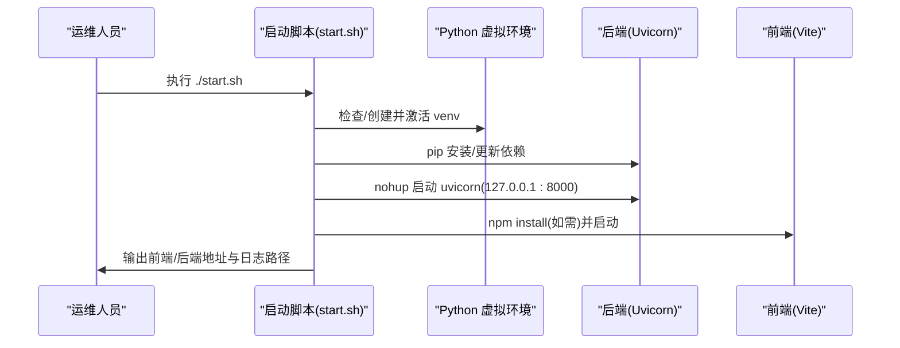
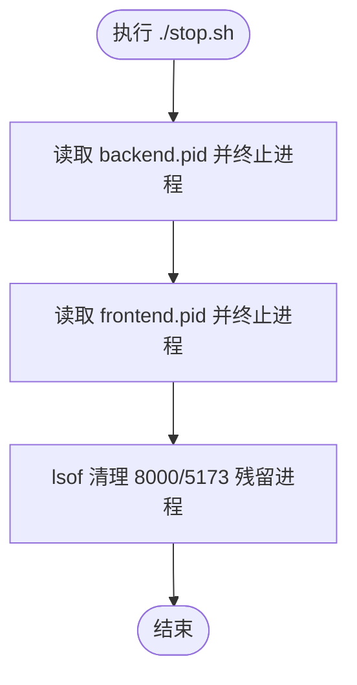
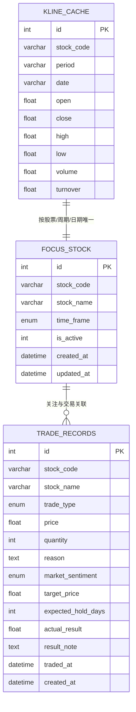
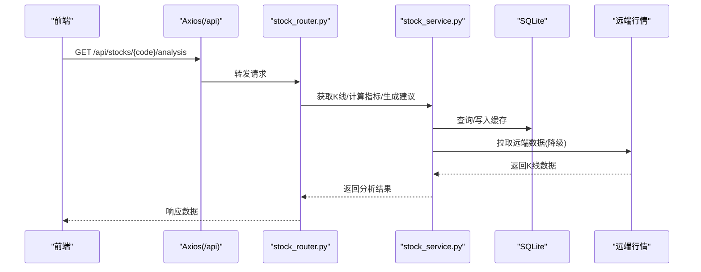
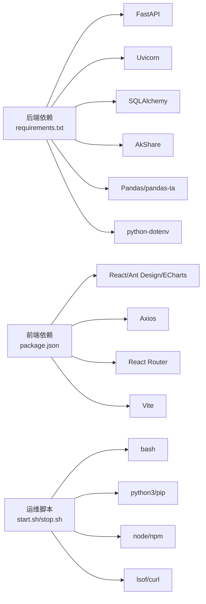

# 部署运维

<cite>
**本文引用的文件**

- [start.sh](file://start.sh)

- [stop.sh](file://stop.sh)

- [backend/app/main.py](file://backend/app/main.py)

- [backend/app/db/database.py](file://backend/app/db/database.py)

- [backend/app/routers/stock_router.py](file://backend/app/routers/stock_router.py)

- [backend/app/services/stock_service.py](file://backend/app/services/stock_service.py)

- [backend/app/services/advice_service.py](file://backend/app/services/advice_service.py)

- [backend/app/services/profile_service.py](file://backend/app/services/profile_service.py)

- [backend/app/models/models.py](file://backend/app/models/models.py)

- [backend/app/models/schemas.py](file://backend/app/models/schemas.py)

- [backend/requirements.txt](file://backend/requirements.txt)

- [frontend/package.json](file://frontend/package.json)

- [frontend/vite.config.ts](file://frontend/vite.config.ts)

- [frontend/src/services/api.ts](file://frontend/src/services/api.ts)

- [doc/技术架构文档.md](file://doc/技术架构文档.md)
</cite>

## 目录
1. [简介](#简介)

2. [项目结构](#项目结构)

3. [核心组件](#核心组件)

4. [架构总览](#架构总览)

5. [详细组件分析](#详细组件分析)

6. [依赖分析](#依赖分析)

7. [性能考虑](#性能考虑)

8. [故障排除指南](#故障排除指南)

9. [结论](#结论)

10. [附录](#附录)

## 简介
本文件面向生产环境部署与运维，围绕 Stock Foker 应用提供从服务器环境准备、依赖安装、应用启动与停止、环境变量与日志管理、监控与性能优化、故障排除到备份与恢复的全流程说明。该应用采用前后端分离架构：后端基于 FastAPI + Uvicorn + SQLAlchemy + SQLite；前端基于 React + Vite，通过代理访问后端 API。

## 项目结构
- 后端 backend

  - 应用入口与中间件：[backend/app/main.py](file://backend/app/main.py)

  - 数据库连接与初始化：[backend/app/db/database.py](file://backend/app/db/database.py)

  - 路由与业务接口：[backend/app/routers/stock_router.py](file://backend/app/routers/stock_router.py)

  - 服务层：行情数据、技术指标、买卖建议、炒股画像

  - 依赖清单：[backend/requirements.txt](file://backend/requirements.txt)

- 前端 frontend

  - Vite 开发服务器与代理：[frontend/vite.config.ts](file://frontend/vite.config.ts)

  - 前端依赖与脚本：[frontend/package.json](file://frontend/package.json)

  - API 调用封装：[frontend/src/services/api.ts](file://frontend/src/services/api.ts)

- 运维脚本

  - 启动脚本：[start.sh](file://start.sh)

  - 停止脚本：[stop.sh](file://stop.sh)

- 文档参考

  - 技术架构文档：[doc/技术架构文档.md](file://doc/技术架构文档.md)

图表来源

- [backend/app/main.py:1-28](file://backend/app/main.py#L1-L28)

- [backend/app/db/database.py:1-24](file://backend/app/db/database.py#L1-L24)

- [backend/app/routers/stock_router.py:1-197](file://backend/app/routers/stock_router.py#L1-L197)

- [backend/app/services/stock_service.py:1-327](file://backend/app/services/stock_service.py#L1-L327)

- [backend/app/services/advice_service.py:1-193](file://backend/app/services/advice_service.py#L1-L193)

- [backend/app/services/profile_service.py:1-114](file://backend/app/services/profile_service.py#L1-L114)

- [backend/app/models/models.py:1-75](file://backend/app/models/models.py#L1-L75)

- [backend/app/models/schemas.py:1-118](file://backend/app/models/schemas.py#L1-L118)

- [backend/requirements.txt:1-10](file://backend/requirements.txt#L1-L10)

- [frontend/vite.config.ts:1-16](file://frontend/vite.config.ts#L1-L16)

- [frontend/package.json:1-30](file://frontend/package.json#L1-L30)

- [frontend/src/services/api.ts:1-65](file://frontend/src/services/api.ts#L1-L65)

- [start.sh:1-113](file://start.sh#L1-L113)

- [stop.sh:1-56](file://stop.sh#L1-L56)

章节来源

- [doc/技术架构文档.md:1-197](file://doc/技术架构文档.md#L1-L197)

## 核心组件
- 后端应用与中间件

  - 应用入口与 CORS 配置：[backend/app/main.py:1-28](file://backend/app/main.py#L1-L28)

  - 启动事件初始化数据库：[backend/app/main.py:20-23](file://backend/app/main.py#L20-L23)

- 数据库与模型

  - SQLite 连接与初始化：[backend/app/db/database.py:1-24](file://backend/app/db/database.py#L1-L24)

  - 数据模型（关注股票、交易记录、K线缓存）：[backend/app/models/models.py:1-75](file://backend/app/models/models.py#L1-L75)

- 路由与接口

  - 股票关注、搜索、K线、分析、交易记录、炒股画像等接口：[backend/app/routers/stock_router.py:1-197](file://backend/app/routers/stock_router.py#L1-L197)

- 服务层

  - 行情数据获取与缓存、技术指标计算：[backend/app/services/stock_service.py:1-327](file://backend/app/services/stock_service.py#L1-L327)

  - 买卖建议生成：[backend/app/services/advice_service.py:1-193](file://backend/app/services/advice_service.py#L1-L193)

  - 炒股画像生成：[backend/app/services/profile_service.py:1-114](file://backend/app/services/profile_service.py#L1-L114)

- 前端

  - Vite 开发服务器与 /api 代理：[frontend/vite.config.ts:1-16](file://frontend/vite.config.ts#L1-L16)

  - API 调用封装：[frontend/src/services/api.ts:1-65](file://frontend/src/services/api.ts#L1-L65)

- 运维脚本

  - 自动检测/安装依赖、启动后端(Uvicorn)与前端(Vite)、健康检查：[start.sh:1-113](file://start.sh#L1-L113)

  - 终止后端/前端进程并兜底清理端口占用：[stop.sh:1-56](file://stop.sh#L1-L56)

章节来源

- [backend/app/main.py:1-28](file://backend/app/main.py#L1-L28)

- [backend/app/db/database.py:1-24](file://backend/app/db/database.py#L1-L24)

- [backend/app/routers/stock_router.py:1-197](file://backend/app/routers/stock_router.py#L1-L197)

- [backend/app/services/stock_service.py:1-327](file://backend/app/services/stock_service.py#L1-L327)

- [backend/app/services/advice_service.py:1-193](file://backend/app/services/advice_service.py#L1-L193)

- [backend/app/services/profile_service.py:1-114](file://backend/app/services/profile_service.py#L1-L114)

- [backend/app/models/models.py:1-75](file://backend/app/models/models.py#L1-L75)

- [frontend/vite.config.ts:1-16](file://frontend/vite.config.ts#L1-L16)

- [frontend/src/services/api.ts:1-65](file://frontend/src/services/api.ts#L1-L65)

- [start.sh:1-113](file://start.sh#L1-L113)

- [stop.sh:1-56](file://stop.sh#L1-L56)

## 架构总览
应用采用前后端分离架构，前端通过 Vite 代理将 /api 请求转发至后端。后端使用 FastAPI 提供 REST 接口，数据持久化采用 SQLite，行情数据通过本地缓存与双源降级策略保障可用性。

图表来源

- [frontend/vite.config.ts:1-16](file://frontend/vite.config.ts#L1-L16)

- [backend/app/main.py:1-28](file://backend/app/main.py#L1-L28)

- [backend/app/routers/stock_router.py:1-197](file://backend/app/routers/stock_router.py#L1-L197)

- [backend/app/db/database.py:1-24](file://backend/app/db/database.py#L1-L24)

- [backend/app/models/models.py:58-75](file://backend/app/models/models.py#L58-L75)

- [backend/app/services/stock_service.py:131-253](file://backend/app/services/stock_service.py#L131-L253)

## 详细组件分析

### 启动脚本与停止脚本
- 启动脚本功能要点

  - 自动创建/激活 Python 虚拟环境并安装/更新后端依赖

  - 检测前端 package.json 变更并按需安装依赖

  - 后端以 Uvicorn 在 127.0.0.1:8000 启动，前端在 127.0.0.1:5173 启动

  - 使用 nohup 与 PID 文件记录进程，支持健康检查等待

  - 日志输出到根目录 .pids 下的 backend.log 与 frontend.log

- 停止脚本功能要点

  - 读取 PID 文件并终止对应进程

  - 兜底清理 8000/5173 端口残留进程

  - 输出终止统计与提示

图表来源

- [start.sh:1-113](file://start.sh#L1-L113)

图表来源

- [stop.sh:1-56](file://stop.sh#L1-L56)

章节来源

- [start.sh:1-113](file://start.sh#L1-L113)

- [stop.sh:1-56](file://stop.sh#L1-L56)

### 数据库与模型
- 数据库连接

  - 使用 SQLite，URL 指向本地文件，启动事件创建所有表

- 数据模型

  - 关注股票、交易记录、K线缓存三张表，含枚举字段与索引

- K线缓存策略

  - 本地缓存优先，缺失部分增量拉取远端，合并返回

  - 远端失败时回退使用缓存，保证可用性

图表来源

- [backend/app/db/database.py:1-24](file://backend/app/db/database.py#L1-L24)

- [backend/app/models/models.py:25-75](file://backend/app/models/models.py#L25-L75)

章节来源

- [backend/app/db/database.py:1-24](file://backend/app/db/database.py#L1-L24)

- [backend/app/models/models.py:1-75](file://backend/app/models/models.py#L1-L75)

### API 接口与数据流
- 接口概览

  - 股票关注、搜索、K线、分析、交易记录、炒股画像

- 数据流

  - 前端通过 /api 代理调用后端

  - 路由层调用服务层，服务层进行本地缓存查询与远端拉取，计算技术指标并生成买卖建议

  - 返回前端渲染

图表来源

- [frontend/src/services/api.ts:1-65](file://frontend/src/services/api.ts#L1-L65)

- [backend/app/routers/stock_router.py:80-131](file://backend/app/routers/stock_router.py#L80-L131)

- [backend/app/services/stock_service.py:131-253](file://backend/app/services/stock_service.py#L131-L253)

章节来源

- [backend/app/routers/stock_router.py:1-197](file://backend/app/routers/stock_router.py#L1-L197)

- [backend/app/services/stock_service.py:1-327](file://backend/app/services/stock_service.py#L1-L327)

- [frontend/src/services/api.ts:1-65](file://frontend/src/services/api.ts#L1-L65)

## 依赖分析
- 后端依赖

  - FastAPI/Uvicorn、SQLAlchemy、AkShare、Pandas、pandas-ta、Pydantic、python-dotenv、HTTPX

- 前端依赖

  - React、Ant Design、ECharts、Axios、React Router、Vite

- 运维脚本

  - start.sh/stop.sh 依赖系统工具（bash、python3、pip、npm、lsof、curl）

图表来源

- [backend/requirements.txt:1-10](file://backend/requirements.txt#L1-L10)

- [frontend/package.json:1-30](file://frontend/package.json#L1-L30)

- [start.sh:1-113](file://start.sh#L1-L113)

- [stop.sh:1-56](file://stop.sh#L1-L56)

章节来源

- [backend/requirements.txt:1-10](file://backend/requirements.txt#L1-L10)

- [frontend/package.json:1-30](file://frontend/package.json#L1-L30)

- [start.sh:1-113](file://start.sh#L1-L113)

- [stop.sh:1-56](file://stop.sh#L1-L56)

## 性能考虑
- 后端性能

  - 使用 Uvicorn 作为 ASGI 服务器，适合高并发 I/O 密集场景

  - 启动事件中一次性创建数据库表，避免运行时开销

- 前端性能

  - Vite 开发服务器用于本地开发，生产建议构建产物并配合反向代理

- 数据缓存与降级

  - K线缓存减少重复拉取，远端失败回退缓存，提升稳定性

  - 双源降级（新浪优先，AKShare 备份）降低外部依赖风险

- 资源监控建议

  - 监控 CPU/内存/磁盘 IO，观察 SQLite 写入峰值与缓存命中率

  - 观察网络请求延迟与错误率（远端接口）

- 优化建议

  - 限制前端请求并发，避免对后端造成瞬时压力

  - 对频繁查询的接口增加本地缓存 TTL 控制

  - 生产环境启用 Gunicorn + Uvicorn Worker 模式（可选）

[本节为通用性能指导，不直接分析具体文件]

## 故障排除指南
- 启动失败

  - 检查 Python 虚拟环境与依赖安装是否成功

  - 查看 .pids/backend.log 与 .pids/frontend.log

  - 确认端口 8000/5173 未被占用

- 健康检查失败

  - 后端 / 未就绪：等待启动脚本健康检查完成或手动 curl 校验

- 远端接口异常

  - K线获取失败：检查网络连通性与远端接口可用性，确认降级逻辑生效

- 数据库异常

  - 表未创建：确认启动事件已执行，或手动触发初始化

- 前端代理问题

  - /api 404：确认 Vite 代理配置指向 127.0.0.1:8000

章节来源

- [start.sh:90-113](file://start.sh#L90-L113)

- [stop.sh:40-48](file://stop.sh#L40-L48)

- [backend/app/db/database.py:22-24](file://backend/app/db/database.py#L22-L24)

- [backend/app/services/stock_service.py:240-253](file://backend/app/services/stock_service.py#L240-L253)

- [frontend/vite.config.ts:6-14](file://frontend/vite.config.ts#L6-L14)

## 结论
Stock Foker 应用具备清晰的前后端分离架构与完善的本地缓存与降级机制，运维脚本提供了便捷的一键启动与停止能力。生产部署建议结合反向代理、进程守护与日志轮转，并持续监控资源与接口性能，确保稳定运行。

[本节为总结性内容，不直接分析具体文件]

## 附录

### 生产环境部署流程（建议步骤）
- 服务器环境准备

  - 安装 Python 3.10+、Node.js 18+、Git

  - 准备反向代理（Nginx/Caddy），将 /api 前缀转发至后端

- 代码与依赖

  - 克隆仓库，执行启动脚本完成依赖安装与服务启动

  - 如需生产构建前端，使用 npm run build 并将静态资源交给反向代理

- 应用启动与停止

  - 使用启动脚本一键启动，使用停止脚本安全终止

- 环境变量与日志

  - 后端可通过 python-dotenv 加载 .env（如需），日志输出到 .pids 目录

- 监控与告警

  - 监控后端进程存活、端口占用、CPU/内存、磁盘空间

  - 监控前端静态资源与 /api 健康检查

- 性能优化与资源监控

  - 评估并发与缓存命中率，必要时引入 Gunicorn + Uvicorn Worker

- 备份与恢复

  - 备份 SQLite 数据库文件与 .pids 日志

  - 恢复时替换数据库文件并重启服务

[本节为通用运维建议，不直接分析具体文件]
