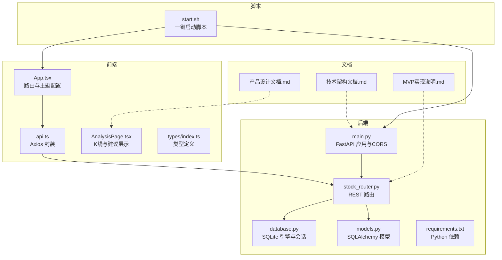
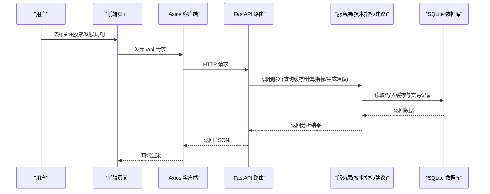
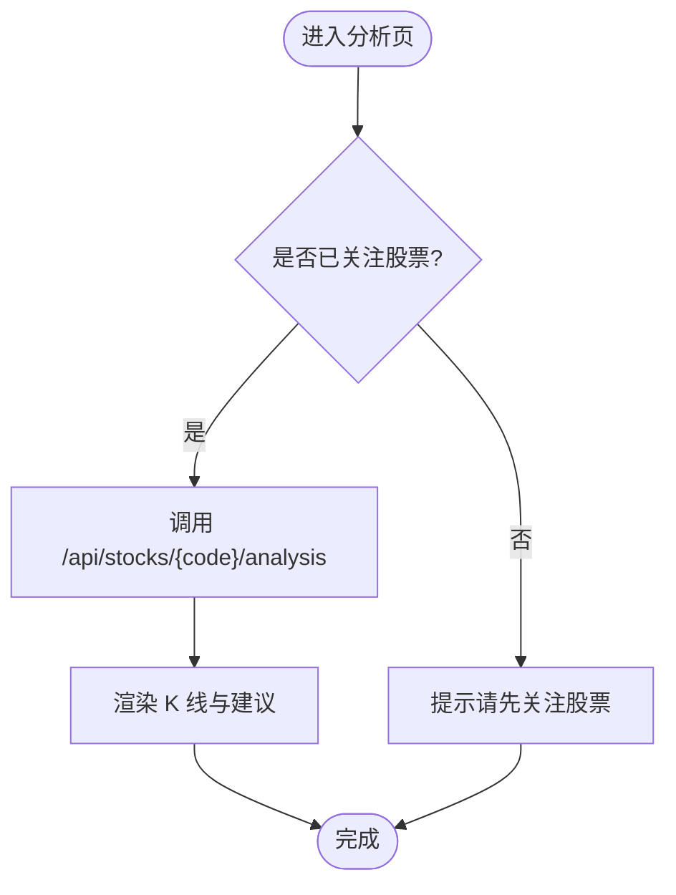
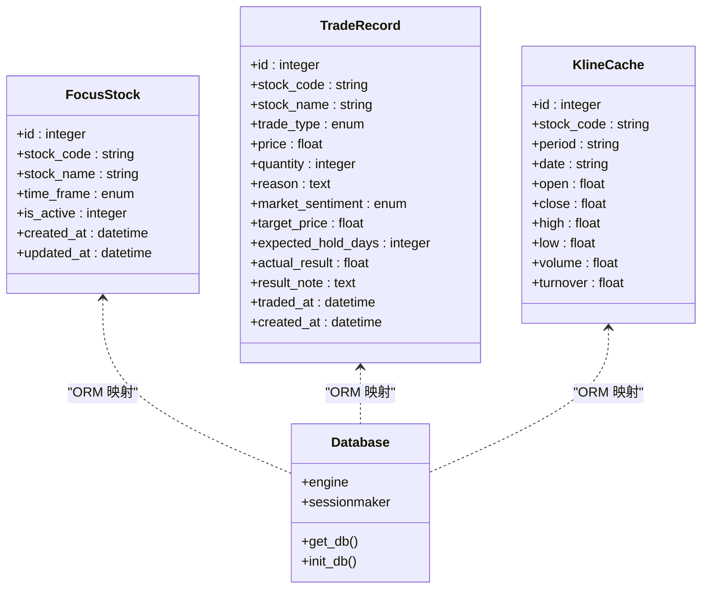
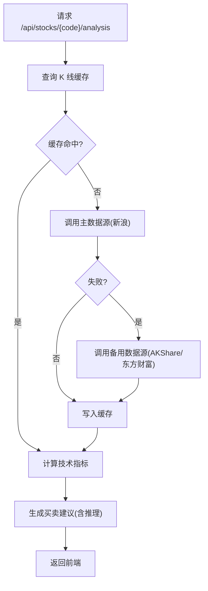
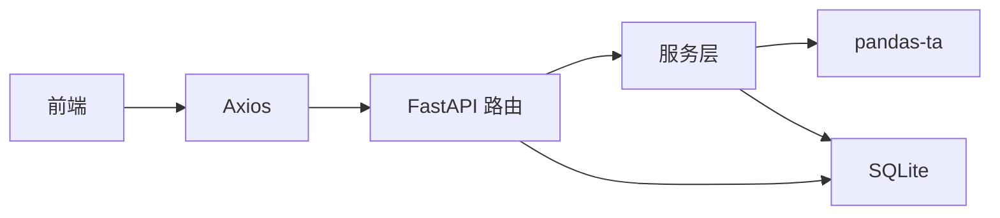

# 项目概述

<cite>
**本文引用的文件**
- [backend/app/main.py](file://backend/app/main.py)
- [backend/app/db/database.py](file://backend/app/db/database.py)
- [backend/app/models/models.py](file://backend/app/models/models.py)
- [backend/app/routers/stock_router.py](file://backend/app/routers/stock_router.py)
- [backend/requirements.txt](file://backend/requirements.txt)
- [frontend/src/App.tsx](file://frontend/src/App.tsx)
- [frontend/src/services/api.ts](file://frontend/src/services/api.ts)
- [frontend/src/pages/AnalysisPage.tsx](file://frontend/src/pages/AnalysisPage.tsx)
- [frontend/src/types/index.ts](file://frontend/src/types/index.ts)
- [doc/产品设计文档.md](file://doc/产品设计文档.md)
- [doc/技术架构文档.md](file://doc/技术架构文档.md)
- [doc/MVP实现说明.md](file://doc/MVP实现说明.md)
- [start.sh](file://start.sh)
</cite>

## 目录
1. [简介](#简介)
2. [项目结构](#项目结构)
3. [核心组件](#核心组件)
4. [架构总览](#架构总览)
5. [详细组件分析](#详细组件分析)
6. [依赖分析](#依赖分析)
7. [性能考量](#性能考量)
8. [故障排查指南](#故障排查指南)
9. [结论](#结论)
10. [附录](#附录)

## 简介
Stock Foker 是一款面向个人投资者的自用股票分析应用，核心理念是“深度聚焦、数据驱动、自我进化”。它通过单股票聚焦模式，融合技术面、基本面、消息面数据，并结合用户的交易记录与个人炒股画像，提供个性化的辅助决策建议。项目强调“辅助决策”而非自动交易，确保可解释性与风险可控；同时坚持本地部署与数据隐私保护，适合有一定交易经验的个人投资者持续迭代使用。

- 核心价值
  - 减少信息噪音：一次聚焦一支股票，避免精力分散
  - 多维度分析：技术指标 + 板块联动 + 消息面的全方位数据融合
  - 自我认知：通过操作记录与炒股画像，帮助用户认识自己的交易风格和弱点
  - 闭环决策：数据输入 → 用户画像 → 智能决策辅助 → 复盘优化

- 目标用户
  - 个人投资者（自用），具备一定股票交易经验，希望通过数据和工具提升交易决策质量

- 主要功能特性
  - 单股票关注与时间框架设置（短线/中线/长线）
  - K线与技术指标展示（MA、MACD、KDJ、RSI、布林带、成交量）
  - 结构化交易记录与交易结果补录
  - 基础炒股画像（胜率、盈亏比、持仓偏好、交易频率、情绪准确率等）
  - 买卖建议（附带推理过程与置信度）

- 项目发展历程与版本规划
  - MVP（第一阶段）：跑通基础数据展示 + 操作记录闭环
  - 第二阶段：补全数据维度 + 风险控制
  - 第三阶段：智能化升级 + 自我进化

- 核心优势与差异化
  - 以“单股票聚焦”为核心，避免多标的跟踪导致的认知负荷
  - 强调可解释性：每条建议附带推理过程，便于用户理解与验证
  - 本地化与隐私优先：所有数据本地存储，不上传云端
  - 渐进式演进：从MVP到智能选股、回测、复盘与通知提醒逐步完善

**章节来源**
- [doc/产品设计文档.md:1-288](file://doc/产品设计文档.md#L1-L288)
- [doc/技术架构文档.md:1-197](file://doc/技术架构文档.md#L1-L197)
- [doc/MVP实现说明.md:1-86](file://doc/MVP实现说明.md#L1-L86)

## 项目结构
项目采用前后端分离架构，前端使用 React + Vite + ECharts，后端使用 Python + FastAPI，数据库采用 SQLite，服务端与客户端通过 REST API 通信。项目提供一键启动脚本，自动检查依赖、构建与启动前后端服务。

**图表来源**
- [frontend/src/App.tsx:1-27](file://frontend/src/App.tsx#L1-L27)
- [frontend/src/services/api.ts:1-65](file://frontend/src/services/api.ts#L1-L65)
- [frontend/src/pages/AnalysisPage.tsx:1-213](file://frontend/src/pages/AnalysisPage.tsx#L1-L213)
- [frontend/src/types/index.ts:1-94](file://frontend/src/types/index.ts#L1-L94)
- [backend/app/main.py:1-28](file://backend/app/main.py#L1-L28)
- [backend/app/db/database.py:1-24](file://backend/app/db/database.py#L1-L24)
- [backend/app/routers/stock_router.py:1-197](file://backend/app/routers/stock_router.py#L1-L197)
- [backend/app/models/models.py:1-75](file://backend/app/models/models.py#L1-L75)
- [backend/requirements.txt:1-10](file://backend/requirements.txt#L1-L10)
- [doc/产品设计文档.md:1-288](file://doc/产品设计文档.md#L1-L288)
- [doc/技术架构文档.md:1-197](file://doc/技术架构文档.md#L1-L197)
- [doc/MVP实现说明.md:1-86](file://doc/MVP实现说明.md#L1-L86)
- [start.sh:1-113](file://start.sh#L1-L113)

**章节来源**
- [doc/技术架构文档.md:19-67](file://doc/技术架构文档.md#L19-L67)
- [start.sh:1-113](file://start.sh#L1-L113)

## 核心组件
- 前端应用
  - 路由与主题：使用 React Router 管理页面路由，Ant Design 提供中文化与主题配置
  - API 封装：统一的 Axios 客户端，基于 /api 前缀代理到后端
  - 页面组件：分析页负责展示 K 线、技术指标与买卖建议；交易与画像页分别管理交易记录与生成画像
  - 类型系统：通过 TypeScript 定义前后端交互的数据结构，保证类型安全

- 后端服务
  - FastAPI 应用：启用 CORS，挂载路由，启动时初始化数据库
  - 路由层：提供股票关注、搜索、K线与分析、交易记录、炒股画像等接口
  - 数据模型：基于 SQLAlchemy 的实体模型，涵盖关注股票、交易记录、K线缓存
  - 数据库：SQLite 本地持久化，零运维成本，满足个人使用场景

- 数据与算法
  - 技术指标：基于 pandas-ta 计算 MA、MACD、KDJ、RSI、布林带等
  - 建议生成：多指标综合评分 + 推理过程，输出买卖建议与置信度
  - 缓存策略：K线数据本地缓存，支持增量更新与离线可用

**章节来源**
- [frontend/src/App.tsx:1-27](file://frontend/src/App.tsx#L1-L27)
- [frontend/src/services/api.ts:1-65](file://frontend/src/services/api.ts#L1-L65)
- [frontend/src/pages/AnalysisPage.tsx:1-213](file://frontend/src/pages/AnalysisPage.tsx#L1-L213)
- [frontend/src/types/index.ts:1-94](file://frontend/src/types/index.ts#L1-L94)
- [backend/app/main.py:1-28](file://backend/app/main.py#L1-L28)
- [backend/app/routers/stock_router.py:1-197](file://backend/app/routers/stock_router.py#L1-L197)
- [backend/app/models/models.py:1-75](file://backend/app/models/models.py#L1-L75)
- [backend/app/db/database.py:1-24](file://backend/app/db/database.py#L1-L24)
- [doc/MVP实现说明.md:27-42](file://doc/MVP实现说明.md#L27-L42)

## 架构总览
系统采用前后端分离架构，前端通过 Axios 发起 API 请求，后端使用 FastAPI 提供 REST 接口，数据访问通过 SQLAlchemy 与 SQLite 交互。数据流从用户操作开始，经过前端页面、API 路由、服务层（技术指标计算与建议生成）、本地缓存与数据库，最终返回给前端渲染。

**图表来源**
- [frontend/src/services/api.ts:1-65](file://frontend/src/services/api.ts#L1-L65)
- [backend/app/routers/stock_router.py:80-131](file://backend/app/routers/stock_router.py#L80-L131)
- [backend/app/db/database.py:14-24](file://backend/app/db/database.py#L14-L24)
- [doc/技术架构文档.md:153-178](file://doc/技术架构文档.md#L153-L178)

**章节来源**
- [doc/技术架构文档.md:153-178](file://doc/技术架构文档.md#L153-L178)

## 详细组件分析

### 前端组件分析
- 路由与布局
  - 使用 React Router 管理首页重定向与子路由，Ant Design 提供中文化与主题色配置
  - 主布局组件承载侧边栏、顶部搜索与关注状态，页面组件按功能拆分

- API 封装
  - Axios 实例统一设置 baseURL 为 /api，配合 Vite 的代理将请求转发至后端
  - 每个业务模块提供独立的函数封装，如获取关注、搜索股票、分析数据、交易记录与画像

- 分析页
  - 支持日K/周K/月K切换，使用 ECharts 渲染蜡烛图、均线与成交量
  - 展示买卖建议的信号、置信度与推理过程，右侧指标概览汇总关键指标数值

**图表来源**
- [frontend/src/pages/AnalysisPage.tsx:28-48](file://frontend/src/pages/AnalysisPage.tsx#L28-L48)
- [frontend/src/services/api.ts:30-41](file://frontend/src/services/api.ts#L30-L41)

**章节来源**
- [frontend/src/App.tsx:1-27](file://frontend/src/App.tsx#L1-L27)
- [frontend/src/services/api.ts:1-65](file://frontend/src/services/api.ts#L1-L65)
- [frontend/src/pages/AnalysisPage.tsx:1-213](file://frontend/src/pages/AnalysisPage.tsx#L1-L213)
- [frontend/src/types/index.ts:1-94](file://frontend/src/types/index.ts#L1-L94)

### 后端组件分析
- 应用入口与中间件
  - FastAPI 应用启用 CORS，允许前端开发服务器跨域访问
  - 启动事件中初始化数据库，确保表结构存在

- 路由与控制器
  - 股票关注：获取当前关注、设置新关注（自动取消旧关注）、更新时间框架、查询历史
  - 股票数据：搜索股票、获取 K 线、获取完整分析（K线+指标+建议）
  - 交易记录：列出、新增、更新（补录结果）、删除
  - 炒股画像：按条件生成画像数据

- 数据模型与数据库
  - 关注股票：包含股票代码/名称、时间框架、激活状态与时间戳
  - 交易记录：结构化记录买入/卖出、价格数量、理由、情绪、目标价与持有周期、实际结果与备注
  - K线缓存：按股票+周期+日期唯一约束，支持增量更新与离线可用

**图表来源**
- [backend/app/models/models.py:25-75](file://backend/app/models/models.py#L25-L75)
- [backend/app/db/database.py:1-24](file://backend/app/db/database.py#L1-L24)

**章节来源**
- [backend/app/main.py:1-28](file://backend/app/main.py#L1-L28)
- [backend/app/routers/stock_router.py:1-197](file://backend/app/routers/stock_router.py#L1-L197)
- [backend/app/models/models.py:1-75](file://backend/app/models/models.py#L1-L75)
- [backend/app/db/database.py:1-24](file://backend/app/db/database.py#L1-L24)

### 数据流与处理逻辑
- 数据获取与缓存
  - 请求到达后，先查询本地 SQLite 缓存（命中则直接返回）
  - 缓存缺失或过期时，调用主数据源（新浪）获取数据，失败则降级到备用数据源（AKShare/东方财富）
  - 成功后写入 SQLite 缓存，支持增量更新与当日覆盖

- 技术指标与建议生成
  - 基于 pandas-ta 计算 MA、MACD、KDJ、RSI、布林带等指标
  - 多指标综合评分（-1.5~+1.5），结合用户画像与时间框架生成买卖建议与置信度
  - 每条建议附带推理过程，包含各指标具体数值与判断逻辑

**图表来源**
- [doc/MVP实现说明.md:43-62](file://doc/MVP实现说明.md#L43-L62)
- [doc/技术架构文档.md:153-178](file://doc/技术架构文档.md#L153-L178)

**章节来源**
- [doc/MVP实现说明.md:27-42](file://doc/MVP实现说明.md#L27-L42)
- [doc/MVP实现说明.md:43-62](file://doc/MVP实现说明.md#L43-L62)
- [doc/技术架构文档.md:153-178](file://doc/技术架构文档.md#L153-L178)

## 依赖分析
- 技术栈与版本
  - 前端：React + Vite + TypeScript + Ant Design + ECharts
  - 后端：Python + FastAPI + SQLAlchemy + pandas-ta + pandas
  - 数据库：SQLite（本地持久化）
  - 部署：本地部署，保护个人交易数据隐私

- 外部依赖与集成点
  - 行情数据：主数据源为新浪财经 API，备用为 AKShare/东方财富
  - 技术指标：pandas-ta 提供 MACD/KDJ/RSI/布林带等计算
  - 数据处理：pandas 用于数据清洗与转换
  - ORM：SQLAlchemy 2.0 提供数据库操作

**图表来源**
- [backend/requirements.txt:1-10](file://backend/requirements.txt#L1-L10)
- [doc/技术架构文档.md:3-18](file://doc/技术架构文档.md#L3-L18)

**章节来源**
- [backend/requirements.txt:1-10](file://backend/requirements.txt#L1-L10)
- [doc/技术架构文档.md:3-18](file://doc/技术架构文档.md#L3-L18)

## 性能考量
- 前端性能
  - 页面首屏加载时间小于 2 秒，K 线图交互流畅，数据更新后刷新时间小于 3 秒
  - ECharts 在分析页中使用，支持缩放与滑条，保证用户体验

- 后端性能
  - FastAPI 异步高性能 API，路由层按模块划分清晰，便于扩展
  - 数据缓存策略显著降低外部数据源压力，提高响应速度

- 数据更新策略
  - 实时数据：交易时段内分钟级更新（分时走势、资金流向）
  - 日级数据：每日收盘后更新（日K线、技术指标、板块数据）
  - 低频数据：按事件触发更新（财报、公告、研报）
  - 本地缓存：历史数据本地持久化，减少重复请求

**章节来源**
- [doc/产品设计文档.md:277-281](file://doc/产品设计文档.md#L277-L281)
- [doc/技术架构文档.md:213-218](file://doc/技术架构文档.md#L213-L218)

## 故障排查指南
- 启动问题
  - 后端未就绪：检查后端 PID 文件与日志，确认端口 8000 是否被占用
  - 前端未就绪：检查前端 PID 文件与日志，确认端口 5173 是否被占用
  - 依赖安装：启动脚本会自动检测 requirements.txt 与 package.json 的哈希，必要时重新安装依赖

- API 调用异常
  - CORS 错误：确认前端代理已正确配置 /api 前缀，后端已启用 CORS
  - 数据源限流：若遇到东方财富限流，系统会自动降级到备用数据源
  - 缓存失效：若缓存过期或缺失，系统会从数据源拉取并写入缓存

- 数据一致性
  - 交易记录：确保交易记录的 stock_code 与 stock_name 一致，traded_at 时间正确
  - K 线缓存：注意唯一约束（stock_code, period, date），避免重复写入

**章节来源**
- [start.sh:1-113](file://start.sh#L1-L113)
- [doc/MVP实现说明.md:80-86](file://doc/MVP实现说明.md#L80-L86)

## 结论
Stock Foker 以“单股票聚焦”为核心，结合技术面、消息面与用户画像，提供可解释的辅助决策建议。项目采用前后端分离架构，前端现代化、后端高性能，数据本地化与隐私优先，适合个人投资者在本地环境中持续迭代使用。MVP 已实现基础数据展示与操作记录闭环，后续将逐步完善板块联动、消息面情绪分析、风险控制、智能选股、回测与复盘等功能，形成完整的“数据输入 → 画像 → 决策 → 复盘”的闭环体系。

[本节为总结性内容，不直接分析具体文件]

## 附录
- 版本规划与里程碑
  - MVP：跑通基础数据展示 + 操作记录闭环
  - 第二阶段：补全数据维度 + 风险控制
  - 第三阶段：智能化升级 + 自我进化

- 非功能性要求
  - 隐私与安全：本地存储、加密存储、API Key 管理
  - 性能：首屏加载、图表交互、数据刷新时间
  - 可扩展性：多股票并行跟踪、策略模型插件化、数据源可替换

**章节来源**
- [doc/产品设计文档.md:236-287](file://doc/产品设计文档.md#L236-L287)